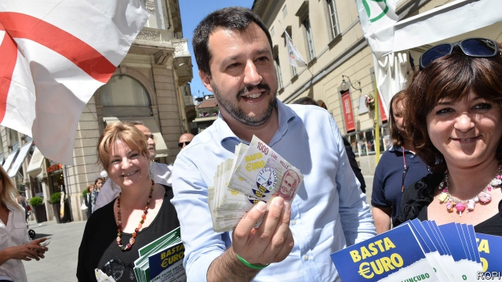

###### Debt and discipline

# The EU edges towards punishing Italy for letting its debt rise 

 

> print-edition iconPrint edition | Europe | Jun 6th 2019 

AS ONE COUNTRY comes out of the naughty corner, another risks being sent there. On June 5th the European Commission opined that Spain was no longer breaking European fiscal rules, and recommended bringing its decade-long “excessive-deficit” procedure to a close. But it began the process of opening a similar procedure against Italy. Eventually, if no compromise is reached, the Italians could face a multibillion-euro spanking. 

The ultimate source of the problem is Italy’s extravagant burden of public debt. In 2018 it came to 132% of GDP, second in Europe only to Greece. The European Union’s rules require that this ratio fall at a prescribed pace. Instead, for the first time in four years, Italy’s debt ratio rose last year. 

That alone would not have warranted action if Italy had convinced the commission there was a good reason for the infraction, or that it would prove temporary. Giovanni Tria, the finance minister, argues that a recession in the second half of 2018 explains some of the overshoot. He also thinks the budget deficit this year will come in at 2.2% of GDP, below the 2.4% initially projected. The government has introduced new basic income and early-retirement schemes, but fewer citizens than expected are taking advantage of them. That should limit the rise in the debt ratio. 

Such arguments would usually sway the commission. But it fears a much worse fiscal picture in 2020. It expects the deficit to break the 3% ceiling enshrined in the EU’s Stability and Growth Pact, meaning Italy will violate both the debt and deficit rules. Mr Tria says this will be avoided either by raising the value-added tax or through “alternative measures” that bring in equivalent revenue. Brussels is sceptical. VAT rises have been deferred in the past and are ruled out by both of the parties in Italy’s populist coalition, the Northern League and the Five Star Movement (M5S). 

Politicians show little inclination to tighten their belts. Flushed with his success in the European elections, Matteo Salvini, the leader of the League, wants to rewrite the EU’s rules rather than follow them. He has pledged to implement a flat income tax, which could cost the government large amounts of revenue. Meanwhile Luigi di Maio, who leads M5S, wants to protect welfare spending. On June 3rd Giuseppe Conte, the technocratic prime minister, threatened to quit if the parties could not compromise on spending. Mr Salvini has since set a two-week deadline for the coalition to strike a deal. 

For now the government has time on its side. The commission’s patience may be wearing thin, but it is not exhausted. A formal disciplinary procedure is launched only once the finance ministries and heads of member states give their blessing. That will not happen before EU leaders meet at a European Council summit on June 20th. The leaders may be satisfied with minor concessions, similar to those Italy’s government made in 2018 when a row erupted over this year’s budget. 

Even if no concessions are made, a fine is a long way off. Once a procedure has been formally opened, the commission will ask Italy to take remedial steps. Only if Italy is deemed to have failed to do its homework will it be fined. In principle, the penalty could be as high as 0.2% of GDP, or about €3.5bn ($4bn). But Brussels has never actually fined a rule-breaker. 

Financial markets, typically a more effective source of discipline, were largely unfazed by the commission’s report on June 5th. But the coalition’s first year in power has hurt investors’ confidence. At the start of 2018, Italian economists note, the government could borrow at roughly the same interest rate as Spain. Now, the interest rate on a ten-year bond is nearly two percentage points higher. ◼ 

