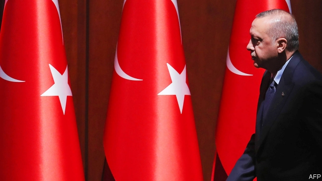

###### A hard AK to follow

# Turkey’s President Erdogan may face a mutiny in his own party 

 

> print-edition iconPrint edition | Europe | Jun 6th 2019 

ONE OF THE more tedious pastimes in Turkish politics is debating whether murmurs of discontent in the ruling Justice and Development (AK) party will transform into open rebellion against President Recep Tayyip Erdogan. Speculation inevitably begins whenever a former AK luminary says something even mildly critical of Turkey’s strongman, and dies down when nothing else follows. 

This year seems different. The economy is in a funk, and AK has been weakened by losses in local elections. Now evidence is mounting that some of Mr Erdogan’s former allies, including his predecessor as president and an ex-prime minister, are on the verge of creating a rival political party. 

Last month, after the opposition narrowly won Istanbul’s mayoral election, Turkey’s election board ordered a re-run. The move was widely believed to have been orchestrated by Mr Erdogan and his inner circle. There was a chorus of protest at home and abroad. 

Exceptionally, some members of AK’s old guard joined in. Abdullah Gul, a former president, called the decision an injustice. A former prime minister, Ahmet Davutoglu, said it contradicted the rule of law. Weeks earlier, Mr Davutoglu had published a manifesto that criticised the new constitution (which gives Mr Erdogan nearly unchecked powers), AK’s alliance with ultra-nationalists, widespread censorship and the influence of a “parallel structure” of cronies and palace officials. 

Mr Gul and Ali Babacan, a former economy tsar, along with a handful of other ex-ministers, are preparing to break with AK and launch a new party, people close to them say. The group were ready to make their move at the start of the year but decided to wait until after the local elections, says Etyen Mahcupyan, a former government adviser. “They will act in the autumn,” he says. Whether Mr Davutoglu will join is not certain. He and Mr Babacan do not get along, AK insiders say. 

Much depends on the outcome of the mayoral rerun in Istanbul, set for June 23rd. For Mr Erdogan, losing in the country’s biggest city was painful the first time around. Losing twice in three months could be embarrassing enough to cause a legitimacy crisis. Critics within AK may feel emboldened to speak out. 

In an interview in 2001, on the eve of AK’s formal launch, Mr Erdogan promised there would be no room in his new party for autocrats: “The leader will not overshadow the party.” At first he seemed to live up to his word, and AK accommodated some degree of debate. But over the past decade, Mr Erdogan has transformed it into a personal vehicle. Members of the old guard have been pushed out. Haunted by an abortive coup in 2016 (after which the government arrested some 60,000 people), the president has surrounded himself with yes-men and family members. Loyalty trumps everything else. The old AK is no more, says Ibrahim Turhan, a former parliamentarian: “This is now Erdogan’s party.” 

How much backing the schismatics might have among AK voters is unclear. Dissatisfaction with the country’s direction is growing, but few analysts expect a new conservative party to shave off more than a fraction of AK’s support. Secular critics scoff that Mr Erdogan’s former enablers will need quite a makeover before marketing themselves as his opponents. 

Mr Erdogan has fended off many threats to his rule, often ruthlessly enough to dissuade anyone from trying again. He may nip this one in the bud. But if it materialises, it would be the most serious challenge he has faced from within. ◼ 

