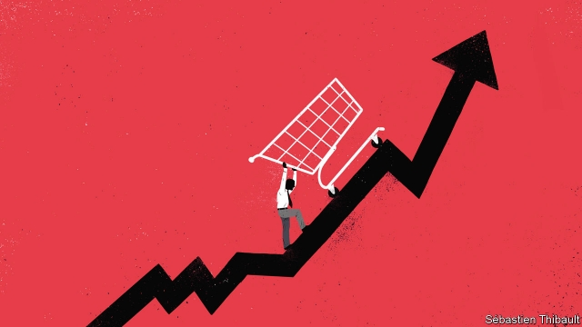

###### Free exchange

# Advertising may make people miserable, but it still has its uses 

 

> print-edition iconPrint edition | Finance and economics | Jun 6th 2019 

EVERY YEAR, as Americans polish off their Thanksgiving feasts, a particular genre of advertisement begins to air. The details vary, but the plot does not: one family member surprises another with the Christmas gift of a luxury car, often adorned with a cartoonishly large bow. The recipient never betrays a hint of the dismay one might expect of someone whose partner has spent tens of thousands of dollars without consultation. Such a car can easily cost more than the median annual income of an American household, and most people who see these ads will not be able to afford one. But the envy such spots induce serves an economic purpose, even as it leaves the majority feeling worse about themselves. 

Ads and other forms of marketing ostensibly serve a straightforward economic role. Firms selling goods and services need to tell consumers about the availability and desirability of their wares, and spend on advertising to do so. By informing consumers about the relative merits of various products, ads improve the quality of purchasing decisions and, conceivably, leave both firms and shoppers better off than they would be in an ad-free world. 

Yet advertising might fall short of this ideal in many ways. It need not be honest or representative of the full range of available products, for example. Some firms target impressionable children, in ways which could contribute to long-run health risks. London has recently banned junk-food advertising on its transport network, a prohibition campaigners want to extend. And honest or not, successful ads induce a desire to spend, perhaps on things the audience does not need or cannot afford. The information content of ads for fancy vacations, bespoke cars or diamond-studded watches does not much matter for people whose budgets cannot accommodate them. Their main takeaway is that others get to enjoy things that they themselves cannot afford. If the effect of advertising is mostly to encourage people to want things that they cannot have, rather than to direct them towards items that are a good match for their needs and tastes, then it is possible that spending on advertising leaves society worse off overall. 

Some recent research suggests this might indeed be the case. A forthcoming paper by Chloé Michel, now at Swiss Re, Michelle Sovinsky of Mannheim University, Eugenio Proto of Bristol University and Andrew Oswald of Warwick University attempts to unpick the effect of advertising on welfare. The researchers used three decades’ worth of survey results from a sample of nearly 1m Europeans, spread across 27 countries, to compare information on self-reported life satisfaction with variation in total advertising spending as a share of GDP. After taking account of other macroeconomic variables such as unemployment, and individuals’ socioeconomic characteristics, they find a significant and inverse relationship between spending on advertisements and national welfare. They estimate that a doubling of ad spending is associated with a subsequent drop in reported satisfaction of 3%—an effect about a quarter as strong as a spell of unemployment. 

It is possible that this result reflects the effect of some other factor which influences both advertising and well-being. And the authors are careful to note that they cannot be certain about the causal mechanism at work. But their findings may illustrate an aspect of the economy that has puzzled some economists for more than a century. In “The Theory of the Leisure Class”, published in 1899, Thorstein Veblen, a Norwegian-American economist, explored the nature of what he termed “conspicuous consumption”. Veblen argued that consumption is not merely about satisfying needs, but is also used to signal status and prestige. 

The priciest cars may offer more nifty features and a smoother ride than a cheaper marque, but the vast difference in price is not primarily down to such advantages. Rather, the buyer is paying for such cars’ value as a status symbol, which derives from the fact that very few people can afford one. (Following his insight, economists use the name “Veblen good” for items for which demand rises with price, though it is not the high price itself that generates the increased demand but rather the exclusivity that the high price confers.) These luxury items defy normal economic logic. In the mass market, productivity-boosting innovations that allow firms to sell better products at lower prices are a route to success. For producers of conspicuous-consumption items, such cost-cutting does not conquer the market but destroys it. 

The notion that people might buy high-cost items in preference to serviceable alternatives simply to set themselves apart from the less well-off would seem absurd, were the economy not chock-a-block with examples, from designer handbags to silver cutlery to oxygenated energy drinks. Advertising enables the process. For goods to grant high status, there must be consumers who want but cannot have them. Ad campaigns featuring sleek cars bedecked with oversized bows add to the value of luxury brands by informing the masses of how desirable they are—and how inaccessible. 

Veblen, though, saw the rich as a largely unproductive class of capital-owning moochers, who profited off the useful labour of working people (hence the “leisure class”). In recent decades, however, the share of Americans working long hours has grown, and has risen fastest among those earning the highest wages—an odd exception to the global norm that working time declines with income. The status envy induced by conspicuous consumption may play a role. In rich countries, most people’s basic needs have long since been met. To keep workers striving—those on higher incomes especially—there must always be more desirable consumer goods and services just out of reach. Perpetual dissatisfaction may well boost economic growth by keeping highly productive workers who might otherwise enjoy more time with their families chained to their desks. But it is a funny sort of prosperity that depends on people never being satisfied with their lot. ◼ 

