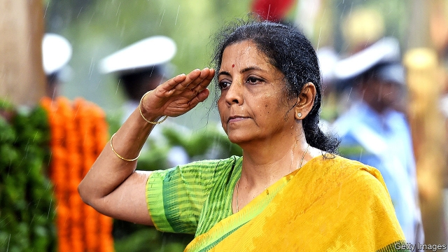
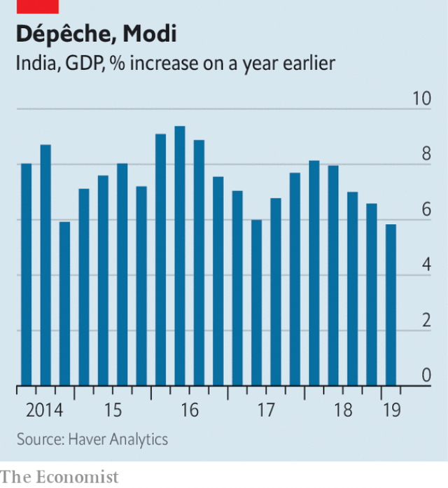

###### Time for a makeover

# In its second term, will India’s ruling coalition be bolder about reform? 

 

> print-edition iconPrint edition | Finance and economics | Jun 6th 2019 

INDIA’S NEW finance minister, Nirmala Sitharaman (pictured below), is an unusual figure in the country’s politics. She is the first woman to head the finance ministry since Indira Gandhi seized the post (while also serving as prime minister) 50 years ago, after nationalising many of India’s banks. She is an economist. But unlike most in her Bharatiya Janata Party (BJP) she hails from the country’s south, having grown up in Tamil Nadu, one of the few big states to resist the BJP’s advances in the recent election. She claims a humbler background than her predecessor, Arun Jaitley. Her father worked for India’s railways and she spent a month selling home furnishings at Habitat, a shop in London. 

Ms Sitharaman thus embodies the BJP’s broadening appeal to aspirational Indians outside its traditional heartlands. But will she help it fulfil those aspirations? On the day she was appointed, India’s statistical authority reported that growth in the first quarter of the year had slipped to 5.8%, its slowest since Narendra Modi was elected prime minister in 2014 (see chart). The government also belatedly released a report it had withheld showing that unemployment had risen to 6.1% in the year ending June 2018. In India, the jobless are often not the poorest, who cannot afford not to work, but the newly educated, qualified for better jobs that have yet to arrive. 

 

The prospects for a quick economic recovery depend partly on the banks Ms Gandhi nationalised. They are responsible for most of the bad loans that have long clogged lenders’ balance-sheets. Optimists point out that the share of bad loans has begun to fall. And several troubled banks have been permitted to expand credit after a more lenient official was put in charge of their regulator, the Reserve Bank of India (RBI), the country’s central bank. 

The RBI cut interest rates for the third time this year on June 6th. It must also keep a close eye on India’s lightly regulated “nonbank” lenders. They have kept credit flowing to households and industry in recent years, financing themselves by selling bonds and commercial paper to yield-hungry mutual funds, until one lender defaulted in September 2018. 

The prospects for a cyclical recovery seem brighter than the chances of deeper reform. Ms Sitharaman is unlikely to enjoy the same autonomy given to Mr Jaitley, a cabinet heavyweight who helped pave Mr Modi’s path into national politics. His departure due to ill health may mean his boss takes a closer interest in economic affairs. That is not necessarily a good thing. 

As chief minister of Gujarat, Mr Modi excelled at drumming up investment from big corporations and breathing down civil servants’ necks. But that approach has translated less well to the role of prime minister, which requires more indirect methods, such as creating the right incentives and delegating to the right people. A bureaucrat quoted in “The Lost Decade”, a new book by Puja Mehra, talks of long, tedious meetings, in which Mr Modi would monitor his policies’ implementation and the civil servant would scoff the peanuts and chickpeas. 

After Mr Modi’s first victory in 2014, liberals hoped the pro-business tub-thumper would become a pro-market prime minister, encouraging investment by liberalising labour and land laws, relying on statecraft, not stagecraft. Instead he became what Indians call “pro-poor”, providing a multitude of redistributive welfare schemes, such as cash handouts for small farmers. 

These schemes seemed inspired by the government’s lingering fear of being outflanked on the left. It largely abandoned its efforts to ease the acquisition of land for industrial purposes after Rahul Gandhi, the leader of the opposition Congress party, accused it of being a “suit-boot ki sarkar”—a government for suited-and-booted corporations. It was slow to help public-sector banks write off their bad loans, in part because it did not want to appear soft on crony capitalists. 

Since this timidity helped win it a second landslide, Mr Modi would seem to have little reason to abandon it. But perhaps his victory has finally killed his fear of the opposition. Ms Sitharaman was described as a “one-person demolition squad” after her impassioned response in parliament to Mr Gandhi’s accusations of government cronyism. Having bulldozed the opposition, perhaps Mr Modi will now feel emboldened not to copy it. ◼ 

