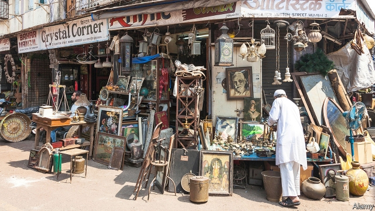
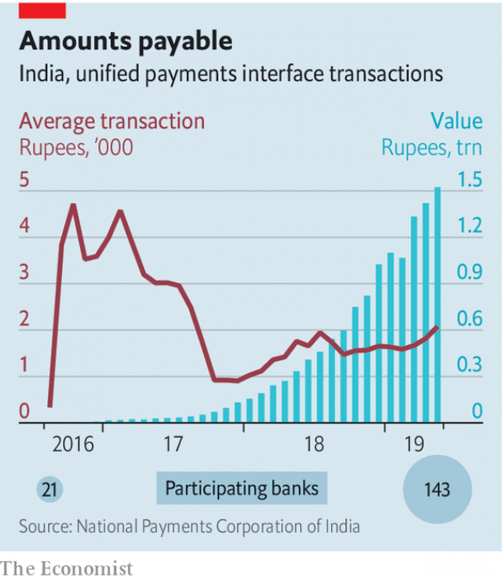

###### E-rupification

# Indians are switching to digital payments in droves 

 

> print-edition iconPrint edition | Finance and economics | Jun 6th 2019 

THE ALLEYS of the 150-year-old Chor (Thieves’) Bazaar, a colourfully named flea market in Mumbai, are crammed with goats, used tyres, speakers, drills and other assorted ephemera. But even in this unlikely place, modern payment methods are gaining a foothold. In stalls abutting the market, bags of sand can be paid for by providing a phone number or scanning a QR (quick response) code. Many countries have seen digital payments take off in the past few years; in India, where little over a decade ago a cheque could take more than two weeks to clear, it feels like a revolution. 

It is one that has been shaped, not always intentionally, by government policies. September 2010 saw the arrival of Aadhaar, a system of biometric IDs that could be used to open a bank account. After becoming prime minister in 2014, Narendra Modi chivvied bankers to open accounts for everyone. Around 360m basic “Jan Dhan” (people’s wealth) accounts were opened, adding to the 243m accounts already in existence. But many sat empty, or held just a rupee or two put in by banks under government pressure to reduce the number of zero-balance accounts.  

Two further developments gave those unused accounts a purpose. The first was the launch in 2016 of the Unified Payments Interface (UPI), an interbank money-transfer system. The second was “demonetisation” later that year, when 86% of banknotes in circulation were recalled. That caused economic carnage—but also gave digital payments a galvanic boost. Paytm, India’s largest digital-wallet firm, took out ads thanking Mr Modi for the move. 

 

Paytm now claims 371m users. PhonePe, a subsidiary of Walmart-owned Flipkart, claims more than 150m, and BHIM, run by a government-led bank co-operative, 46m. The value of digital transactions has risen more than 50-fold in the past two years, with many more smaller payments (see chart). Even the drivers of Mumbai’s three-wheeled auto-rickshaws have begun accepting payments that go through UPI to their (presumably new) bank accounts. 

China’s giant payment apps, WeChat and Alipay, send transfers between their digital wallets, going through an official clearing house. Cryptocurrencies, which some tout as a possible future for digital money, touch the regulated financial system only when they are bought and sold. By contrast India’s pioneers, which started with digital wallets, are fast becoming interoperable with UPI, which sends money directly between bank accounts. The result is both well integrated with the banking system and flexible enough to allow innovation in serving customers. 

Regulators are happy with the system, says Saurabh Tripathi of BCG, a consultancy, since it protects deposits, increases financial inclusion and cuts tax evasion from unreported cash deals. It also suits banks, since they get fine-grained information on transactions that can be used for credit analysis and product customisation. 

The global tech giants like the look of it, too. Google Pay is already available in India and Amazon Pay plans to launch soon. WhatsApp, which has 300m Indian users, has run a trial of a payments service with 1m of them, though the government’s requests regarding privacy and data-localisation are delaying it going nationwide. The success of other dominant chat apps that have moved into payments, such as WeChat Pay in China and Kakao Pay in South Korea, suggests that whenever its launch happens, it will go with a bang. ◼ 

