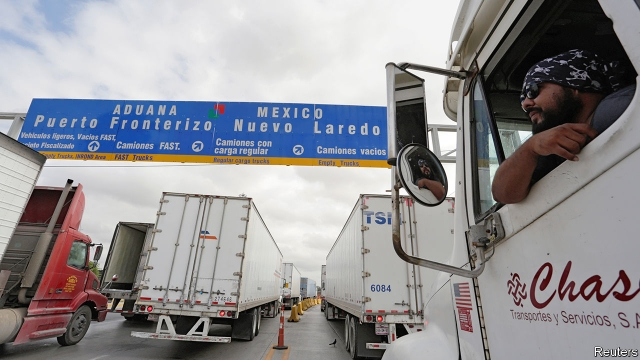
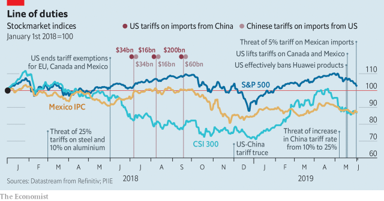

###### Bully for you

# President Donald Trump is trashing deals in favour of tariffs 

 

> print-edition iconPrint edition | Finance and economics | Jun 8th 2019 

NEW FRONTS in President Donald Trump’s assault on the global trading system are opening up by the day. On May 30th he dropped a bombshell on Mexico, threatening a 5% tariff on all its exports to America, rising to 25% by October if immigration flows do not fall (see article). On May 31st he turned to India, announcing the end of longstanding trade preferences on around $6bn-worth of its exports to America. A proposal is being considered to enable the administration to increase tariffs on imports from countries deemed to be manipulating their currencies. The appointment of judges to the court of appeals of the World Trade Organisation (WTO) is being blocked. Japan and the European Union are on notice that America may impose tariffs on their cars. Meanwhile the biggest trade fight of all, with China, is getting bloodier. 

The trade element of Trumponomics is a striking departure from previous administrations’ policies, and a stiff challenge to the multilateral trading system. But critics must face some uncomfortable truths. The first is that some of America’s frustrations with its trading partners are justified. China’s system of subsidies and state-directed capitalism harms competing firms elsewhere, and raises questions about surveillance and security. India’s protectionism has long been an obstacle to trade liberalisation. And the WTO’s dispute-settlement system has serious weaknesses. 

Moreover, America has the strength to force others to comply with many of its demands. Although its share of the world economy (measured at market prices) has fallen from 38% in 1969 to 24% this year, it is still the world’s most important commercial market. When previous tariffs on Mexican and Canadian steel and aluminium were removed, trade between the three North American countries was still more restricted than before. But Mexicans and Canadians celebrated their loss as a win, since it could have been much worse. 

Mr Trump may even succeed in creating some manufacturing jobs in America, as companies respond to the risk of new tariffs by deciding to serve a greater share of the domestic market from within. Tariffs certainly seem to be spooking some into avoiding China. Analysts at Bank of America Merrill Lynch report that companies are increasingly sourcing from elsewhere, and “localising”—that is, increasing production capacity in markets where they sell. 

 

Finally, low tariffs are unlikely on their own to derail the affected economies. Currencies and commodity prices fluctuate all the time, says Paul Bracher of Frost Bank, a Texas-based supplier of trade finance, and though a 5% tariff would crimp his customers’ profits, as margin compressions go it would be “not that big”. 

But a 25% tariff would be a “game-changer”, he says, as few companies could adjust fast enough to avoid them. The Mexican government would retaliate, and business confidence in America would suffer. (On June 4th Jerome Powell, the Federal Reserve’s chairman, hinted that it would cut interest rates if necessary.) Economists at Citibank calculate that 25% tariffs could cause Mexico’s GDP to contract by 4.6% if prices and exchange rates do not adjust, or crush the value of the peso by 59% if they do. These figures were not intended as predictions, but to make the point that “the consequences of this policy could be so extreme we see it as unlikely to happen”. 

Chinese officials are drawing up a list of “unreliable entities”, which could mean sanctions for American companies complying with their government’s ban on sales to Huawei, a Chinese telecommunications company. Erin Ennis of the US-China Business Council, a lobby group, worries that America is pushing past the point at which China will be persuaded to change its policies. Mr Trump’s tariffs may well result in the Chinese government increasing subsidies, she says, in order to speed up the development of domestic goods and services that can replace foreign ones. 

Indeed, Mr Trump may even have pushed his own party too far. America’s constitution says that trade policy falls to Congress, though over time Congress has delegated certain powers to the president. He has tested the limits of that delegation, for example by claiming national security as justification for tariffs on imported steel and aluminium. But the latest threat of tariffs on Mexican imports requires him to declare a state of national emergency, which Congress has the power to override. Even if it declines to, a court might. John Murphy of the US Chamber of Commerce, a business group, says that “the Chamber is examining all legal options”. 

In its admirers’ telling, Trumponomics is muscular pragmatism. Regarding China, they say that earlier efforts failed and multilateral approaches are timid or naive. If you believe that trade weakens economies and steals jobs, it all makes sense. 

But it also sits ill with Mr Trump’s glee when he actually agrees to a trade deal. Last November he signed one with Mexico and Canada, the USMCA, and boasted of making progress in talks with China. The president can be a dealmaker, or, in his own phrase, a “tariff man”. He cannot be both. ◼ 

