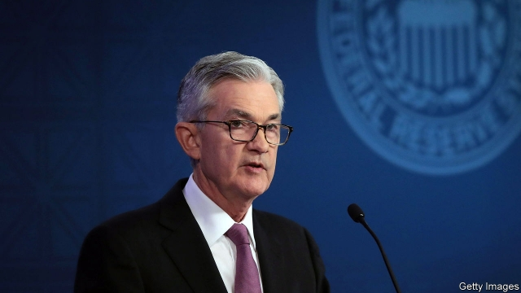

###### Evolutionary road

# The Federal Reserve is reviewing its monetary-policy framework 

 

> print-edition iconPrint edition | Finance and economics | Jun 6th 2019 

“MOST OF AMERICA thinks the Federal Reserve is a national forest.” That reminder that the general public has little idea what a central banker does was offered by an incumbent governor of the Federal Reserve to Alan Blinder when he joined in 1994. He passed it on 25 years later, on June 4th, to a star-studded group of economists and policymakers gathered at the Federal Reserve Bank of Chicago to discuss the Fed’s first public review of its framework. 

The review is a year-long exploration of how the Fed should adapt to trying economic times. It typically slashes interest rates by around five percentage points in a recession. But chronically low rates mean that it now has less than half of that room for manoeuvre. The Fed is seeking to answer three questions. Should it update its forward-looking inflation target to consider past inflation too? Should its toolkit be expanded? And could it communicate and implement its policies better? 

What connects all three is the difficulty of managing expectations. At the effective lower bound, where interest rates are at or very near to zero, the Fed cannot simply slash short-term rates. It must either try other sorts of interventions in financial markets—or make promises and hope they are believed. In theoretical models, such expectation management can be extraordinarily powerful. If the Fed can convince consumers that it will maintain loose monetary policy, they may open their wallets, thereby helping to end the slump. 

Lars Svensson of the Stockholm School of Economics argued for an average inflation target, on the grounds that it could move inflation expectations in the right direction when interest rates hit the lower bound and would be relatively easy to communicate. It could also allow the Fed to rely less on big financial interventions such as quantitative easing, which other speakers warned could mean risks to financial stability building up. 

A move in that direction seems possible. But it seems unlikely that the Fed will eventually decide that a radical rethink is needed. In part, that is because of mounting evidence that its tools did not perform so badly last time round. Janice Eberly of Northwestern University, James Stock of Harvard University and Jonathan Wright of Johns Hopkins University argued that from 2012 the Fed’s actions contributed meaningfully to the recovery, and indeed could be implemented even more aggressively to speed up future recoveries. And Eric Sims and Jing Cynthia Wu of the University of Notre Dame argued that there is more scope to replace conventional policy with quantitative easing than with either forward guidance or negative interest rates. 

Jerome Powell, the Fed’s chairman, emphasised that he was coming to the review with an open mind. But he also said that in the depths of the crisis policymakers had “major questions” about whether promising good times ahead “would really have moved the hearts, minds, and pocketbooks of the public”. 

That doubt is scary for central bankers, whose power comes from their credibility. Perhaps in the current calm the public could be readied for a recession-busting exercise in persuasion. But however earnestly a Fed governor pledges to boost inflation in slumps, a successor may tighten if inflation surges. It is therefore reasonable to doubt that the Fed can keep its promises. The danger for central bankers is that they try to manage expectations, fail—and leave their credibility in tatters. ◼ 

