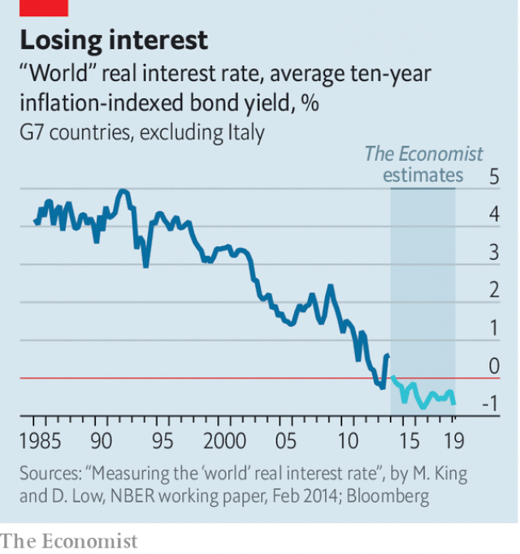

###### Buttonwood

# The long-term decline in bond yields enters a new phase 

 

> print-edition iconPrint edition | Finance and economics | Jun 6th 2019 

AT THE END of 1989, an American in London received a call from a friend back home. The caller had watched the fall of the Berlin Wall and the toppling of Nicolae Ceausescu in Romania with growing dismay. He was at the end of a four-year course in Russian Studies at an elite university with hefty tuition fees. He had learned all the Kremlinology a would-be cold warrior could need—but not that the cold war might suddenly end. “I just took a $60,000 bath,” he said. 

This story comes to mind not so much because of fears of a new cold war, this time with China, but because of the bond market’s recent response to such fears. Long-term interest rates have tumbled almost as swiftly as communism fell in Europe. The yield on a ten-year Treasury bond has plunged from 2.5% to 2.1% in the past month. Ten-year Bund yields have turned negative again and have reached a new all-time low. 

What happens to long-term interest rates in large part reflects what is expected to happen to short-term rates. The bond market’s Kremlinologists expect the Federal Reserve to cut them soon. Other central banks will seek to keep money easy. One consequence is that the secular decline in real interest rates is unlikely to reverse soon (see chart). The implications are far-reaching: the whole edifice of asset prices is founded on a low-rate regime. But what if that regime were to come to an abrupt eventual end? 

 

It is hard to be truly confident about the future path of real interest rates. The reasons for their decades-long decline are not well understood or agreed upon. One school stresses an increased desire for saving. Demographic change is part of this story. As a large chunk of the rich world’s population approaches the end of their working lives, they seek to set aside more of their income for retirement. The integration of high-saving China into the world economy is another factor. In this view, long-term interest rates had to fall simply to clear the saturated global market for savings. 

Another school says that low bond yields are a distortion caused by the policies pursued by central banks in the rich world. They have kept short-term interest rates close to (or in some cases below) zero for much of the past decade. They have also spent trillions of dollars buying government bonds with the explicit goal of driving down long-term interest rates. In their defence, central bankers say they set interest rates to keep the economy purring. If they had pressed down too hard on the monetary pedal, the result ought to be a burst of rising prices. 

In the absence of rising inflation it seems reasonable to expect that the era of low interest rates will last. If yields on the safest government bonds remain low, the expected returns on other assets—the earnings yield on equities, say, or the rental yield on property—should stay in line. The result would be that all assets will continue to look expensive relative to their long-run averages. 

As logical as this seems, it is nevertheless disquieting. At some stage the influences that have pushed down yields will attenuate, even if this is not soon. Long-term interest rates will surely rise again. It is reasonable to believe that this will not be sudden. Demographic change happens slowly. So perhaps asset prices will adjust slowly to the new reality, whenever it dawns. But it is quite hard to imagine a world in which real interest rates grind upwards and asset-holders avoid taking a capital loss, says Shamik Dhar of BNY Mellon, a fund-management group. The uncertainty about the timing of even a gradual adjustment creates headaches, for instance for someone hoping to own a home. Buy at the wrong time, and you end up with a house that slowly loses value. 

And what if real interest rates rise a lot more quickly than they fell? Well, they might. China is already a spent force in the global savings glut: its current-account surplus has dwindled to next to nothing. Baby-boomers moving into retirement might step up their spending. If rich countries turn once again to fiscal policy as a tool for ginning up their economies, there are plenty of asset-heavy projects (airports, roads, fibre-optic networks) to soak up savings. 

Kremlinologists look for signs of shifting authority, for who’s up and who’s down. But when everyone is focused on who will be the next boss, they may all miss signs that the regime itself is cracking. For now, financial-market Kremlinologists are preoccupied with which assets to hold and which to avoid. But at some point capital will become scarcer. Somebody may find that they have taken an expensive bath. 

