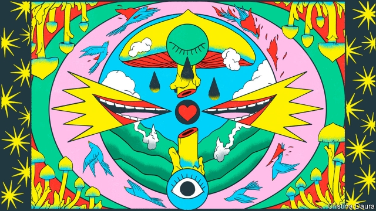
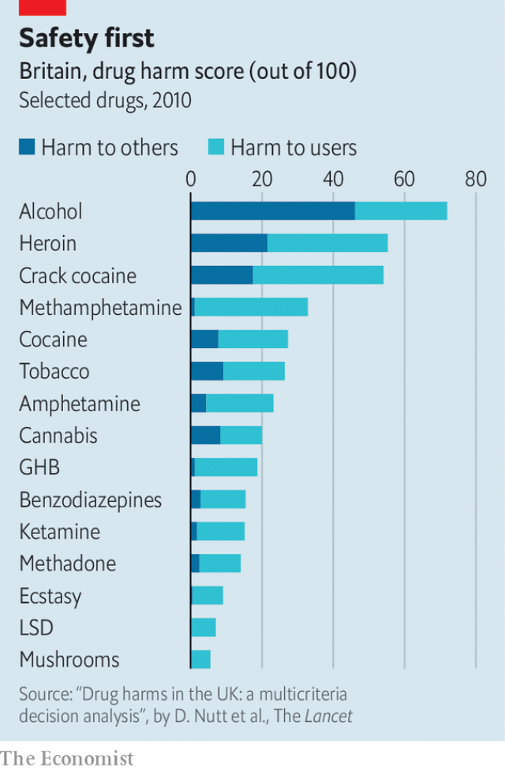

###### What the dormouse said

# Magic mushrooms, illegal in most places, may have therapeutic uses 

 

> print-edition iconPrint edition | International | Jun 8th 2019 

“MY CHILDHOOD was similar to those of many immigrants: my parents were under a lot of stress, and there was violence and alcoholism in the family,” says Carlos Plazola. “When I was under stress, I reacted with fear and anxiety. I always regretted my responses, but I couldn’t override them. After a mushroom journey, I found new ways to respond that included compassion and empathy.” That is why Mr Plazola joined Decriminalise Nature Oakland, a group which this week persuaded the council of the Californian city in effect to tolerate the consumption of magic mushrooms and other psychoactive plants and fungi. Last month Denver voted to do the same, but just for magic mushrooms. A campaign in Oregon wants to legalise their use by registered therapists. A Republican state senator in Iowa, Jeff Shipley, has filed a bill to allow the use of psilocybin and other hallucinogens for medical purposes. 

After half a century, psychedelic drugs are inching in from the cold. Magic mushrooms, whose active ingredient is psilocybin, are in the vanguard. 

Attitudes towards the drug may be moving back towards those prevalent in the 1950s and early 1960s, when psychedelics elicited interest rather than horror among ordinary Americans. The name “magic mushrooms” was coined, improbably, by a headline writer in stodgy old Life magazine. The magazine’s owner, Henry Luce, who had been taking LSD with his wife, had commissioned a banker friend to write about taking part in the secret mushroom ceremonies that had persisted in Latin America for centuries after the drug was suppressed by the Spanish invaders. 

The therapeutic potential of psychedelics was discussed by scientists and enthusiasts. Bill W, co-founder of Alcoholics Anonymous, said he got sober with the help of a hallucinogen—the seeds of Belladonna, or deadly nightshade. Over 1,000 research papers, involving 40,000 volunteers, are reckoned to have been published in the period looking into their potential for treating a wide range of mental ills. But the research effort was scuppered by the moral panic sparked by Timothy Leary, founder of the Harvard Psilocybin Project, who, to the horror of parents and politicians, urged America’s young to “turn on, tune in and drop out”. 

Magic mushrooms were banned in America in 1970, and are listed as Schedule 1 drugs by the UN, an assessment meaning that the potential for abuse outweighs their medicinal potential. Though barred in most of the world, psilocybin is legally available in a few places, such as Jamaica and the Netherlands, which has led to a small but flourishing psychedelic-tourism business (see article). 

But things are changing, for a few reasons. That the widespread decriminalisation of marijuana in America did not bring the social and moral collapse some detractors predicted has opened minds to the possibility of doing the same for other drugs. Psychedelics have enjoyed a vogue in Silicon Valley. Steve Jobs said taking LSD was “a profound experience, one of the most important things in my life”. And consuming tiny doses of psychedelics to enhance productivity is fashionable these days. Influential pundits such as Sam Harris discuss their potential. 

All this has helped rehabilitate psychedelics. But the main reason for the revival of interest is probably the determination of a group of scientists. A few of the older ones first worked on the drugs in America in the earlier wave of research; they have been joined by a younger, transatlantic band. Earlier this year, Imperial College in London opened the world’s first Centre for Psychedelic Research. 

The scientists’ findings are reaching a wider public through, for instance, the journalism of Michael Pollan, who last year published “How to Change Your Mind”, a book about the history and use of psychedelic drugs. In the words of Del Jolly of the victorious decriminalisation campaign in Denver: “There’s so much information out there. Healthy normals are beginning to understand the potential of these things.” 

There are plenty of psychedelics researchers could work on, but the focus is on psilocybin. That is partly because nobody has heard of it, so, unlike LSD, it does not raise hackles. It is also relatively easy to synthesise. Since 2006, when the results of the first of the new wave of studies was published, there have been a dozen papers showing that it may be a useful treatment for obsessive-compulsive disorder, tobacco addiction, alcoholism, depression and the anxiety that so often afflicts people when they are approaching death. 

Research has gone slowly because of the drug’s illegality. Getting funding can be difficult. David Nichols, a former professor of medicinal chemistry and pharmacology at Purdue University, Indiana, who first worked on psilocybin in 1969, founded the Heffter Institute because he knew that governments would be loth to fork out for research into illegal drugs. Backed by philanthropists, it has paid for a lot of research. 

The paperwork is horrendous. It took Peter Hendricks at the University of Alabama at Birmingham, who is conducting trials on the impact of psilocybin on cocaine addiction, six or seven years to overcome the bureaucratic hurdles. Because so little psilocybin is produced, getting hold of it is tricky and expensive. According to David Nutt, professor of neuropsychopharmacology at Imperial, and a former adviser to the British government (famously sacked for saying that horse-riding accidents did more damage than ecstasy), each dose of psilocybin used in Imperial’s trials has cost around £1,500 ($1,900). 

The trials are mostly small—only a couple involve more than 50 patients—and some have no placebo comparison. But the results are encouraging. A study at Imperial followed 12 patients with treatment-resistant depression. Nine were classed as seriously and three as moderately depressed; three months after taking a dose of psilocybin, one was seriously and six were moderately depressed, while five were no longer depressed. A study at Johns Hopkins University (JHU) of 51 patients with late-stage cancer suffering from depression and anxiety found that four-fifths had statistically significant improvements in their mood after six months; another at the same university into tobacco addiction found that six months after a dose of psilocybin 80% of volunteers had not had a cigarette for a week. The JHU study covered just 15 patients, who also benefited from a lot of psychological support. But the rates for the various drugs on the market is 25-35%. For cognitive behavioural therapy, it is 17%. 

How the drug works is a bit of a mystery. It induces perceptions and sensations that range from heaven to hell (a terrifying bad trip), and commonly include a sense of oneness with the universe and of the revelation of a great, spiritual truth. A third of the 36 patients in a trial carried out at JHU rated its effects as the most profound spiritual experience of their lives; a further third said it was in the top five. That aspect seems to be essential to its efficacy: several studies have shown that the more profoundly mystical the experience, the greater the therapeutic effect. 

Magnetic resonance imaging gives some clues to what is going on. Psychedelics seem to act in part through the default mode network (DMN), an interconnected group of bits of the brain that switch on when people remember the past, imagine the future or ruminate on themselves, and which is overactive in depressed people. When people take psychedelics, the DMN switches off; at the same time, other bits of the brain communicate with each other more than they normally do, perhaps forging new neural pathways that override old, destructive patterns of thinking. So it may be that these drugs tackle mental problems on a higher level than existing medicines and can thus act across a wide range of disorders. Matthew Johnson, of JHU, likens their effects to “a reboot of the system—it’s like pressing control-alt-delete”. 

A study at JHU highlights another interesting parallel: that what is happening in the brain resembles what happens to those who meditate intensely. “It may be that what you get from psychedelics is a crash course in the effects that you could get from a long-held meditation practice,” says Dr Johnson. “My expectation would be that the self-control and cognitive benefits from meditation couldn’t come from a crash course. But in terms of the enhanced sense of self, this may be a helicopter ride to the top of the mountain, while those on the meditation path are hiking up.” 

Researchers are excited. Depression and addiction are huge problems: 300m people worldwide suffer from depression, according to the WHO; 8m people die from tobacco addiction every year; and America is suffering from an opioid epidemic. Existing medicine for addiction, such as methadone for heroin, or nicotine substitutes for tobacco, is not very effective. And as Dr Nutt points out, no serious advances have been made in drugs for depression for 30 years. A variant of ketamine, a widely abused controlled drug, has recently been licensed for use in America in the most serious cases of depression, but its effect lasts only about a week. Psilocybin’s seems to persist for at least six months. 

America’s Food and Drug Administration has given “breakthrough” status to psilocybin trials being conducted by a British company, Compass, whose seed investors include Peter Thiel, a tech billionaire. Compass is undertaking the first large-scale trial of the safety, efficacy and appropriate dosage of psilocybin for treatment-resistant depression. “Breakthrough” status means that “the drug may demonstrate substantial improvement over existing therapies”, and the FDA is keen to “expedite” its licensing. Compass is seeking a patent for a particular molecular form of psilocybin and the process to manufacture it. The drug’s current illegality will not be a problem if the FDA approves it. “If the science holds,” says Ekaterina Malievskaia, one of Compass’s co-founders, “there are no political and ideological hurdles.” 

Compass’s patent application is raising a few eyebrows in the field. Some researchers feel that psilocybin is a spiritual gift which people have enjoyed for millennia and nobody should try to own. Usona, a non-profit founded by Bill Linton, CEO and founder of Promega, a biotech company, and Malynn Utzinger, a doctor, is also starting a trial—for “major” depression, a broader category than “treatment-resistant” depression. It is funded by philanthropy and is not seeking a patent: “We feel the work we’re doing is so transformational that we’re best serving the world by not attempting to monopolise treatment through patents,” says Mr Linton. 

But there are also questions about whether Compass will be able to make money. Synthesised psilocybin will certainly be needed, for although magic-mushroom cultivation is widespread, whether decriminalised or not, sick people will need to be given controlled quantities in a safe, cheerful environment, not a handful of Psilocybe mushrooms. 

Even so, as Mr Linton points out, “This molecule has been synthesised many times since 1958 [when Albert Hoffmann, the chemist who discovered LSD, first did so]. There are many synthetic routes to reach the final product, and it is highly unlikely that anyone could obtain a blocking patent.” Compass, however, might gain a commercial edge if its particular molecular form gets FDA approval and a patent. 

There is a long way to go yet. Few drugs make it through the FDA process, and even if everything goes swimmingly, psilocybin will not be on the market for four or five years. Some of the drug’s proponents worry that decriminalisation could jeopardise its progress by reigniting the moral panic of half a century ago. Mr Pollan, generally an enthusiast, cautions against “premature decisions about psychedelics before the researchers have finished their work”. 

 

Although psilocybin seems safe compared with other mood-altering drugs (see chart), messing with your mind is inherently risky. “People will get hurt,” says Brad Burge of the Multidisciplinary Association for Psychedelic Studies. “That’s inevitable. People will drive when on magic mushrooms. That can lead to a pushback.” But nobody in the field wants to prolong a situation in which, in the words of Cindy Sovine, who worked on the decriminalisation campaign in Denver, “people are going to jail and losing their children” for personal use of a drug that can bring pleasure and enlightenment. 

In the current climate, progress towards a more liberal regime, whether through the medical or the legal route, is likely to continue. After all, as Max Planck, a great physicist, put it: “A new scientific truth does not triumph by convincing its opponents and making them see the light, but rather because its opponents eventually die.” ◼ 

