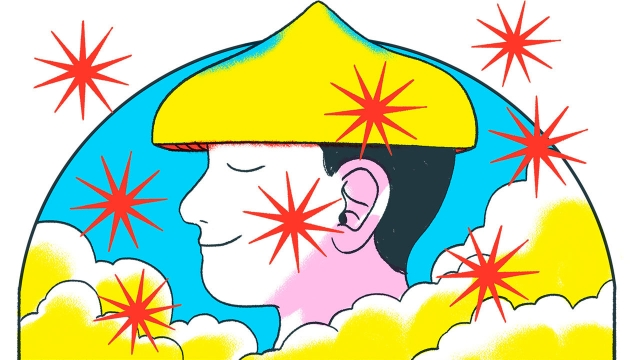

###### Blissing out

# Psychedelic tourism is a niche but growing market 

 

> print-edition iconPrint edition | International | Jun 8th 2019 

“IT WAS LIKE being transported into a parallel dimension of eternal unfolding completeness and divine bliss. Very powerful, direct and overwhelming. It was a big surprise, but also incredibly obvious. A ‘Doh!’ moment, rather like Homer Simpson,” says Guy, a South African who runs an online-marketing company from Stockholm, and who attended a retreat last month organised by the Psychedelic Society, a British outfit, at a rural artist’s haven in the north-east of the Netherlands. 

Magic mushrooms were banned in the Netherlands in 2007, after a 17-year-old partaker jumped off a bridge. But “truffles”, a form of the mushrooms that grow underground, are legal, and underpin a growing business in weekend trips. Prices for the Psychedelic Society’s retreats range from £550 ($700), for those on low incomes, to £1,200. Applicants are screened to weed out people who should not take the drug, such as those who have had psychotic episodes. The society has organised retreats for three years and now runs one most weekends. The waiting list is in the hundreds. 

At the one Guy joined in May, nationalities ranged from American through a range of Europeans to Chinese; motivations from mild curiosity, through a sense of being emotionally or professionally stuck, to grief. Guy hoped to “mend my broken heart”: his partner had left him and their one-year-old son two years earlier. “I’m surviving, and I want to be living.” 

The retreats are organised around a “ceremony”, in which participants, lying on mattresses, drink a tea made from truffles. While they trip for five or six hours, four facilitators stay with them, to hold their hands if they get scared or listen to their babblings. The rest of the time is taken up with exercise, dance and “group work” (on, for instance, lowering emotional defences). Lode Lhamo, a French facilitator who adopted a Tibetan name after becoming a Buddhist in India, says the whole team is motivated by “the level of wounding and pain that people carry. We can’t really transform society unless people heal themselves.”  

Competition is growing. Synthesis Retreats started last year and expects 600-700 clients in 2019 and twice as many next year. Martijn Schirp, a founder, thinks about 20 firms offer a similar service in the Netherlands. There are others in Mexico, where possession has been decriminalised, and Jamaica, where mushrooms are legal. “This whole space is buzzing. There are converging trends: the psychedelic renaissance, wellness, and people looking to buy experiences rather than things,” says Mr Schirp.  

A few weeks on, Guy does not think his life has been transformed, but he is grateful for the experience and things are going a little better with his ex. “I had a conversation with her, about things like money, schedules and holidays. The kind of conversation that would normally be difficult. But when things escalated, I was able to pull back a bit.” He feels things have somehow shifted. “I don’t want to make out this is a broken-heart medicine, but even if it’s a trick of the mind, it kind of worked.” 

