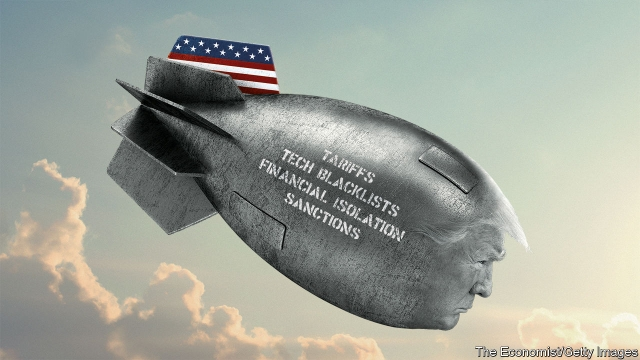

###### Weapons of mass disruption

# America is deploying a new economic arsenal to assert its power 

 

> print-edition iconPrint edition | Leaders | Jun 6th 2019 

WHEN DONALD TRUMP arrived in the Oval Office he promised to restore America’s might. His method has turned out to be a wholesale weaponisation of economic tools. The world can now see the awesome force that a superpower can project when it is unconstrained by rules or allies. On May 30th the president threatened crippling tariffs on Mexico after a row over migration. Markets reeled, and a Mexican delegation rushed to Washington to sue for peace. A day later preferential trading rules for India were cancelled. Its usually macho government did not put up a fight and promised to preserve “strong ties”. China faces a ratcheting up of tariffs soon, and its tech giant, Huawei, has been severed from its American suppliers. The country’s autocratic leaders are enraged, but on June 2nd they insisted they still seek “dialogue and consultation”. A tighter embargo on Iran, imposed over European objections, is strangling its economy. 

President Trump must view this scene with satisfaction. Nobody takes America for granted any more. Enemies and friends know that it is prepared to unleash an economic arsenal to protect its national interest. America is deploying new tactics—poker-style brinkmanship—and new weapons that exploit its role as the nerve centre of the global economy to block the free flow of goods, data, ideas and money across borders. This pumped-up vision of a 21st-century superpower may be seductive for some. But it could spark a crisis, and it is eroding America’s most valuable asset—its legitimacy. 

You might think that America’s clout comes from its 11 aircraft-carriers, 6,500 nuclear warheads or its anchor role in the IMF. But it is also the central node in the network that underpins globalisation. This mesh of firms, ideas and standards reflects and magnifies American prowess. Though it includes goods traded through supply chains, it is mainly intangible. America controls or hosts over 50% of the world’s cross-border bandwidth, venture capital, phone-operating systems, top universities and fund-management assets. Some 88% of currency trades use greenbacks. Across the planet it is normal to use a Visa card, invoice exports in dollars, sleep beside a device with a Qualcomm chip, watch Netflix and work for a firm that BlackRock invests in. 

Foreigners accept all this because, on balance, it makes them better off. They may not set the rules of the game, but they get access to American markets and fair treatment alongside American firms. Globalisation and technology have made the network more powerful although America’s share of world GDP has fallen, from 38% in 1969 to 24% now. China cannot yet compete, even though its economy is approaching America’s in size. 

Despite this, Mr Trump and his advisers are convinced that the world order is rigged against America, pointing to its rust-belt and its trade deficit. And rather than mimic the relatively restrained tactics of the last trade conflict, with Japan in the 1980s, they have redefined how economic nationalism works. 

First, instead of using tariffs as a tool to extract specific economic concessions, they are being continuously deployed to create a climate of instability with America’s trading partners. The objective of the new Mexican tariffs—fewer migrants crossing the Rio Grande—has nothing to do with trade. And they breach the spirit of USMCA, a free-trade deal signed by the White House only six months ago, which will replace NAFTA (Congress has yet to ratify it). Alongside these big fights is a constant barrage of petty activity. Officials have skirmished over foreign washing machines and Canadian softwood lumber imports. 

Second, the scope of activity has been extended beyond physical goods by weaponising America’s network. Outright enemies such as Iran and Venezuela face tighter sanctions—last year 1,500 people, firms and vessels were added to the list, a record figure. The rest of the world faces a new regime for tech and finance. An executive order prohibits transactions in semiconductors and software made by foreign adversaries, and a law passed last year known as FIRRMA polices foreign investment into Silicon Valley. If a firm is blacklisted, banks usually refuse to deal with it, cutting it off from the dollar payments system. That is crippling—as two firms, ZTE and Rusal, discovered, briefly, last year. 

Such tools used to be reserved for times of war: the legal techniques used for surveillance of the payments system were developed to hunt al-Qaeda. Now a “national emergency” has been declared in tech. Officials have discretion to define what is a threat. Though they often clobber specific firms, such as Huawei, others are running scared (see article). If you run a global company, are you sure your Chinese clients are not about to be blacklisted? 

The damage to America’s economy so far has been deceptively small. Tariffs cause agony in export hubs such as northern Mexico, but even if Mr Trump imposes all his threatened tariffs, the tax on imports would be worth only about 1% of America’s GDP. His poll ratings at home have held up, even as they have slumped abroad. His officials believe the experiment in weaponising America’s economic network has only just begun. 

 

In fact, the bill is mounting. America could have built a global coalition to press China to reform its economy, but it has now squandered precious goodwill. Allies looking for new trade deals with America, including post-Brexit Britain, will worry that a presidential tweet could scupper it after it has been signed. Retaliation in kind has begun. China has begun its own blacklist of foreign firms. And the risk of a clumsy mistake that triggers a financial panic is high. Imagine if America banned the $1trn of Chinese shares trading in New York, or cut off foreign banks. 

In the long run the American-led network is under threat. There are hints of mutiny—of America’s 35 European and Asian military allies, only three have so far agreed to ban Huawei. Efforts to build a rival global infrastructure will accelerate. China is creating its own courts to adjudicate commercial disputes with foreigners (see Chaguan). Europe is experimenting with building a new payments system to get round the Iran sanctions, which could in time be used elsewhere. China, and eventually India, will be keen to end their dependence on semiconductors from Silicon Valley. Mr Trump is right that America’s network gives it vast power. It will take decades, and cost a fortune, to replace it. But if you abuse it, ultimately you will lose it.◼ 

