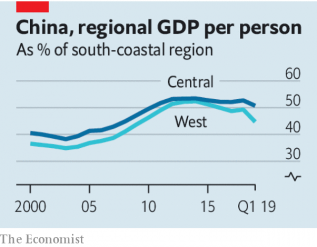

###### Head south, young Chinese

# How China’s government should help its backward regions 

> print-edition iconPrint edition | Leaders | Jun 8th 2019 

IT HAS BEEN a tense few days for the Communist Party in Beijing. Officials were afraid that dissidents would try to commemorate the 30th anniversary of the crushing of the Tiananmen Square protests on June 4th. Censors scrubbed any allusion to it within the Great Firewall. Police kept activists under close watch, escorting some of them out of the capital for an enforced “holiday” during the sensitive period. 

But what is extraordinary about the decades since Tiananmen is how the party has largely succeeded in erasing the massacre from the public’s consciousness. About 40% of the population was not even alive then. Most Chinese would say that the economic boom, which began three years after the bloodshed, has had a far bigger impact on their lives. China’s defence minister, Wei Fenghe, recently said the army’s “resolute measures” in 1989 had “preserved stability” and that “earth-shattering changes” in China showed it was correct. That view has much support in China. Few dare to disagree openly. 

Just as remarkable is that the boom has continued for so long without itself creating much unrest. Consider how uneven it has been. Coastal cities have attained almost rich-world standards of living. Deeper inland, vast swathes of the country, especially rural areas, lag far behind. Schools and hospitals are shabby and life expectancy is low. Many people have moved from the countryside to urban areas in search of work. They typically earn more than they would have done in a village, but are often marginalised. Their urban neighbours, and Chinese laws, treat them as second-class citizens. Compared with the gaping regional divides in China, the rich world’s increasingly visible geographical inequality seems almost trivial. 

 

One reason why there has not been more grumbling in China is that the government has poured huge sums into poor places. It has used tax benefits to get firms to invest in western and central areas. In 2000 the construction of things such as roads, railways and factories accounted for roughly a third of local GDP in all China’s regions. By 2015 that had risen to more than 40% along the wealthy south coast, but to nearly 70% in the west. For years this spending spree worked. By 2013 GDP per person in inland provinces had risen from just one-third of coastal levels to about one-half. 

Since then however, the government’s efforts have proved less effective. The gap has started widening again. Many cities in the interior are still prospering. But coastal regions, especially in the south, are powering ahead and are likely to widen their lead (see article). Indeed, the government’s intervention is increasingly counter-productive. Its heavy-handed approach threatens both growth and social stability. 

First, look at the poorer regions’ economies. Pouring lots of concrete has naturally been a boost. But the regions have far less need now of new infrastructure. It is reasonable to ensure poor places are not starved of public investment, but too often China ignores market signals entirely. It is particularly important that China spends wisely because of its enormous domestic debt, much of which relates to unnecessary building in the interior. It would be better to direct cash at hospitals, schools and job training than to squander it on more empty expressways. 

Then look at the people who live inland—well over half the population. One reason place-based policies are in vogue in the rich world is that many workers have stayed in failing places. The same is true in China—but by design. The government has been maintaining barriers to migration to booming coastal cities and lowering them to inland ones. Far better to let workers move freely by abolishing the pernicious hukou system that restricts migrants’ access to public services outside their home towns. As coastal areas age rapidly, they will need young migrants to keep them as dynamic as they are today. The government should make it easier to move to them, not least by building more affordable housing that anyone, not just locals, can buy. 

A big reason why China has remained relatively stable since Tiananmen is that most Chinese have had hope that their lives will improve. But the next 30 years will be tougher, as the population ages and growth slows. It will become harder for some to sustain their dreams. Putting obstacles in the way of those who wish to seek their fortunes in coastal megacities will needlessly hinder China’s development. ◼ 

