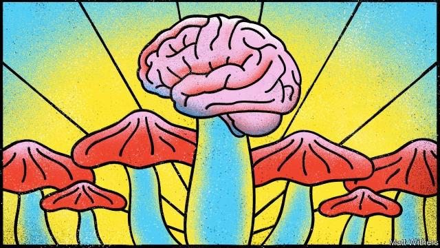

###### Mushroom clouds

# Magic mushrooms should be decriminalised 

 

> print-edition iconPrint edition | Leaders | Jun 8th 2019 

“IT WAS LIKE when you defrag the hard drive on your computer. I experienced blocks going into place, things being rearranged in my mind. I visualised, as it was all put in order, a beautiful experience with these gold blocks going into black drawers that would illuminate and I thought: ‘My brain is being defragged! How brilliant is that!’” said Patient 11 in a small trial carried out at Imperial College, London, into the effects of psilocybin, the active compound in magic mushrooms, on people with depression resistant to available treatments. Six months on, the experience had left its mark. “My mind works differently. I ruminate much less, and my thoughts feel ordered, contextualised.” 

The rehabilitation of psychedelic drugs, banned in most countries, is under way (see article). Oakland, California, in effect decriminalised psychoactive plants and fungi this week; a Republican state senator wants to do the same in Iowa; Denver decriminalised magic mushrooms last month; and campaigns in California and Oregon demand ballots to decriminalise psychoactive plants and legalise the therapeutic use of psilocybin, respectively. 

Half a century ago, the therapeutic potential of psychoactive drugs inspired around 1,000 studies of their impact on various mental ailments. The research was shut down amid the moral panic sparked by Timothy Leary, a psychologist and evangelist for psychedelic drugs, who urged America’s young to “turn on, tune in and drop out” of whatever respectable futures their parents had mapped out for them. Slowly, impeded by the drugs’ legal status, research on psychedelics has started again—mostly on psilocybin, because it is easy to synthesise and does not suffer from the same stigma as LSD (Leary’s favourite). Around a dozen small studies have been carried out at American universities and at Imperial College. They hint that psilocybin, along with supportive psychiatric care, may be an effective treatment for depression, addiction, obsessive-compulsive disorder and the anxiety that often afflicts people when death is approaching. 

At present this is no more than a possibility, but an exciting one. Around 300m people suffer from depression. Around 8m people die from the effects of tobacco every year. America is suffering an opioid epidemic. There has been no major breakthrough in depression medication for 30 years. The only drug recently licensed is a version of another controlled drug, ketamine, which is effective for no more than a week. The world needs more tools to deal with depression and addiction. America’s Food and Drug Administration is interested enough to have given psilocybin “breakthrough” status, which means it wants to expedite its passage through the approvals system. Any resulting drug will have to be administered in controlled settings. Much of its efficacy is likely to depend on the support given by doctors. But the way psilocybin works on people’s brains suggests that it may have a broad potential for addressing mental illness. 

Few will oppose the careful process leading up to the licensing of the drug. But there are worries, even among some of psilocybin’s proponents, about decriminalisation. The drug, it is argued, has a powerful effect on the brain, and not enough is yet known about it. Some people—those with a familial history of schizophrenia, for example—should not take it at all. Researchers fear that a few spectacular accidents involving the drug will reignite the moral panic that slammed the door on the first wave of research. 

Accidents will surely happen. They always do when people mess with their brains. Depending on the country, 12-34% of recreational users of psilocybin have a disturbing experience, and sometimes these have lasting effects. But a large-scale study of Americans showed no association between taking psychedelic drugs and mental health problems. Psilocybin has potential both to heal people’s ills and to give them pleasure. A third of volunteers in a study rated the mystical experience it induced as the most profound of their lives, and another third put it in the top five. It is also, by the standards of other mood-altering substances, pretty safe. It is not addictive, there is no known lethal dose, and—unlike alcohol—any damage is usually restricted to those who take it. 

Certainly, moves to decriminalise psychedelics should be accompanied by campaigns to educate people about the risks. Those who take them should get the setting right—a safe place, with benevolent people and a sober friend around. But humanity should celebrate the fact that it has such powerful medicine available to it, rather than jailing people for taking it.◼ 

