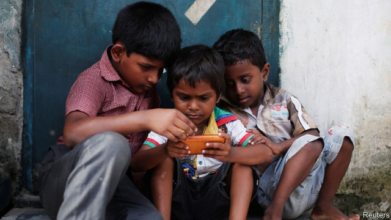

###### The internet’s next act

# The second half of humanity is joining the internet 

 

> print-edition iconPrint edition | Leaders | Jun 8th 2019 

IN 2007 MORE humans lived in cities than outside them for the first time. It was a transition 5,000 years in the making. The internet has been quicker to reach the halfway mark. Over 50% of the planet’s population is now online, a mere quarter of a century after the web first took off among tech-savvy types in the West. The second half of the internet revolution has begun. As our briefing describes, it is changing how society works—and also creating a new business puzzle. 

Most new users are in the emerging world; some 726m people came online in the past three years alone. China is still growing fast. But much of the rise is coming from poorer places, notably India and Africa. Having seen what fake news and trolling has done to public discourse in rich countries, many observers worry about politics being debased, from the polarisation of India’s electorate to the persecution of Myanmar’s Rohingya minority. On the positive side, charities and aid workers talk endlessly and earnestly about how smartphones will allow farmers to check crop prices, let villagers sign up for online education and help doctors boost vaccination rates. 

Less well appreciated is that the main attractions of being online are the same for the second half as they were for the first. Socialising and play, not work and self-improvement, are the draw. Porn is popular. Messaging apps help friends stay in touch, and let migrant workers say goodnight to their children back home. People entertain their friends—and strangers—on social media with goofy home-made videos on YouTube or TikTok, an app focused on short, humorous clips. Cheap data plans and thumb drives bring pirated films to millions who may never have been to a cinema. Dating apps are more popular than farming advice; video games are more popular than either. Such boons are unlikely to make their way into many UN development reports. But they are a boost to the stock of human happiness. 

For businesses, the second half of the internet offers a vast pool of customers. It also brings a headache—most of these new users are too poor to spend very much. Tens of billions of dollars in venture-capital money have flowed into internet startups in emerging markets, excluding China. The Silicon Valley giants have built up big user bases—over 1.5bn Facebook users are in developing countries. YouTube, a video site owned by Google, is increasingly dominated by non-Western users. Last year Walmart spent $16bn buying Flipkart, an Indian e-commerce giant. Jumia, an e-commerce firm with 4m customers in Nigeria and 13 other African countries, floated in New York in April. 

Despite these firms’ punchy valuations, they are still looking for sustainable business models. Reliance Jio, an Indian firm, has sunk $37bn into building a high-speed mobile network and acquiring a big base of mostly poor users. Each Facebook user in Asia generates only $11 of advertising revenue a year, compared with $112 for a North American one. The combined revenue of all the internet firms in emerging markets (excluding China) is perhaps $100bn a year. That is about the same size as Comcast, America’s 31st-biggest listed firm by sales. 

Nonetheless, the impact of these firms on business will get bigger in two ways. First, they will grow fast—although whether fast enough to justify their valuations remains to be seen. To maximise their chances, many are offering not just a single service (such as search or video), as Western firms tended to in their early years, but a bundle of services in one app instead, in the hope of making more money per user. This approach was pioneered in China by Alibaba and Tencent. Go-Jek in Indonesia offers ride-hailing, payments, drug prescriptions and massages. Facebook is pushing a digital payments system in India through its chat service, WhatsApp (see article). 

The second is that in the emerging world, established firms are likely to be disrupted more quickly than incumbents were in the rich world. They have less infrastructure, such as warehouses and retail sites, to act as a barrier to entry. Many people, especially outside the big cities, lack access to their services entirely. Beer, shampoo and other consumer-goods firms could find that as marketing goes digital, new insurgent brands gain traction faster. Banks will be forced to adapt quickly to digital payments or die. Viewed this way, there is a huge amount of money at stake—the total market value of incumbent firms in the emerging world, outside China, is $8trn. If you thought the first half of the internet revolution was disruptive, just wait until you see the second act. ◼ 

