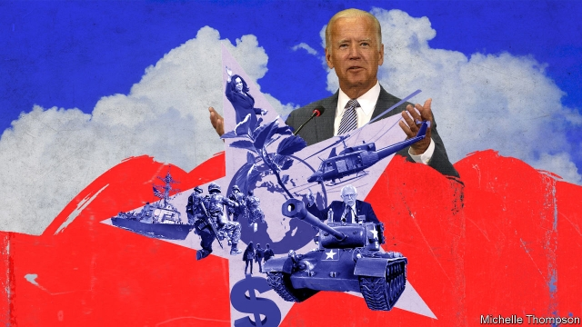

###### On climate change, Uber, foreign policy, abortion, David Cameron, labour markets, Unilever, sheep

# Letters to the editor 

> print-edition iconPrint edition | Letters | Jun 8th 2019 

 

“How climate change can fuel wars” (May 25th) focused on one direction of the connection between conflict and global warming, and not the most direct. 

The primary concern of the International Committee of the Red Cross is that people living in places already affected by conflict are among those most vulnerable to climate risks. This is true in countries such as Nigeria, Somalia, South Sudan and Yemen through the heightened consequences of droughts and floods in conflict areas. 

At the same time, discussions on climate finance in the context of the Paris agreement are intended to consider the most vulnerable, but in practice exclude conflict settings. International support for adaptation must increase, but also avoid marginalising people living in conflict areas. Humanitarian systems must adjust. 

YVES DACCORDDirector-generalInternational Committee of the Red CrossGeneva 

PROFESSOR MAARTEN VAN AALSTDirectorRed Cross Red CrescentClimate CentreThe Hague 

 

Your comprehensive analysis of loss-making companies in the ride-hailing industry (Free exchange, May 11th) ignored one significant factor: the actual income drivers get to keep after expenses. Recent studies show the typical Uber driver in America receives net income of $9 an hour before income tax. This barely meets the legal minimum wage. In new markets like India, drivers are staging protests over their low (and falling) income. And yet you identified payments to drivers as “the juiciest target” for these companies to cut costs. 

The ride-hailing industry’s strategy of predatory pricing cannot be maintained for long. Investors’ goodwill (and deep pockets) will dry up sooner rather than later, and fares will have to rise. The real answer lies in mass-transit systems. 

ACHAL RAGHAVANAdjunct/visiting professorIndian Institute of Management Udaipur 

 

Though Lexington’s evidence on the prospects for America’s Middle East peace plan was solid, his conclusion was questionable (May 11th). It is true that Saudi-Iranian tensions and the rise of China should have American foreign-policy wonks looking in different directions. But the Israeli-Palestinian conflict will remain centre stage for politicians, simply because of the number of interests at play. 

For the Republicans, Israeli-backed lobbyists will continue to play an important role in crafting political strategy. On the Democratic side, the rise of the social-justice movement and a morals-backed foreign policy, espoused by Elizabeth Warren in a recent article in Foreign Affairs, will keep the plight of the Palestinians in the spotlight. As they say, all politics is local. 

EVAN NEBELBethesda, Maryland 

 

Contrary to your article on the Democrats’ new thinking on foreign policy, there is nothing radical or fresh in their ideas (“There’s something happening here”, May 4th). At best, calls for a foreign policy of “greater restraint” and focus on inequality and corruption are a reversion to Barack Obama’s strategy of leading from behind and the human-development priorities presented in his speech in Cairo. In reality, the desire for restraint and rational goals reflects the strong isolationist strand that cuts across party lines and has marked debates about America’s role in the world since the earliest days of the republic. 

There is room for a healthy debate about America’s strategic role post-Donald Trump. But to the degree that discussion is in need of original ideas because the old ones have been found wanting, I suppose nobody’s right if everybody’s wrong. 

KAMAL SIDHUSingapore 

 

Regarding the “law” on abortion in America (“Supremely wrong”, May 18th), many conservatives have a problem with Roe v Wade precisely because the courts, and not the legislature, have set the policy. As the late Antonin Scalia once said: “You want a right to abortion? Persuade your fellow citizens and enact it”. However imperfect the political system may be, at least Alabama’s abortion law has been passed by the state legislature. 

DAN BRENDELAlexandria, Virginia 

Denis MacShane suggested that David Cameron donned Nigel Farage’s mantle and blames the former prime minister for conceding ground to “simplistic anti-Europeanism” (Letters, May 18th). It was not Mr Cameron’s job to sacrifice his career in the cause of protecting the EU from the voters. I certainly think a comparison with Lord North is unfair. Perhaps Cardinal Wolsey would be better, for a prime minister ultimately blown ashore by a European headwind impossible to tack against. 

WILLIAM PALFREMANLeeds 

 

“Working it” (May 25th) toys briefly with David Graeber’s idea of “Bullshit Jobs” before deciding that it isn’t useful in explaining low unemployment. To make your case you use two examples which might symbolise inefficiency; not to be confused with bullshit. 

The suitcase-straightener at Haneda airport can immediately see what they contribute: they could also surmise what would happen without them. Second, the three bartenders mixing an outstanding gin martini together and then watching the customer drink it. Talk about witnessing the fruits of one’s labours! The scale of bullshit jobs might still be unclear, but the glee with which you seized upon these examples, muddling efficiency with notions of usefulness and value, suggests that there might well be some bullshit involved after all. 

SUNIL MITRA KUMARLecturer in economicsIndia Institute and DFIDKing’s College London 

 

Schumpeter stated as an apparent fact that Unilever’s “pursuit of environmental and social responsibility”, which is admirable, “helps win customers” (May 4th). Is there evidence of this? I would confidently hazard a guess that more than 95% of those who buy Unilever’s variously branded products have no idea of the conglomerate behind them, nor do they care. 

PETER EDWARDSHarpenden, Hertfordshire 

 

I was about to complain that the “shear madness” that people will pay for fancy lambs in Senegal (“Golden fleeces”, May 18th) was a spelling error, when I realised it was probably an intentional pun. As was the reference to armed men who “rammed into” a friend’s house”. I’m now feeling a little sheepish. 

ROLLO PRENDERGASTBerkhamstead, Hertfordshire 

“Shear madness”? How do ewe sleep at night? 

JOE JENKINSONBristol 

