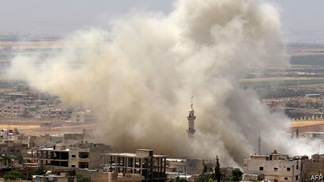
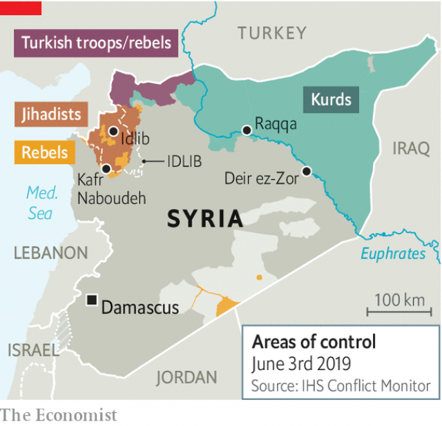

###### Yet more misery

# Bashar al-Assad’s ruinous campaign to retake Idlib from Syrian rebels 

 

> print-edition iconPrint edition | Middle East and Africa | Jun 6th 2019 

EVEN THE Eid al-Fitr holiday did not bring a respite for the almost 3m Syrians bottled up in Idlib. Warplanes buzzed overhead, as they have for more than a month, dropping ordnance on this scrubby province in north-western Syria, the last significant pocket of rebel-held territory. The offensive has already killed more than 300 people. Russian and Syrian jets have repeatedly bombed hospitals despite promises that they would be protected. Some 250,000 people have been displaced. 

The ferocious bombing now under way in Idlib was not supposed to happen. Last September Bashar al-Assad, Syria’s dictator, began massing troops for an offensive to retake the province. But a deal to prevent it was hashed out by Vladimir Putin and Recep Tayyip Erdogan, the presidents of Russia and Turkey, the strongest foreign powers in the neighbourhood. The Sochi agreement, as it is known, called for a buffer zone up to 25km deep between rebels and the regime. Soldiers from both countries would patrol it and apply pressure to their allies. Russia would restrain the Syrian army, while Turkey would force militants to retreat deeper into the province. 

 

Signing the deal was easy. Implementing it was another matter. Turkey overestimated its influence over Hayat Tahrir al-Sham (HTS), al-Qaeda’s former Syrian affiliate. In January HTS launched an offensive against other rebels in Idlib, including a Turkish-backed faction. It now controls most of the province. Both HTS and the Syrian army violated the truce by shelling each other. The buffer zone exists only on paper. The regime is now advancing into Idlib from the south-west. At each town along the way Syrian and Russian jets unleash air strikes to soften up the rebels. Ground troops attack soon after. 

Most of the people in Idlib are internally displaced: they fled from one region to another as parts of Syria fell to the regime. The province has swelled to more than double its pre-war population. Mr Assad likes to portray it as a festering nest of jihadists. This is partly a problem of his own making. Rather than fight to retake every rebel-held pocket, he allowed some foes to surrender and granted them safe passage to Idlib. Some of the extremists now battling the regime were brought to Idlib on its buses. 

Messrs Putin and Erdogan would both like to halt the fighting. If it worsens, trapped civilians will have nowhere to go except north. Mr Erdogan does not want another exodus across his border, especially not with the Turkish economy on the brink of what may be a painful double-dip recession. Russia, for its part, fears an offensive would strain relations with Turkey. The situation in Syria has brought them closer over the past three years, while Turkey’s ties with America have deteriorated. Mr Erdogan has agreed to buy S-400 air-defence systems from Russia, despite American warnings that the purchase would make Turkey ineligible to buy F-35 jets. 

Russia also doubts the capabilities of the Syrian army, which has demonstrated tactical incompetence time and again throughout the eight-year war. In late May, after the regime won a string of victories, rebels launched a surprise counter-attack on the village of Kafr Naboudeh. The Syrian troops garrisoned there were well-equipped and dug in. But they beat a disorganised retreat and left behind a cache of heavy weapons that were quickly turned on other regime troops. 

None of this changes the strategic picture in Syria. Opposition supporters talk about a rebel counter-offensive emerging from Idlib. This is wishful thinking. Though they can harass the regime, their numbers are too small to retake much ground—and they are too radical to win much foreign support. 

The question is simply how much suffering will be inflicted on Idlib. Mr Assad seems emboldened to retake the last bit of his country (never mind that what he controls is largely in ruins). Mr Putin is losing patience with rebels who have also shelled Russian bases in Syria. On June 3rd he blocked a statement in the UN Security Council that urged combatants to protect civilians in Idlib. But he may not want to damage his ties with Mr Erdogan over what will be a ruinous offensive. The two plan to meet later this month on the sidelines of the G-20 summit. As ever, the future of Syria will not be in the hands of Syrians. ◼ 

