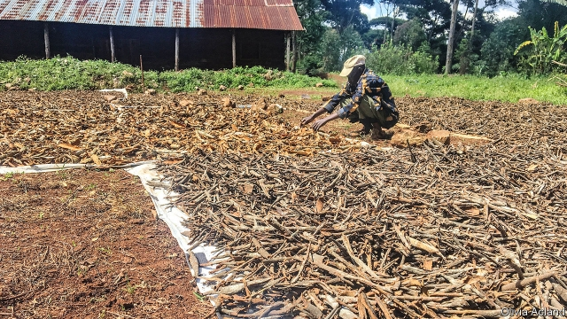

###### Guns and tonic

# Eastern Congo has the world’s largest quinine plantations 

 

> print-edition iconPrint edition | Middle East and Africa | Jun 8th 2019 

THE KIVU provinces in the east of the Democratic Republic of Congo have a tragic reputation. Armed militias rape and plunder. Ebola, a virus, has infected more than 2,000 people. 

But the region has also saved millions of lives. North and South Kivu are home to the largest cinchona forests in the world. The bark of these trees, which were introduced by the Belgians, contains quinine, a drug that cures malaria. (It also tastes pleasantly bitter when dissolved in fizzy water and served with gin and a slice of lime.) 

Near the edge of a plantation is one of just five quinine-extracting factories in the world. The operation, which has been running since 1961, produces about 100 tonnes of processed quinine a year, or about 30% of global demand. “First we address the country’s needs, then we export the rest,” says Etienne Erny, the managing director of Pharmakina, the firm that owns the factory. 

Just under half the quinine is sent abroad. A third of this is turned into tonic water and the rest into medicine. It is a tragic twist of fate, therefore, that despite the abundance of quinine in Congo, it still has the second-highest rate of malaria deaths in the world. In 2017 some 435,000 people died from the disease. Many cannot afford to pay the $2 for a course of 21 pills or do not diagnose the malady in time. 

While conditions in the Kivus (most notably altitude and humidity) are ideal for cultivating trees, the region’s never-ending skirmishes are not. Some of Pharmakina’s forests stretch into an area which is overrun with dozens of rebel groups that call themselves “Mai-Mai” and claim to have magical powers in battle. They regularly kidnap and kill. Now and then they send letters to Pharmakina demanding cash and threatening to abduct its workers. “You don’t pay, but you have to talk to them,” says Michael Gebbers, another director. Discussions take time and frightened employees do not dare turn up at the plantations. Moreover, during Congo’s two bloody wars, which ran for a total of six years between 1996 and 2003, great swathes of the forest were unreachable and the company’s output dwindled. 

The problems of running a business in Congo extend beyond insecurity. Because there is no reliable supply of electricity, the factory is often powered by expensive generators. The chemicals used to process quinine are costly and come by lorry from Tanzania.  

As if this weren’t enough, the firm also has to deal with growing competition. Indian traders have begun buying cinchona bark and shipping it to Delhi, where the cost of processing is lower. Demand has also fallen since the discovery of synthetic quinine and artemisinin, another plant-based anti-malaria drug. Still, people hoping to give Congo’s economy a tonic can do their bit to drive up demand each time they raise a glass. 

