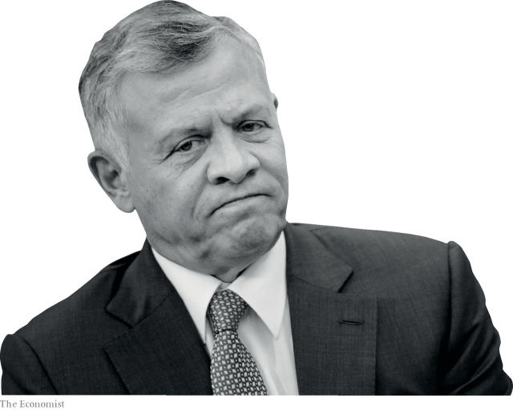

###### Fewer friends, more problems

# King Abdullah of Jordan fears that old allies are ditching him 

 

> print-edition iconPrint edition | Middle East and Africa | Jun 6th 2019 

“WE ARE ALL King Abdullah.” So said the official campaign to celebrate the 20th anniversary of the king’s accession to the throne in Jordan. But the turnout on February 7th suggested that few agreed with the sentiment. Even trays heaped with mansaf, lamb stewed in yogurt, could not rouse large crowds. Two months later the World Economic Forum on the Middle East and North Africa, held on the Dead Sea in Jordan, also failed to attract the desired audience of global bigwigs. At home and abroad, says a former official, “the king is losing his prestige.” 

Other Middle Eastern countries have oil. Jordan has location. It sits at a strategic crossroads, so the West and regional powers have long valued its stability. During the cold war Jordan served as a reliable and moderate Western ally when other Arab states turned to the Soviet Union. It acted as a conduit to next-door Israel, with which it has a peace treaty, when others shunned the Jewish state. America used Jordanian territory to launch special forces into Iraq and as a base from which to co-ordinate rebels in Syria’s civil war. 

Today, though, Jordan doesn’t seem so essential. Many Arab states now deal directly with Israel. Some of them are upset with King Adbullah (pictured) for not toeing the line on regional matters. He has maintained relations with Qatar, which has been ostracised by other Gulf states, and backed away from the war in Yemen led by Saudi Arabia and the United Arab Emirates (UAE). He is seen as soft on the Muslim Brotherhood, an Islamist group that operates in Jordan but is banned elsewhere. The king has even shaken hands with Hassan Rouhani, the president of Iran, which is hated by big Arab powers. 

As it pulls troops out of the region, America is also losing interest in Jordan. King Abdullah moans that the administration of Donald Trump is ignoring him as it draws up a peace plan for Israel and the Palestinians. The king fears that he will be pushed to provide a permanent home for millions of Palestinians, who are the majority in Jordan, making it the de facto Palestinian state. The king also worries that the plan will ignore his historical claim to custodianship of Jerusalem’s holy places or give countries that support Mr Trump, such as Saudi Arabia, a role in the city. 

America, Saudi Arabia and the UAE can put pressure on Jordan by withholding aid. America gives it over $1bn each year, around 2.5% of GDP. The Gulf states injected billions more into Jordan during and after the Arab spring. But Saudi Arabia did not renew its aid package in 2017, a move that Jordanian officials viewed as punishment for their nonconformist policies. Months later King Abdullah said he faced economic pressure to tone down his opposition to Mr Trump’s recognition of Jerusalem as Israel’s capital. As Jordan faced an economic crisis last year, the Gulf states (including Saudi Arabia) promised $2.5bn, mainly in the form of loans. Only a fraction of the cash has been transferred so far. 

King Abdullah needs the help. Millions of Palestinian, Iraqi and Syrian refugees have sought shelter in Jordan, a burden it cannot afford, says the king. Public debt equals 95% of annual GDP. The government has cut subsidies and raised taxes, pushing prices higher. Over a million of Jordan’s 10m people are poor. Youth unemployment stands at 41%. Such is the demand for jobs that when the American embassy in Jordan advertised for a secretary, radio stations ran the news on their bulletins. “The malls, markets and restaurants are empty,” says Samer Tawil, a former economy minister. 

The people used to blame greedy ministers and corrupt officials for their misery—and looked to the king for remedies. Now when they protest, as they often do, they call out King Abdullah by name. “Prices are rocketing and Abdullah is playing poker,” runs one of their chants. “Jordan can’t handle the cost of its royal family,” says a sheikh from the Beni Hassan, the kingdom’s largest tribe. A widely-shared letter from a former minister, Amjad al-Majali, demanded the king “hunt the corrupt circle that is close to you”. 

Anger is fiercest among the indigenous Bedouin, who dominate the security and intelligence services. Retired officers sign open letters stating that they no longer consider Abdullah and his Palestinian wife, Rania, their monarchs. Some threaten to take up arms. Amid reports of coup plots, the king removed his interior minister and intelligence chief. Their replacements immediately arrested tribal leaders—further inflaming tempers. 

Some Bedouin sheikhs look to Prince Hamzah, the king’s half-brother, who was removed as heir apparent in 2004 to make way for the king’s son. Prince Hamzah’s rich Arabic lilt (acquired during a youth living with tribesmen) appeals to the Bedouin and contrasts with the king, who grew up speaking English. After years out of public view the prince is back in the media. “Only the intelligence services would authorise that,” says a politician. Calls for choosing a government by elections, not by royal decree, are growing too. Better to share power, perhaps, than risk losing it all. ◼ 

