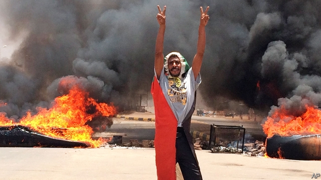

###### Sudan’s Tiananmen?

# Pro-democracy protesters are slaughtered in Khartoum 

 

> print-edition iconPrint edition | Middle East and Africa | Jun 6th 2019 

WHERE JUST weeks ago the scent of freedom was in the air, there came the smell of smoke and cordite. The sounds of jubilant song gave way to those of automatic gunfire and the screams of the dying. In the early hours of June 3rd Sudan’s armed forces moved against pro-democracy protesters who had been holding a sit-in since April outside the army’s headquarters in Khartoum, the capital of Sudan. They shot and killed more than 100 people, including some children. All that remains of the carnival of democracy that had sprouted there are burnt tents and rubbish. 

It was the worst violence since demonstrations toppled Sudan’s brutal dictator, Omar al-Bashir, in April. It was also the most gruesome. People were whipped, raped and robbed. Bodies were slung into the Nile. Doctors treating the wounded were beaten and shot. In Omdurman, across the river, rescuers fished out the bodies of people who had been hurled, screaming, off a bridge. 

Residents of the capital likened the carnage to atrocities committed by government forces and its militias during Sudan’s long civil wars. Not coincidentally, the bulk of the bloodshed this week was the work of the Rapid Support Forces (RSF), a paramilitary force linked to the Janjaweed, a militia responsible for genocide in Darfur. Thousands of its troops now patrol Khartoum. 

On June 3rd the Transitional Military Council, which took over after Mr Bashir’s fall, turned off the internet and phone networks. Its leader, Abdel-Fattah Burhan, said the junta would form an interim government and hold elections in nine months. The Sudanese Professionals Association, which has spearheaded the uprising since it began last December, rejected the plan. 

Trouble had been brewing for weeks. Protesters and the junta were tussling over who would control the country’s transition to democracy. Negotiators had agreed on some issues, such as the establishment of a civilian-led parliament and cabinet, and a three-year transition before elections. But talks stalled over the contentious issue of who would be in charge of the highest decision-making body, the sovereign council. 

To break the deadlock, the protesters declared a national strike, while the junta turned to its powerful deputy head, Muhammad Hamdan Dagalo (who is widely known as Hemedti) and his RSF. A former camel-rustler who had dropped out of primary school, Mr Dagalo rose to prominence after turning his clan of Arab nomads in Darfur into a gang of the Janjaweed. Horse-riders from that militia suppressed a rebellion 15 years ago by burning villages, slaughtering civilians and raping the women who couldn’t escape. 

Today, money and diplomatic support from anti-democratic Arab regimes have emboldened the junta. Mr Dagalo had previously sent at least 3,000 mercenaries to fight for Saudi Arabia and the United Arab Emirates (UAE) in Yemen. His forces are well-equipped and battle-hardened, and he has rich friends. The junta’s call for financial help was quickly answered. Saudi Arabia and the UAE sent $500m and promised another $2.5bn. Egypt’s security forces, no stranger to coups, are thought to have offered advice. 

Yet the junta’s swift resort to violence may have increased the risk of civil war. It could, perhaps, have let the protests gradually run out of steam. Instead, it unleashed death just before the start of Eid, the festival to celebrate the end of the holy month of Ramadan. “The country will never forgive them for gunning down innocents the day before Eid,” says a doctor from Khartoum. Soldiers and policemen not affiliated with the RSF are said to be furious about the bloodshed. Troops in several garrisons have mutinied and tried to break into armouries to grab weapons to fight the RSF. 

The killings also raise questions over where exactly power resides. Mr Dagalo, who denies orchestrating the violence in Khartoum (the government also claims the RSF was not involved), is thought to have presidential ambitions. If so, he may seek to undermine any transition that weakens him. He “needs state power to protect his interests”, says Magdi el-Gizouli of the Rift Valley Institute, a think-tank. “He is effectively terrorising the population of Khartoum into submission.” 

He is not the only one with an incentive to thwart democracy. Mr Bashir kept himself in power for 30 years by playing factions off against one another. Many in the junta fear a new order, especially if it establishes the rule of law. Some fear justice for atrocities in Darfur or elsewhere. 

The latest killings give the top brass even more reason to worry. The junta is “basically in the same exact boat as Bashir”, who faces charges of genocide at the International Criminal Court (ICC), says Ahmed Kodouda, a political analyst. 

Demonstrators, meanwhile, are enraged by the betrayal of their democratic revolution. From Al-Haj Yousif, an outlying neighbourhood of Khartoum, come reports of fresh protests suppressed by gunfire. In hospital corridors, doctors and patients alike sing protest songs, vowing not to abandon their struggle. 

Averting a civil war in Sudan may require trade-offs between justice and peace. Outsiders, including Western governments and the African Union, have condemned the violence and called for a civilian-led transition. But many, including Britain, also insist that those responsible for war crimes be held accountable and handed over to the International Criminal Court. The fear is that Sudan may get only one of these things, or neither.◼ 

