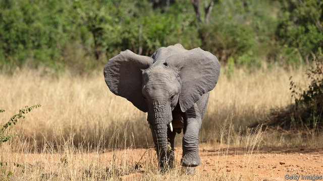

###### John Magufuli’s follies

# Tanzania’s president loves mega-projects. Careful planning, less so 

 

> print-edition iconPrint edition | Middle East and Africa | Jun 6th 2019 

LIKE ISAIAH BERLIN’S hedgehogs, who knew one big thing, John Magufuli, Tanzania’s president, sees economic growth through a single prism: the state, and the state alone, delivers prosperity. Cash has been poured into Air Tanzania, the loss-making state-owned airline, which has recently bought half-a-dozen new planes, including a Boeing 787 Dreamliner. Passengers arriving on it will be able to whizz across the country in high-speed trains, if things go to plan. Some 30 infrastructure projects are in the works. Dodoma, Tanzania’s capital-in-name-only, is being overhauled. It will have Africa’s largest stadium. A hydroelectric dam in the south is more modestly conceived: it will merely be the continent’s joint second-biggest. 

Such mega-projects go down well domestically. They foster pride and are taken as evidence that the president is serious about giving Tanzania a modern economy by 2025. For a president who won election in 2015 by the smallest margin in Tanzania’s history, they are also potential vote-winners. Donors and investors are less enthusiastic. They have nothing against infrastructure-driven development, but it needs to be well planned, carefully implemented and make financial sense. They worry that Mr Magufuli’s schemes often fail on all three counts. Already, several have made faltering starts. 

Take Air Tanzania. Its reputation is dismal. In 2011 it stopped flying altogether after its last aircraft was grounded for repairs. Its new Dreamliner has yet to revive its fortunes. Flights to Mumbai and Guangzhou should have started last September but did not because the airline had been suspended by the International Air Transport Association over unpaid debt, and did not have experienced pilots. Flights will finally begin in July, the company says. 

Mr Magufuli’s vision sometimes trumps forethought. When he abolished state school fees, too few teachers had been trained to meet the surge in demand. “I have teachers teaching classes of 130 under a tree,” complains one headmaster. 

Similarly, government ministries have been told to move from Dar es Salaam, Tanzania’s biggest city, to Dodoma. Yet the buildings meant to house them are under scaffolding and the city’s expansion will not be complete for another decade. Mere details, scoffs the president (who has not moved): “Stay under a mango tree.” 

Grander projects are planned. A new railway is being built that will eventually connect Dar es Salaam to Kigali, Rwanda’s capital, along 1,090 miles of track. The first, 186-mile phase, costing $1.9bn (about 4% of GDP) is due to be completed in December. Mr Magufuli insists on the trains being electric, which pleases environmentalists. However, Tanzania has an erratic electricity supply. Potential passengers worry that their trains may be stranded. 

Mr Magufuli’s answer to this is his most controversial project of all: the Rufiji Hydroelectric Project. The 2,115-MW dam is equalled in generating capacity in Africa only by Egypt’s Aswan Dam (Ethiopia’s troubled Grand Renaissance Dam will eventually eclipse both). If completed, it would more than double the amount of electricity Tanzania generates. But the dam is to be built in the Selous, Africa’s biggest game reserve and a UNESCO World Heritage site. Conservationists are livid and think it may lead to more elephant poaching. 

Others question the dam’s viability. Mr Magufuli reckons it will be built within three years at a cost of $2.9bn. Both estimates need to be trebled, reckons Joerg Hartmann, an independent dam specialist. Donors also doubt the wisdom of making Tanzania’s power supply dependent on a single source vulnerable to droughts. 

The president, an engineer by training, is fond of the grandiose. Yet less ambitious projects could deliver more. Tanzania has plenty of water and natural gas. Smaller dams and power plants would be cheaper and quicker to build. 

But the president is not for turning. Donors have little clout: it is hard to use aid as pressure when his government deliberately delays its disbursement and tries to tax it. Domestic critics have even less sway. Opposition MPs are frequently arrested. Those who criticise the dam have been told they will be jailed. Even the president’s own officials are too scared to offer candid advice. Some Western diplomats say they are asked to break bad news to the president by aides too timid to do so. 

Mr Magufuli faces few checks. “He is allowed to make all the decisions, from the smallest to the biggest,” says Daniel El-Noshokaty, the resident director for the Konrad Adenauer Foundation, a think-tank associated with Germany’s centre-right CDU party. If feasibility studies are carried out, they are rarely published. Donors suspect the president based his decision to build his huge dam on a viability study carried out by the Norwegian government in 1980. Yet not only did Norway abandon the project, because it did not make financial sense, but water levels have since fallen by 25% due to climate change and upstream irrigation, says Zitto Kabwe, an economist and opposition MP. 

Only a booming economy would allow Mr Magufuli to pay for his projects without taking on unsustainable debt. The president points to official figures showing an expanding tax base and annual economic growth of 7%. Sceptics note that government data are unreliable and that questioning them could soon be a criminal offence. The International Monetary Fund (IMF) reckons the economy will grow by just 4% in 2019, one percentage point above population growth. Tax revenues ticked up by 3.1% last year, not nearly enough to fund the president’s dreams. The IMF warned in a recent report (whose release was blocked by Tanzania) that a big increase in spending on mega-projects could leave the country struggling to repay its debts. 

Far from boosting the economy, Mr Magufuli is shackling it. Private investment has been scared off by limits on foreign ownership, a ban on international arbitration to settle contract disputes and a delay in paying VAT refunds. Executives working for multinational firms have been arrested, and ludicrously high fines imposed on spurious grounds (Acacia Mining, a British firm, was told to pay $190bn—more than three years of Tanzania’s GDP—for allegedly undervaluing gold exports). Tanzanian businessmen have been strong-armed into surrendering assets to the state. Tour operators and farmers complain of lower profits due to new taxes and rule changes. Unless Mr Magufuli changes course, one day the only elephant left in the Selous may be a white one. ◼ 

