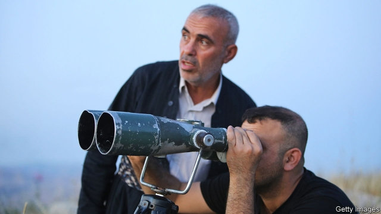

###### The fault in our stars

# When is Eid al-Fitr? 

 

> print-edition iconPrint edition | Middle East and Africa | Jun 6th 2019 

AS THE SUN slipped into the Mediterranean on June 3rd, imams in Gaza took to their minarets to announce the end of Ramadan. Observers in Saudi Arabia had spotted the hilal, the waxing crescent moon that marks a new Islamic month. Muslims could celebrate the Eid al-Fitr holiday—at least for a few minutes. Word soon came from Jerusalem: Palestine’s grand mufti could not find the moon. Eid was postponed. 

“Do not fast until you see the crescent, and do not break your fast until you see it,” said the Prophet Muhammad. Early Muslims were keen astronomers, in part because faith demanded it. Scholars like Ibn Yunus of Egypt corrected Ptolemy’s mistakes. The first modern observatory was built in Baghdad. Their work shaped our understanding of the cosmos. The moon’s phases are now a matter of predictable calculation. 

But Islam still relies on human eyes to spot the hilal. This is hardly a science. Even if it hangs overhead, that sliver of luminous lunar rock can be obscured by clouds or smog. Eid is thus rarely observed at the same time across the Middle East. Arch-rivals Saudi Arabia and Iran often choose different dates, which are adopted by allies and co-religionists. 

This year was unusually absurd. War-torn Syria and Yemen had two Eids, one for government-controlled lands, the other for rebel-held pockets. Watchers in Libya could not find the moon on June 3rd but adopted the Saudi date anyway. Wags wondered if some countries were making political statements. For the first time in recent memory, Jordan and Palestine broke with Saudi Arabia. Both are unhappy with the kingdom over its support for Donald Trump and his Middle East peace plan. 

Along with Eid greetings, Arabs swapped Eid jokes. One widely shared video from a Kuwaiti YouTube channel showed Sunni and Shia clerics playing tug-of-war with the lunar crescent. But the confusion is a real annoyance. Muslims in the West groan about having to ask their bosses for a day off—without knowing in advance which day it will be. 

Other calendars that fix their months by the moon use mathematical formulas: Rosh Hashanah or the Chinese new year are predicted scientifically. Some Muslim jurists say their faith permits the same. Enthusiasts have designed websites and apps that show when and where the crescent will be visible. Their work suggests that the hilal should not have appeared in the eastern hemisphere until June 4th. No one tell the Saudis—or Mali, which somehow spotted it on the 2nd. 

