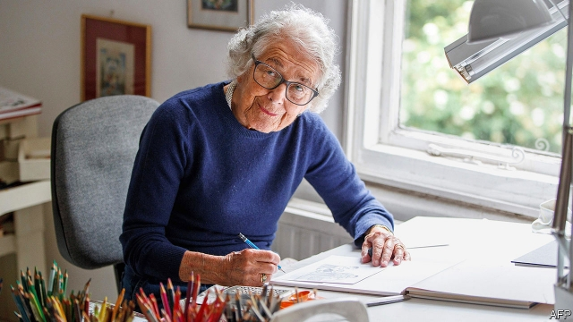

###### Cats large and small

# Obituary: Judith Kerr died on May 23rd 

 

> print-edition iconPrint edition | Obituary | Jun 6th 2019 

WHENEVER she tried to draw a tiger, Judith Kerr disliked the result. For “The Tiger Who Came to Tea” she went to the zoo, usually with her small daughter Tacy, and drew them for hours. However much she thought she knew what they looked like, they were always better—sleeker, more striped, even more orange. Her tiger was rather plump. No wonder, when he had swallowed all the sandwiches on the plate (Owp!), and all the buns on the dish, and all the biscuits and all the cake, and drunk all the milk in the milk jug and all the tea in the teapot and then eaten all the food in the cupboards in Sophie and her mummy’s house. 

So she had no great hopes for the book when she finished it, in 1968. But to her enormous surprise it sold tremendously, and started her on a career of doing picture books, and three more-serious ones, that sold more than 10m copies round the world. All of them were produced at the same table, laden with jars of crayons in carefully assorted colours, in the light-filled attic at the top of her house in Barnes, in south-west London. There she worked away with a very soft pencil and her crayons. She was quite slow, rubbing out a lot and redrawing to get it right. And she was sparing with her indelible inks, since once you put ink on you couldn’t shift it. She took similar care over the words, though those were harder, and they might need a good brisk walk along the river. 

Often, as she worked at her desk, a cat sat on her lap. She was entranced by their weirdness and strange ways. The first of her drawing companions was Mog, a scruffy black-striped tabby who became, with input from her eight successors, the heroine of 17 books. (As if she knew her lofty status, Mog would urge on the paintbrush with her nose.) Mog-on-paper, like the original, was nice, but not very clever; she was a very forgetful cat. Most of all she forgot her cat flap, and then didn’t know how to come in from the garden, jumping up on the geraniums to meow loudly at the kitchen window until her family cried “Bother that cat!” Mishaps came thick and fast, whether with escapes, or bad dreams, or “accidents” on favourite chairs, and frequently Mog took to flying, forgetting that cats can’t fly. But at the end of most books the beaming creature was hugged and loved by the family again. 

That family was drawn in lightest disguise, with Judith’s writer husband Tom and her children Tacy and Matthew taken from life, as well as the tables and crockery and chairs. (The garden, though, was rather sketchy. She felt she never looked enough at trees.) For her, cats and stability and family closeness were all one thing. She could not have a cat as a child, because she spent those years wandering. Her Jewish family escaped from Berlin in 1933 when Hitler won the election and her father, a prominent man of letters, found himself marked for death. He left, and she, her brother and her mother followed, fleeing to Switzerland, then to Paris, and eventually to England, where she stayed. 

As a child she was almost unaware of why they had left. In Berlin she heard strange remarks, such as whether her nose looked “ordinary” or not, and thought Hitler was hiding behind the lavatory curtain. In Switzerland she dreamed she saw her father, who now had 1,000 marks on his head, buried under coins pouring down from a broken ceiling. But her sharpest regret was that she chose the wrong toy to take when they fled, packing a stupid new woolly dog instead of her old, soft, familiar pink rabbit with embroidered black eyes and an endearing habit of collapsing on its paws. She imagined tearfully that Hitler must be snuggling it now. 

That story was told in “When Hitler Stole Pink Rabbit” (1971), the first of three lightly fictionalised books about her wandering and emigré years. She meant to write only one book at first, to prove to her children that her childhood was much better than it sounded. They were poor and lived a lot on charity, but she found it fun to be a refugee: to belong a little in lots of places, as her father said. She thrived at strange schools and was good at languages, unlike her parents, who were gradually destroyed by exile. Her next two emigré books dwelled more on them and their struggles. 

She could draw and paint wherever she was, and did so whenever she could. Her Indian ink got spilt on various floors, and her best presents (as for Anna, her persona in “Pink Rabbit”), were paintboxes and crayons, especially bright-blue-purply ones. Once in England, doing odd small jobs, she went to art evening classes and got a scholarship to the Central School of Arts and Crafts. Meanwhile she sketched everything she saw, especially people in motion or asleep. She sold her first painting for 3/6 to a man in a Lyons tea shop, and then sold more. By the 1950s she thought she could make a modest living at it, and after a break to have the children she turned to the drawing of picture books again. 

Over years of cosy bedtime stories with Tacy and Matthew, she had watched their faces closely to see how they reacted. Her iron rule was never to describe what they could tell from the picture, and to use as few words as possible. But she liked to challenge children, too. She knew, from “Pink Rabbit”, how to touch deftly on terrifying things, and that book had become a set text in German schools. So in “Mog in the Dark”, Mog “sat in the dark and thought dark thoughts” of what else might be lurking there. And in “Goodbye Mog” in 2002 Mog died, though “a little bit of her stayed awake to see what would happen next.” Many small readers were upset, and her chronicler was sorry. But she was a little tired of drawing all those stripes, and she also thought it an important book to write. 

Even more important was to live life as she did, with joy and energy and the odd tot of whisky, and not to waste one day of it. Though she thought she was such an ordinary person, who often wore the wrong clothes and was a useless cook, her luck in life had been extraordinary. She had made a wonderful marriage; and she had escaped horrors. Her autobiography was dedicated to “the one and a half million Jewish children who didn’t have my luck, and all the pictures they might have painted.” Of tigers, too.◼ 

