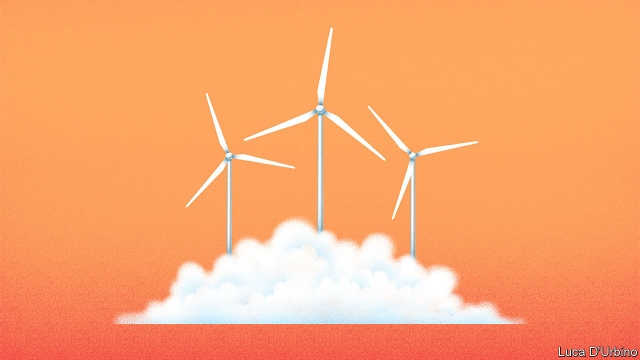

###### Alternative energy

# An innovative approach to making electricity from the wind 

 

> print-edition iconPrint edition | Science and technology | Jun 6th 2019 

THE WIND BLOWS more strongly at higher altitudes. That is why wind turbines have grown ever taller. The blade tips of today’s biggest now reach up a dizzying 260 metres, the height of the Transamerica building in San Francisco. Many dream of capturing stronger winds even higher up than that, but building taller turbine masts and constructing blades able to withstand the terrifying stresses involved in high-altitude wind gathering are costly. A number of firms are therefore developing a different and, they hope, ultimately cheaper approach to generating electricity at great heights. Their idea is to skip the mast altogether. Instead they propose to fly kites. 

The kite developed by SkySails, a German firm, is a rectangular parachute-like structure attached to an 800-metre-long tether. This tether starts off coiled around a horizontal drum that is mounted on an axle which is anchored at each end in the shipping container in which the system’s generator is housed. 

SkySails’ kite is launched, like a recreational kite, into the wind at ground level. Then, as the kite is pulled up by the wind while being manipulated to travel in a series of figures-of-eight in order to achieve a constant, optimal speed, the tether uncoils, spinning the drum. That powers a generator. Once the tether is fully extended, the kite is angled to catch less wind, reeled partway back in, and allowed to reel out again. In-reeling, according to SkySails’ boss, Stephan Wrage, consumes only 4% of the energy the kite generates on its way out, so the process is pretty efficient. 

The SkySails Power system, as it is called, goes on sale next year. A single unit will produce 200 kilowatts—enough to run about 100 homes. It will, Mr Wrage says, cost about €300,000 ($340,000). At $1,700 a kilowatt, that is half the cost of a conventional turbine of equivalent capacity, and is comparable with the cost per kilowatt of industrial-scale turbines that have outputs measured in megawatts. Nor is SkySails alone in designing a system that works with a simple, wind-launched kite of this type. Kitepower, a competitor in the Netherlands, has come up with a similar arrangement, albeit somewhat smaller, which it, too, expects to be on sale next year. Other firms, however, are working on kites that are launched actively from the ground, rather than relying on winds near the surface for their initial lift. 

One such is TwingTec, a Swiss firm. Its prototype rises dronelike into the air, lifted by electrically driven propellers at the end of its wings (which have a combined span of three metres). The kite then stays aloft until its sensors indicate that the wind has died down, after which it lands itself automatically on a truck-top pad. TwingTec is now building a bigger version, with a wingspan of 5.5 metres, that will begin producing power for BKW Energie, a Swiss utility, in October. 

Another system with active launch is that designed by Ampyx Power, a Dutch company. Its prototypes, which also have a wingspan of 5.5 metres, are propelled into the air by catapult—though, like TwingTec’s, they also have propellers to allow a controlled descent and landing once a tour of duty is over. 

These current versions, though, are just the beginning. The firm hopes, later this year, to fly an arrangement with two fuselages and a wingspan of 12 metres. And even that is but a stepping stone. The target is a wingspan of 36 metres. This version, scheduled for 2024, will have an output (2.36 megawatts) and a price (€2.4m) about the same as those of a standard turbine in a wind farm. 

Nor is it absolutely necessary that the electricity generation is done on the ground. Makani, a firm recently absorbed by Alphabet, Google’s parent company, has a different approach. It is lifting the generators into the sky, on board a pilotless aircraft with a wingspan of 26 metres. This craft has eight rotors, which act as propellers for take-off and landing. Once at operating altitude, however, they become miniature turbines. The electricity they generate (600 kilowatts at full capacity) is sent to the ground through a power line encased in a tether nearly half a kilometre long. Makani’s prototype has been tested in Hawaii and, later this year, a further series of tests from an oil platform off the coast of Norway are planned. 

Whether power-generation from high-altitude winds actually can compete with existing turbines remains to be seen. The potential is certainly there. Airborne Wind Europe, an industry group based in Brussels, calculates that the wind blows fast enough at heights of around 500 metres for this form of energy production to work almost anywhere in Europe. Lower down, however, the strongest winds are often found in coastal areas. These are places where population densities are frequently high and land for onshore wind farms is thus expensive, while building those farms offshore increases the awkwardness of construction and maintenance. 

The mechanics of kite-flying, however, are more stressful than those of a wind turbine revolving smoothly and regularly. Flying tight figures-of-eight in gusty winds while pulling on a tether requires a robustness of structure and a precision of control that go beyond those involved in conventional aeronautics. And if, despite all precautions, a tether were to snap, measures would need to be in place to bring both it and the kite once attached to it safely back to earth. Moreover, air-traffic-control authorities will doubtless have something to say if their airspace seems likely to be invaded by fleets of giant kites. 

Regardless of all this, high-altitude wind generation is an intriguing idea. In a world searching hard for alternatives to fossil fuels, it seems a promising option. The next few years should show whether or not that promise can be realised.◼ 

