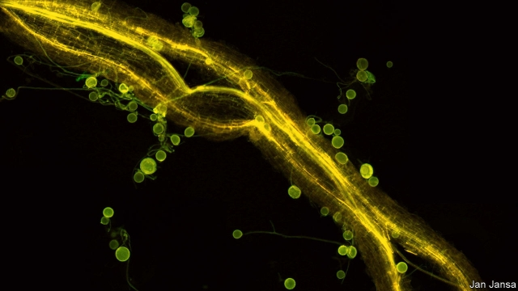

###### Symbiosis

# Fungi, it turns out, are canny traders of nutrients to plants 

 

> print-edition iconPrint edition | Science and technology | Jun 6th 2019 

IN THE SOIL, where plants’ roots meet fungal hyphae, there are trading posts of a type that came into being more than 200m years ago—long before people got around to engaging in similar activities. These meeting places are the exchanges where plants provide fungi with nutrient molecules, such as sugars and fats, that they make by photosynthesis, in exchange for raw materials like nitrates and phosphates, which fungi are adept at collecting from the surrounding area. 

That much is well established. Botanists have long wondered, however, how the details change when resources become patchy, and thus scarce in some places and abundant in others. A study just published in Current Biology by Toby Kiers of the Free University of Amsterdam suggests that, like cunning merchants who know how to make a profit, fungi exploit resource scarcity by marking up their prices. They demand more nutrients from plants in return for their valuable mineral commodities. 

Such canniness has long been suspected. But proving it means tracking the raw materials as they are collected and distributed. That has proved tricky. Dr Kiers, though, thought she could do it using structures called quantum dots. 

A quantum dot is a mote of matter a few nanometres across. It is made of a semiconducting material capable of fluorescing when struck by ultraviolet rays, and different sorts of dot fluoresce in different colours. Dr Kiers theorised that if she and her team attached quantum dots to particles of phosphate then they might be able to track those particles around as they were collected by fungi and passed along to plants. Matthew Whiteside, a member of her team, developed the technique, tested it and found that she was right. After sowing a Petri dish that played host to fungal hyphae and carrot roots with tagged phosphates Dr Whiteside found that he could, after sufficient time had passed, spot the tagged phosphates inside both hyphae and roots by shining ultraviolet light on them. 

Dr Kiers then arranged for some patches of the Petri dish “garden” in which the fungi and carrots were growing to be rich in phosphates, and some to be poor. She also arranged for the phosphates in the rich zones to be tagged with dots that would fluoresce blue when bombarded with ultraviolet light and for those in the poor zones to fluoresce red. As she monitored the collection and trading of the phosphates from fungi to carrots she found that the fungi enthusiastically transported them across the hyphal network from areas of abundance to zones of scarcity. 

Moreover, though she was unable to measure directly what price the carrots paid for their phosphates, she managed to do so indirectly. She found that hyphae growing in resource-poor patches put on more weight per unit of phosphate transferred to nearby roots than did those in patches of abundance. This, she argues, makes it clear that fungi in zones of scarcity are marking up the price of their products. 

