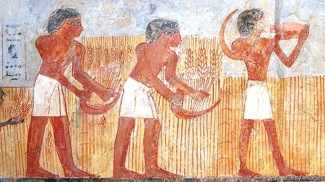

###### Diet and evolution

# Modern humans may be evolving to deal with carbohydrate-rich diets 

 

> print-edition iconPrint edition | Science and technology | Jun 6th 2019 

IT IS EASY to assume that the long march of evolution has halted in modern man—that the safe, disease-free lives people now lead mean natural selection no longer operates on much of Homo sapiens. It is an attractive idea. Frances Brodsky of University College, London and her colleagues, however, beg to differ. A paper they have just published in eLife suggests that diet, at least, is still a selective pressure. 

Dr Brodsky and her team study proteins called clathrins. These are involved in a range of matters physiological, but one of the molecules the team is investigating, encoded by a gene called CLTCL1, is concerned with the regulation of blood-sugar levels. CLTCL1 comes in two forms, one more efficient than the other at encouraging the removal of glucose from the blood. The team decided to look into the evolutionary history behind this. 

To do so they analysed the relevant DNA in 2,504 human genomes taken from a database called the 1000 Genomes Project. This project has collected samples from 26 human populations around the world. They also looked at chimpanzee DNA, and at fossil DNA from two extinct species of human, Neanderthals and Denisovans. 

Putting all this information together they deduced two things. First, just under half of people alive today carry the more efficient version of the gene. Second, this version is also a more recent version of the gene. It seems to have started spreading during the Neolithic—the moment when humans started farming cereals. 

Dr Brodsky suspects this is no coincidence. A cereal-based diet is far richer in carbohydrates than the diet of a hunter-gatherer. Once digested, those carbs will end up as glucose in the bloodstream. An inability to control high blood sugar is known as diabetes. And diabetes can be fatal. So a better way of removing glucose from the blood and into storage cells will be favoured by natural selection. A gene variant encouraging this would probably spread quite rapidly through a population of farmers. 

There is, in fact, already one known example of something similar having happened—the persistence into adulthood of the ability to digest lactose, a sugar found in milk. Human children produce an enzyme, lactase, that lets them do this. Usually, this capacity is lost in adults. But populations descended from those that domesticated milk-producing animals such as goats and cattle often retain lactose-digestion into adulthood. 

Whether the efficient form of CLTCL1 really is still becoming more abundant—and people are thus evolving—is impossible to say at the moment. One thing which remains to be confirmed is that those with the less effective version actually do have problems regulating their blood-sugar levels. If that turns out to be true, though, and given that even today diabetes kills many people, the chances are good that this piece of evolution is still a work in progress.◼ 

