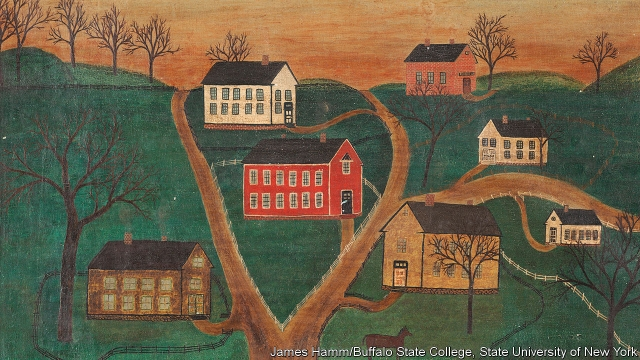

###### The tiniest of clues

# Researchers find a way to use minute samples to detect forged paintings 

 

> print-edition iconPrint edition | Science and technology | Jun 8th 2019 

THE AMOUNT of creativity that forgers put into their work can sometimes rival that of the artists they copy. A sharp eye and an uncertain provenance might suggest to someone that a particular work is counterfeit, but often science is the only way to prove it. This can be done by analysing the materials the artist used, to see if they are contemporary with the claimed date of the painting. Forgers, though, are wise to this. Some remove the paint from old canvasses and reuse them for their creations. They also apply pigments prepared in period ways. Such trickery could become easier to expose with a new technique to spot modern forgeries from the tiniest of samples. 

One of the difficulties with the laboratory analysis of a painting is obtaining samples of a sufficient size. Often the tests involved are destructive, so the same sample cannot be tested twice to confirm the results. A piece of wood from the back of a frame or a fragment trimmed from the edge of a canvas might be an acceptable loss. But taking a portion of paint from the picture itself could be a problem, especially if it damages what could turn out to be an extremely valuable work. 

One technique is to use radiocarbon dating to establish the age of any organic materials in the sample. This process relies on measuring the presence of carbon-14 (14C), a mildly radioactive isotope created naturally in the atmosphere by cosmic rays. Since it is radioactive, it decays away, so old things have less of it than modern ones—and exactly how much less is predictable. Again, though, sample size can be a problem. Radiocarbon dating used to require samples in the region of tens of grams, but advances in scientific methods mean the amount of test material required is being dramatically reduced. 

The latest reduction was reported this week in the Proceedings of the National Academy of Sciences, by Laura Hendriks of ETH Zurich and her colleagues. By converting a sample into carbon dioxide and then into ions, before using an accelerator mass spectrometer, a sensitive instrument capable of measuring the quantity of 14C present, Dr Hendriks has brought the amount needed down to millionths of a gram. 

The team tested their technique on a known forgery, a painting entitled “Village Scene with Horse and Honn & Company Factory”, which imitates an American primitive folk-art style. The painting is dated May 5th 1866 and signed “Sarah Honn”. 

The researchers took two samples. One, weighing 330 micrograms (as millionths of a gram are known), consisted of a few fibres from the canvas. Testing these produced a date range showing they were consistent with the claimed date of the painting. 

Determining the age of the paint was trickier. A fleck weighing just 160 micrograms was taken from part of a white-painted building on the canvas. This contained inorganic pigments in an organic binding medium overlaid by a shellac varnish. What the group were interested in was the oil used in the binding medium, as this would have come from biological sources, such as seed oil, and would thus contain 14C that would have started decaying at the time the oil was produced. 

First, the researchers needed to remove the varnish to avoid mixed ages from two different sources. Varnishes are often added later to paintings, so are not reliable for dating. Suitably cleaned up, the sample weighed only 58 micrograms. Nevertheless, this was enough to show that it contained an excess of 14C that was characteristic of when nuclear testing during the cold war added to the effects of cosmic rays, causing spikes in the usual background amount of the isotope in the atmosphere. 

Detailed analysis revealed two possible periods for the binding medium’s manufacture: 1958-61 or 1983-89. That compares well with the real history of the painting. When he was convicted in 1990, after a decade of producing and selling fakes, Robert Trotter, an American artist, confessed that he had painted “Village Scene” in 1985. 

Dr Hendriks’s experiment shows that it is now possible to date a sample of paint weighing no more than 200 micrograms. This could mean more paintings of disputed origin are offered for analysis—or maybe not if their owners are unwilling to contemplate bad news.◼ 

