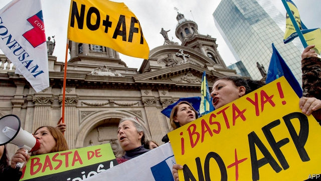

###### Will you still feed me?

# Chile tinkers with its ground-breaking pensions system 

 

> print-edition iconPrint edition | The Americas | Jun 8th 2019 

ACCORDING TO José Piñera, its mastermind, Chile’s pension system is a “Mercedes-Benz” system. Introduced in 1981 under the dictatorship of Augusto Pinochet, it replaced a pay-as-you-go system of funding pensions (where current workers pay for current retirees) with one where people are required to save a portion of their salaries for their own pensions, and their contributions are invested in private funds. The model was one of the first to try to make public pensions sustainable. But its future is far from certain. 

Last month José’s brother, Sebastián Piñera, Chile’s centre-right president, persuaded congress to debate plans to reform the system, despite not having a majority. The 14 opposition deputies who broke ranks and voted in favour of discussing the government’s bill were branded “traitors” by many on the left, who want to bring back a redistributive pay-as-you-go system. 

By many measures the system has been a success. Today private pension funds manage around $212bn, equivalent to 75% of Chile’s annual GDP. That capital has helped to fuel Chile’s economic boom, which has made the country the richest in South America. The trouble is that the payouts have not lived up to many Chileans’ inflated expectations.  

People were told they would get pensions worth 70% of their final salary if they chipped in 10% of their earnings for 37 years. But on average, Chilean workers contribute for less than half of their working lives, says Fernando Larraín of the fund managers’ association. Around 30% of employed Chileans work informally. If paid in cash, they seldom put any of it in a pension pot. Others are unemployed, studying or raising children. As lifespans lengthen, the money they save will have to stretch further. Projections by the OECD suggest that the average Chilean earner will get less than 40% of their final salary in old age. 

Attempts have been made to add a safety-net. In 2008 a centre-left government introduced a tax-funded basic pension, now worth $154 a month to 600,000 elderly people who had no savings. A subsidy tops up the pensions of another 900,000. Together they now cover over half of Chile’s 2.8m retirees. “We now have a mixed system,” says David Bravo of the Catholic University. 

But many Chileans want more redistribution. Mass protests have taken place every year since 2016, most recently in March, excoriating the companies that manage the pension pots. Returns have actually been rather good—funds have made 8% per year since the 1980s—but protesters complain that managers have taken too big a cut (administration costs 1.25% of salaries). 

Mr Piñera’s plan would require employers to contribute, with the money going into a new state-run fund. It would also give incentives to postpone retirement. But it does not raise the retirement age. Nor can pension reform ever solve the deep inequality that lies behind the anger. Half of Chileans earn less than $550 a month. “It’s a ticking bomb,” says Marta Lagos, the co-founder of MORI-Chile, a pollster. ◼ 

