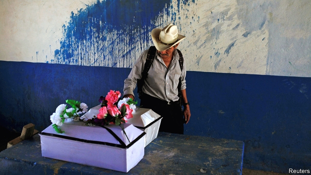

###### A killer, reviled

# El Salvador stops honouring the leader of the El Mozote massacre 

 

> print-edition iconPrint edition | The Americas | Jun 8th 2019 

OVER FOUR days in December 1981, soldiers from El Salvador’s army shot, stabbed and burned to death nearly 1,000 peasants from the north-eastern village of El Mozote and surrounding rural hamlets. The victims were accused of sympathising with left-wing guerrillas. All were unarmed. Most were women, children and old people. To this day, no one has gone to prison for the massacre, which was the largest in modern Latin American history. Block letters on the outside wall of a military base in San Miguel, 70km (45 miles)away, paid tribute to the commander who led the massacre, Domingo Monterrosa. On June 1st, hours after being inaugurated, El Salvador’s new president Nayib Bukele ordered that the army remove them. 

El Salvador, a tiny, hilly country of 6.4m people, was once trumpeted as a model for conflict resolution. On January 16th 1992 guerrillas and army commanders signed peace accords that ended a 12-year civil war in which more than 75,000 civilians had been killed and 1.5m people displaced. A truth commission appointed by the UN spent eight months investigating claims of massacres, forced disappearances, rapes and torture. But just five days after the commission’s report was published, El Salvador’s congress passed a sweeping amnesty. It had been a secret condition of the peace deal, but made it impossible to prosecute those responsible. Over the years, the country’s two main political parties—the left-wing Farabundo Martí National Liberation Front (FMLN) and the right-wing Nationalist Republican Alliance (Arena), which emerged from the warring sides—fought over other issues. But on the matter of the amnesty, they always agreed.  

Then, in 2016, the Supreme Court declared the amnesty law unconstitutional and ordered a new investigation into crimes like the El Mozote massacre. The elderly survivors trekked to mass graves in the mountains to watch anthropologists exhume their murdered relatives’ bones and to a courtroom in a dusty town to testify in the trial of 18 military officers accused of participating in the carnage. On May 21st peasants in house dresses and ranchero hats picketed the halls of congress to protest against an attempt by Arena and the FMLN to pass a new amnesty law. After an outcry and an intervention from the Inter-American Court of Human Rights, the politicians postponed the vote. 

Mr Bukele, who was just four months old at the time of the massacre, is the first president since the war to belong to neither political party. He got his start in advertising, and his seven years of political experience—most recently as mayor of San Salvador, the capital—have been characterised by urban regeneration, social-media wizardry and feuds with journalists and political rivals (in 2017, he engineered his ejection from the FMLN by criticising it). Young people and poor people support him but he has few allies in congress. His inauguration speech in a packed plaza in San Salvador offered little in the way of plans to tackle the country’s myriad problems: gang violence that drives thousands of refugees to leave each year; a shortage of cash for social programmes; and corruption scandals involving both the FMLN and Arena. 

Mr Bukele’s order to take down Monterrosa’s name—which he announced on Twitter—signals an attempt to break with those parties’ legacies. Less than 24 hours after Mr Bukele’s tweet, on the afternoon of June 2nd, soldiers in T-shirts and camouflage trousers appeared with ladders outside the barracks in San Miguel. They chipped away at the paint until Monterrosa’s name had disappeared.◼ 

