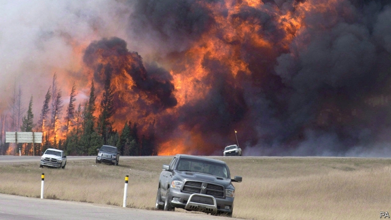
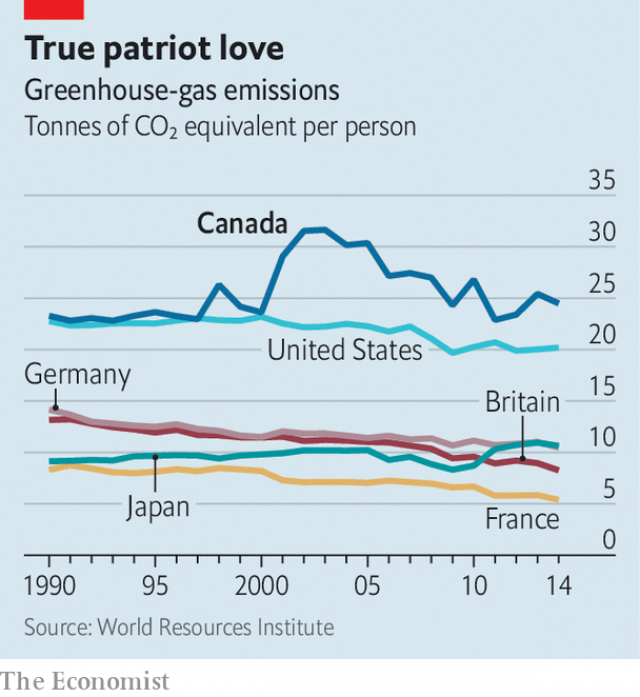

###### Burning up

# Justin Trudeau is trapped between eco-warriors and gas-guzzlers 

 

> print-edition iconPrint edition | The Americas | Jun 8th 2019 

AS OMENS GO, it was pretty clear. On May 30th Jason Kenney, the newly-elected conservative leader of Alberta, had planned a celebration. Having successfully scrapped the province’s carbon tax, which added about 6.7 cents to each litre of fuel, he was to visit a petrol station in Edmonton, the provincial capital, and watch as the price dropped. Instead, wildfires to the north of the city created smoke so thick that streetlights came on at midday. The press conference was cancelled. “We’ve always had forest fires,” he airily told reporters the next day. “And we always will.” 

Such single-minded dedication to his cause has made Mr Kenney, who is not a climate-change denier himself but allows them in his United Conservative Party, a formidable opponent to Justin Trudeau, the Liberal prime minister. At stake is the national climate-change plan that Mr Trudeau carefully stitched together in 2016 with eight of Canada’s ten provincial leaders (Saskatchewan and Manitoba held out). Alberta’s signature was crucial because it emits more greenhouse gases than any other province. The intensity of the battle could affect the outcome of a general election in October. 

 

A major component of the plan was agreement on a national carbon price starting at C$10 a tonne in 2018, rising to C$50 ($37.40) by 2022. Provinces were left to decide the mechanism for pricing carbon, but if they did not, the federal government would impose a tax. With the biggest provinces on board, it finally looked as if Canada might meet its commitment under the Paris agreement to bring CO2 emissions down by 30% from 2005 levels by 2030. 

But then Mr Trudeau started losing his friends. In Ontario Kathleen Wynne’s Liberals were defeated last year by the Progressive Conservatives led by Doug Ford, who campaigned on scrapping the province’s carbon cap-and-trade system. Conservatives took over from the Liberals in New Brunswick soon after. Add Mr Kenney’s Alberta, plus the original two holdouts, and that makes five provinces out of ten now opposed to Mr Trudeau’s plans. 

They are taking their battle to the courts, opposing the federal carbon tax of C$20 a tonne that went into effect on April 1st in provinces which do not have their own levies. That will now be put in place in Alberta “as soon as possible”, says Catherine McKenna, the federal environment minister. The provinces argue that Ottawa has no constitutional right to impose the tax. Saskatchewan lost its case on May 3rd but says it is appealing. 

Taking on five of the ten premiers on any issue would be difficult enough for a Canadian prime minister. But with climate change Mr Trudeau is fighting with one arm tied behind his back. Since coming to power in 2015 he has maintained that Canada can fight global warming while still pumping lots of oil. Hydrocarbons are Canada’s top export. Mr Trudeau says he wants to phase out Alberta’s tar sands eventually, but it is not easy to sit on the fence. 

Greens mourned the federal government’s decision in 2018 to buy the existing Trans Mountain pipeline, which carries oil from Alberta to the west coast. They are still angry about its proposed expansion (the government’s final decision is expected by June 18th). Environmentalists and some indigenous groups are also fighting a new oil pipeline that would pass through Alberta and British Columbia. The federal government has proposed a ban on oil tankers sailing off the northern coast of British Columbia, but it has been held up in parliament by senators. 

The most absurd battle may be in Ontario, where the operators of petrol stations now face fines of up to C$10,000 a day from the provincial government if they do not display stickers that criticise the federal carbon tax. The federal government has responded by reminding residents in provinces where the national tax has been imposed that they can apply for an income-tax rebate funded by its proceeds. 

A real danger for Mr Trudeau is that the Liberals may lose the youth vote that helped push his party to power in 2015. A rise in the vote share of the Green Party or the New Democrats could split the left. Mr Kenney is planning to lend the federal Conservatives a hand by campaigning in the October election campaign. Mr Trudeau is discovering, like many prime ministers before him, that in an oil-producing country like Canada it is not easy being green.◼ 

