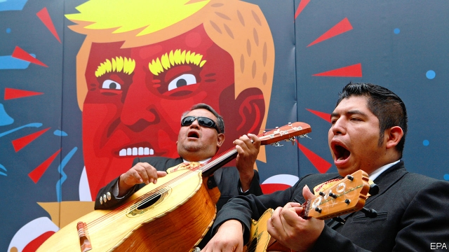
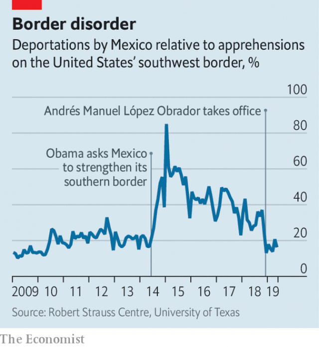

###### What tariffs mean

# Mexico has little choice but to placate Donald Trump 

 

> print-edition iconPrint edition | The Americas | Jun 6th 2019 

POLITICIANS OFTEN like to rally their supporters by railing against foreign menaces. Mexico’s president is an exception. Even as Andrés Manuel López Obrador rages against other indignities of modern Mexican life, he dare not criticise Donald Trump too harshly. That is partly because Mr López Obrador, known as AMLO, eschews foreign distractions from his left-wing domestic agenda. But it is mostly because Mexico’s economic ties to the United States are so vital that no president would jeopardise them with reckless posturing. 

No Mexican president, that is. Donald Trump won office by denouncing Mexico as a place to which good American jobs go and from which evil migrants come. He has threatened to rip up trade deals and close the border. Each time, Mexican officials try to soothe him with compliments and compromise, because they cannot punch back hard. Only about 15% of the United States’ exports go to Mexico, but a whopping 80% of Mexico’s exports head the other way. “There is nothing we have in our arsenal that is equivalent to what the United States can do to us,” says Andrés Rozental, a Mexican former diplomat and minister. 

On May 30th Mr Trump retrieved from his arsenal a time bomb of ruinous proportions: a 5% tariff on all imports from Mexico, beginning on June 10th and increasing by five percentage points each month until it hits 25% in October. Unlike past threats, this is an executive order rather than a series of strongly worded tweets (though it was that, too). The news sent the peso into a slump. A Mexican delegation including Marcelo Ebrard, the foreign secretary, rushed off to Washington in search of a solution. AMLO published an open letter to Mr Trump calling for dialogue, signing off as “your friend”. Talks continued as The Economist went to press. 

At issue is the dramatic rise in the number of Central American migrants heading for the United States. In May 4,300 migrants were apprehended on America’s southern border each day, around the same number as were being caught each week two years ago. That Central Americans are emigrating is hardly Mexico’s fault: the vast majority are fleeing droughts, poverty and violence in Honduras, El Salvador and, especially, Guatemala. Those countries received their punishment in March from Mr Trump, when he cut off aid to all three. 

 

But Mr Trump argues that the migrants are travelling through Mexico with unwarranted ease. Mexico has done little to stop people-smugglers from using legal bus companies to ferry them, for example. The number of Central American migrants deported by Mexico as a ratio of migrants apprehended by America (which America considers a rough measure of whether Mexico is pulling its weight) dipped to 10% at the start of this year before climbing to 20%. That is well below the levels it reached under Enrique Peña Nieto, AMLO’s predecessor, whom Barack Obama politely asked to curb migration across his territory. AMLO’s administration took office in December boasting that it would end mass deportations and treat migrants better, while slashing spending on border enforcement. 

A drop in the exchange rate could soften the blow of a 5% tariff. But a tariff of 25% would be devastating to Mexico’s $350bn in exports. Its economy is already struggling: GDP contracted in the first three months of this year. Further falls would hit tax revenue and so derail Mr López Obrador’s ambitious spending pledges, says Charles Seville of Fitch, a credit-rating agency. 

Little wonder then that Mexico is keen to talk. Mr Ebrard will vow to stiffen controls in the future and boost border-security funding by $250m in the next 12 months. But promises alone are unlikely to sway Mr Trump. The United States wants to see more migration patrols along the 200km-wide southern Mexican isthmus. Mexico has already beefed up its presence there. But it has ruled out accepting safe third-country status, which would allow the United States to refuse any asylum claim from a migrant who passes through Mexico first. A face-saving fudge looks possible, though perhaps not by June 10th. 

Many in Mexico feel that the country is the victim of Mr Trump’s re-election campaign. On June 3rd an American judge dismissed a lawsuit against Mr Trump’s attempt to divert money from the Pentagon to pay for his wall on the US-Mexico border. If he is building that wall during an election year, that would presumably delight his supporters. He may even claim that Mexico is paying for the wall through the tariffs, though it is far more likely that American consumers will pay the price. 

Some aides and nearly all economists will advise Mr Trump that tariffs will impede economic growth. The US states that benefit most from trade with Mexico are Republican-voting ones. The Mexican government is drawing up retaliatory tariffs that would target Trump-supporting states, such as Texas and Arizona, if talks fail. Some Republican senators are nervously mulling a vote to block the tariffs. 

The new dispute with Mexico could also unravel one of Mr Trump’s previous self-proclaimed triumphs. His replacement of NAFTA (“perhaps the worst trade deal ever made”) with the United States-Mexico-Canada Agreement (“a very, very good deal”) may not now be ratified until after the US elections in 2020. It will sail through Mexico’s congress, but many will be wondering what the point of it is. Mexicans now know that if they appease this president, the deal they get will only last until he needs a new political boost. Other countries will have noticed this, too. ◼ 

Award: Sarah Maslin, our Brazil correspondent, has won the gold prize for foreign reporting in the Engine MHP 30 to Watch: Young Journalist Awards, for her coverage of gangs in El Salvador, Jair Bolsonaro and refugees from Venezuela. 

