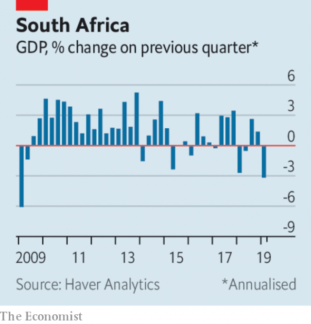

###### Weapons of mass disruption

# Business this week 

> print-edition iconPrint edition | The world this week | Jun 6th 2019 

Reports emerged that America’s federal government is preparing to investigate the country’s biggest tech firms for anti-competitive practices. The Department of Justice will oversee any potential investigations of Google and Apple, while the Federal Trade Commission will have jurisdiction over Facebook and Amazon. Not to be outdone, lawmakers in the House Judiciary Committee said they were planning their own antitrust probe of digital platforms, including the four tech giants. See article. 

America continued to fight trade wars on several fronts. President Donald Trump indicated that he would move forward with threats to impose 5% tariffs on imports from Mexico in an attempt to pressure the country to stem the flow of migrants crossing America’s southern border. While there is little support for the president’s proposed tariffs in Congress, even among members of his own party, Mr Trump insisted that attempts to stop him would be “foolish”. See article. 

Jerome Powell, the chairman of the Federal Reserve, reassured financial markets rattled by growing trade tensions. Speaking at a conference in Chicago, Mr Powell said the central bank would “act as appropriate to sustain the expansion” amid growing economic uncertainty. The remarks sparked a rally in American share prices and signalled the Fed’s willingness to cut interest rates. Futures markets indicate a 59% chance of a rate cut by July. See article. 

China announced plans to create a list of “unreliable” foreign firms, groups and individuals deemed harmful to the interests of Chinese firms. The move follows America’s decision last month to place Huawei on its own blacklist, in effect banning American firms from doing business with the Shenzhen-based telecoms giant. China has not provided details about which companies would be included on its blacklist or what measures would be taken against them. 

A group of 14 financial firms, led by Swiss bank  UBS, is preparing to launch a blockchain-based digital currency for use in settling cross-border trade. The bitcoin-like token, called the utility settlement coin, or USC, is expected to reduce risk and make transactions more efficient. The USC will be backed by major global currencies held at central banks. The firms behind the effort—which include banks in America, Europe, and Japan—expect the digital currency to be operational by 2020.  

 

Africa’s most industrialised economy shrunk by an annualised 3.2% in the first quarter, its largest decline in a decade. Almost every sector of the South African economy was hit, according to the country’s statistics office, with manufacturing, mining and agriculture output falling by 8.8%, 10.8% and 13.2% respectively. The contraction can be blamed in part on severe power outages. Eskom, the state-owned utility responsible for supplying nearly all of the country’s power, has struggled to meet demand and is now regarded as a significant risk to South African growth. 

Blackstone, a private-equity firm, announced that it will buy a portfolio of industrial warehouses in America from GLP, a Singapore-based property investment manager, for $18.7bn. The acquisition, one of the largest private real-estate deals in history, represents a big bet on the continued growth of e-commerce, which has spurred demand for warehouse space by retailers. 

Infineon Technologies, a German chipmaker, agreed to acquire a rival, Cypress Semiconductor, for €8.4bn ($9.4bn). The deal, which valued San Jose-based Cypress at $23.85 per share, a 46% premium over its share price in the last month, will create the world’s eighth-largest semiconductor maker. Infineon investors were dissatisfied with the acquisition, sending shares in the Munich-based firm tumbling more than 9%. 

Apple said it will shut down its iTunes music service, replacing it with its Music, TV and Podcasts apps. The decision to phase out the software was announced at the firm’s annual developer conference. The change will be rolled out later this year with its latest operating system, macOS Catalina. 

Fiat Chrysler withdrew its $35bn proposal to merge with Renault. The tie-up, which would have created the world’s third-biggest carmaker, was abandoned by the Italian-American firm shortly after midnight on June 5th when the French government, Renault’s largest shareholder, requested a delay to a final decision on the merger. Fiat Chrysler blamed “political conditions in France” for the deal’s collapse. See article. 

A social-media campaign calling for a ban on office dress codes that require women to wear high heels went viral in Japan. The effort spread under the hashtag #KuToo, which plays on the Japanese words for shoe (kutsu) and pain (kutsuu). Asked to comment on the online campaign, Japan’s health minister said that such workplace rules are “necessary and appropriate”. 

