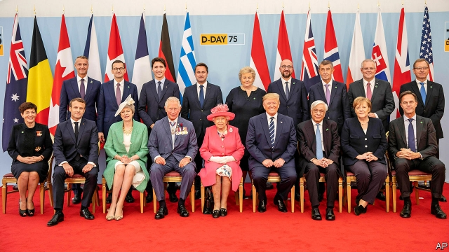
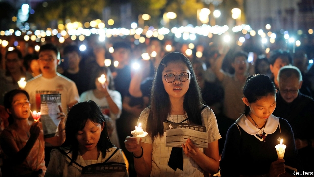

###### Weapons of mass disruption

# Politics this week 

 

> print-edition iconPrint edition | The world this week | Jun 8th 2019 

Two days of ceremonies commemorated the 75th anniversary of the Normandy landings of 1944. The queen and Theresa May, Britain’s prime minister, were joined by President Donald Trump of America, President Emmanuel Macron of France and many other national leaders from across the world. The events followed a state visit by Mr Trump to Britain, which included a state banquet at Buckingham Palace. However, the visit was also greeted by mass protests on the streets of London. See article. 

Rodrigo Duterte, the president of the Philippines, said his former wife had “cured” him of homosexuality. He then accused a critical senator of being gay. Gay-rights groups decried the implication that homosexuality was both a disease and a slur. 

Thailand’s parliament chose the incumbent, Prayuth Chan-ocha, as prime minister. As army chief, Mr Prayuth launched a coup and disbanded the previous parliament in 2014, before pushing through a new constitution that shores up the junta he heads. One opposition MP likened his selection to “making someone who set fire to a temple the abbot of that temple”. See article. 

All nine Muslim ministers in Sri Lanka’s government, as well as two Muslim provincial governors, resigned. Sri Lanka has been suffering from a wave of anti-Muslim violence after jihadist suicide-bombers killed some 250 people in April. A prominent Buddhist monk had demanded that two of the ministers be dismissed, claiming, without any evidence, that they had links to the bombers. The other ministers and governors resigned in sympathy. See article. 

The Trump administration banned cruises and other tourism trips by American citizens to Cuba, in an attempt to press the communist government to stop supporting Venezuela’s embattled dictator, Nicolás Maduro. 

Colombia’s constitutional court rejected changes proposed by President Ivan Duque to a tribunal created to prosecute former rebels and military officials for war crimes. The tribunal was created after a peace deal was signed in 2016 with the Revolutionary Armed Forces of Colombia, a leftist rebel group. 

A Canadian inquiry described the high rate at which indigenous women are murdered, often by their partners, as a “race-based genocide”. It denounced the government for failing to protect them. 

Sudanese security forces slaughtered pro-democracy protesters in Khartoum—by coincidence, just before the 30th anniversary of the Tiananmen massacre in China. At least 100 people were killed; many more were injured. The killings suggest that the military junta that took charge after the ousting of President Omar al-Bashir in April has no intention of allowing free elections. Other Arab autocracies, such as Saudi Arabia, are giving the junta money and encouragement not to back down. See article. 

The council that oversees elections in Algeria said a presidential poll would not be held as planned on July 4th due to a lack of eligible candidates. Protesters pushed for the delay, fearing the election would prolong the old regime. Demonstrations continue two months after they helped topple Abdelaziz Bouteflika, the long-serving president. It is up to the interim president to name a new date for the vote. 

Hundreds of members of Cameroon’s opposition were arrested during protests against President Paul Biya. The protesters were demanding the release of hundreds of others arrested following previous demonstrations, including Maurice Kamto, the opposition leader. They also called for an end to the fighting between the government and separatists in English-speaking parts of the country. 

The authorities in Bahrain took their suppression of dissent to a new level, warning that people who “follow” anti-government social-media accounts could face legal consequences. Most of the regime’s critics are already in prison or have fled abroad. 

The European Commission found Italy in violation of EU fiscal rules over a proposed budget that fails to shrink its debt, currently 132% of GDP. The finding could lead to disciplinary action including multi-billion-euro fines. See article. 

Turkey said it would go ahead with its purchase of Russian-made S-400 anti-aircraft missiles. America has said it will block the planned export of F-35 fighters to Turkey, a NATO ally, if it does not axe the deal. 

Tens of thousands of demonstrators in Prague called for the resignation of Andrej Babis, the Czech prime minister, who is a business magnate. The police have recommended charging him with fraud, and a European Commission audit found he had a conflict of interest involving a company he once owned, Agrofert. 

Andrea Nahles stepped down as head of Germany’s Social Democratic Party, destabilising the country’s coalition government, led by Angela Merkel and the Christian Democrats. The party may take months to select a new leader. Some in the party want to pull out of the coalition, which would mean new elections this autumn. See article. 

Lars Lokke Rasmussen, the leader of Denmark’s governing centre-right coalition, conceded defeat in the country’s general election. The centre-left bloc led by Mette Frederiksen won 91 of the 179 seats in parliament. See article. 

China and Russia agreed to upgrade their relationship to what they called a “comprehensive strategic partnership of co-ordination for a new era”. This was announced after a meeting in Moscow between China’s president, Xi Jinping, and his Russian counterpart, Vladimir Putin. Tass, a Russian news agency, quoted Mr Putin as saying the partnership had reached “an unprecedentedly high level”. Mr Xi told Russian media that Mr Putin was his “best and bosom friend”. 

 

In China, censorship of the internet was stepped up and tight security maintained around Tiananmen Square to prevent any attempt to commemorate the crushing of pro-democracy protests in the square on June 4th 1989. The measures appeared largely effective in Beijing, but in Hong Kong about 180,000 people joined a candlelit vigil to mark the bloodshed, organisers said. China’s defence minister, Wei Fenghe, said the army’s “resolute measures” in 1989 were “correct” and had “preserved stability”. China has never given an official figure for how many people died. 

