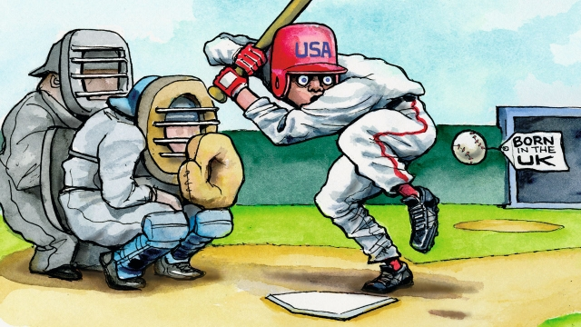

###### Lexington

# Baseball and exceptionalism 

 

> print-edition iconPrint edition | United States | Jun 8th 2019 

“YOU MIGHT not get this crazy game,” warned Tom Heitz, a historian, before attempting to induct a crowd of baseball scholars into the mysteries of town ball. An early form of baseball, played in north-eastern states until around the 1870s, town ball is recognisable to modern Americans by its rounded bat, four bases (or “stakes”) and the batsman’s need to get around them. Yet the fact that he may hit all around the plate, must run if he so much as foul-tips the ball, and that fielders wear no protective glove was perplexing to some of the scholars. As the crowd divided into two teams, on the grounds of James Fenimore Cooper’s garden in Cooperstown, New York, this gave Lexington a sly advantage. Though he had never played baseball, he had played cricket and rounders, two English games to which town ball is closely related. 

It follows that baseball is a close cousin to them too—which has been even more confounding to the game’s aficionados. Indeed, the Baseball Hall of Fame in Cooperstown, whose annual symposium on baseball and American culture the town-ballers were attending, is testament to the lengths Americans have gone to to deny their national pastime’s foreign roots. To this day, many of the thousands who visit the museum—to stand in awe before a bust of Babe Ruth or Jackie Robinson—believe baseball was invented in Cooperstown, one day in 1839, by Abner Doubleday. 

The symposium’s participants were wise to that hoax, of course, but not entirely to a related myth. Many believed baseball’s 19th-century rise to displace cricket—formerly America’s most popular game—was propelled by its singularly “American” qualities. That is another sort of nonsense. And both sorts are revealing—as is the way with baseball—of broader national traits. 

Baseball’s rise, from a village-green activity with tangled roots in English games to one of the first professional sports, was propelled by elite organisers and entrepreneurs in America’s growing cities, such as Albert Spalding, the sporting-goods tycoon. They saw the political and commercial gains to be had from promoting a uniquely American game. They therefore raided cricket clubs (of which there were 100 in Philadelphia alone) for talent, while promoting baseball’s native qualities. It was “our game—the America game”, crowed Walt Whitman, who loved a national myth. 

Anglophobia, stirred by Britain’s trade with the Confederacy during the civil war and the prominence of Irish-Americans among early ballplayers, assisted this process. So did a flexible view of what baseball’s intrinsic qualities were. Mostly, the game was held to be dynamic where cricket was languid. Yet at least one commentator in the 1870s considered baseball less dangerous. 

The Doubleday scam completed the mythologising. Alarmed by the persistent claim that baseball evolved from rounders, Spalding bankrolled a commission to produce a better explanation. “Patriotism and research”, its chairman declared in 1889, indicated that the game was invented by Doubleday, the soldier credited with firing the first shot for the Union at Fort Sumter. This fiction was wildly popular, and still is. The Hall of Fame acknowledges—on a plaque in its inner sanctum—that the Doubleday myth is untrue. Yet the fact that the plaque also describes Cooperstown as baseball’s “spiritual home” helps keep its spirit alive. 

There are two major morals to this history. The first is that America is less exceptional—because, like baseball, more of a European-accented hybrid—than it often considers itself to be. And there are costs to that self-deception, including—as the flip-side of American exceptionalism—isolation in sport and otherwise. Few Americans will be aware that ten finalist countries are currently contesting the quadrennial Cricket World Cup, followed by 2bn people in those countries alone. Baseball, which has spread more modestly and remains fundamentally a domestic game, is parochial by comparison. Yet America’s belief in its exceptionalism, exaggerated as it may be, is at the heart of the country’s achievements. It may be, baseball suggests, their essential feature. 

That is not merely because the game reflects the triumphs and tensions of the society that plays it. All national sports do that. Thus, Brazilian football and Indian cricket represent the binding of disparate peoples by a common culture, and the problems that plague them. Brazilian football is riven with inequality, as Brazil is; Indian cricket is factional and corrupt. That American baseball is the story of America over the past 150 years—a common endeavour marred by periodic storms between communities, between capital and labour, inside and outside the ballpark—is in that sense momentous, but unsurprising. What sets it apart is the cultural heights to which the game’s mythologising has lifted it. 

This is most obvious in its literature, from the novels of Bernard Malamud and Philip Roth to the non-fiction of Roger Kahn and Michael Lewis. American sports-writing is generally superior, because America takes popular culture so seriously. (The gathering of 170 academics to a conference on baseball was another sign of that.) Yet the boundless themes of national identity, striving and becoming, of real and imagined Americas, and more, that flow from baseball’s unique status make its canon the richest by far. 

They are also reflected in the game’s popularity, especially among those with the most detached view of America: the millions of immigrants who have arrived over baseball’s history. For Jews, Mexicans, Irish, among others, baseball has been a point of entry to American culture. Roth called it “this game that I loved with all my heart, not simply for the fun of playing it ... but for the mythic and aesthetic dimension that it gave to an American boy’s life—particularly to one whose grandparents could hardly speak English.” 

Baseball is a fun game indeed; and also, as the English say of cricket, more than a game. It is a symbol of Americans’ belief in their own extraordinariness. It also represents what a splendidly self-fulfilling prophecy that delusion has often turned out to be. 

