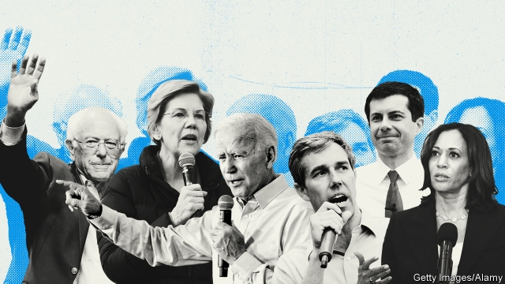

###### The Senate, the Senate

# Democrats running for president are selling plans to transform America 

 

> print-edition iconPrint edition | United States | Jun 6th 2019 

TO BE NOTICED in the crowded Democratic presidential primaries, it helps to toss out a sweeping policy proposal or two. Bernie Sanders, the socialist senator from Vermont, who took this approach in his unsuccessful challenge to Hillary Clinton in 2016, would still like free public college tuition and “Medicare for All”. After a slow start Elizabeth Warren, the senior senator from Massachusetts, is enjoying a little polling bounce as reward for her proposals to break up big tech firms, impose a wealth tax on the ultra-rich and bring in universal child care. Upstarts have latched onto the strategy, too. Pete Buttigieg, the mayor of South Bend, Indiana, would like to pack the Supreme Court with six more justices. Andrew Yang, an entrepreneur with a large online following, has made a universal basic income his defining issue. Actually accomplishing any of these things will prove much harder than advertised, because even if Democrats were to take the White House in 2020, they look unlikely to take control of the Senate. 

It may seem obvious to point out that the eventual Democratic nominee will first have to defeat Mr Trump before remaking the American health-care system. Yet when debating their two dozen (and counting) choices, party activists sometimes sound as if dethroning Mr Trump, whom betting markets now give a 49% chance of re-election, is inevitable. Americans usually like to re-elect their presidents when the economy is doing well. In April the unemployment rate hit a 49-year low. The chance of some presidential meltdown delivering a crushing Democratic victory seems slight. Though Mr Trump remains unpopular—with approval ratings hovering around 42%—his supporters are unyielding. A slew of scandals, from the jailing of his close associates to the caging of migrant children at the border, have had little measurable effect on his popularity. 

Even if Mr Trump lost, the Democrats’ less-discussed Senate problem would persist. Although it is theoretically possible for a future Democratic president to assemble cross-party majorities to pass legislation, continued partisan trench-warfare seems more likely. It is difficult to imagine a single Republican voting for a wealth tax. For Matt Bennett of Third Way, a centre-left think-tank, chastened Republicans could revert to being “partisan but not preposterous” after Trumpism breaks its hold over the party. The debate might then fall between “kitchen-table” ideas, like gradual expansions of health-insurance coverage, which might stand a chance, and “Brooklyn coffee-shop, thumb-sucker” ones, like Medicare for All or abolishing the country’s immigration-enforcement agency, which would not. 

Democrats would therefore need a working Senate majority to get more ambitious schemes through. Out of 100 senators, 47 are reliable Democrats. To win back control of the chamber, the party would need to pick up a minimum of three seats and also win the presidency (since the vice-president’s vote breaks ties). That does not sound too hard, but even a net gain of three seats looks a stretch because of the way the upper chamber over-represents rural America. Though it is early, betting markets rate Democrats’ chances of winning a Senate majority at 31%. 

To wrest seats away from incumbents in difficult territory, the party needs high-quality candidates to run. Yet top-tier candidates are instead opting to be second- or third-tier presidential candidates. Beto O’Rourke, who nearly upset Ted Cruz in his run for the Texas Senate, would be the prime candidate to challenge John Cornyn, the state’s other Republican senator, but is instead aiming for the White House. 

At least Mr O’Rourke is registering a few percentage points in the polls. The same cannot be said of Steve Bullock, the popular Democratic governor of Montana, who is opting to run for president rather than challenging Steve Daines, the state’s lone Republican senator. About 69% of Americans do not yet know Mr Bullock well enough to rate his favourability, according to a recent poll from YouGov. 

Stacey Abrams, who lost a close contest for governor in Georgia, and who has the diary schedule of someone who is running for something, has said she will not stand for the Senate. Even without the distracting draw of the White House, recruiting troubles persist: Josh Stein, the attorney-general of North Carolina, would be the obvious candidate to challenge Thom Tillis, but he has declined. Tom Vilsack, a prominent former governor of Iowa, has ruled out a challenge to Joni Ernst. 

Even if they were to win a narrow Senate majority, that would not automatically result in the kind of new New Deal that Democratic activists seem to dream of. Surmounting the filibuster, which requires a super-majority of 60 votes for legislation, will be impossible without Republican votes. Ms Warren has endorsed eliminating the filibuster, as has Mr Buttigieg. Her Senate colleagues and competitors, Cory Booker, Kirsten Gillibrand and Kamala Harris, are more skittish, even though it is difficult to imagine some of their signature campaign issues—gun control for Mr Booker, paid family leave and abortion rights for Ms Gillibrand, and marijuana legalisation for Ms Harris—attracting eight or so breakaway Republican supporters. 

Many current policy debates would be rendered practically meaningless by divided government, or even by a slim Democratic majority in the upper chamber. A hypothetical President Joe Biden and a President Elizabeth Warren would accomplish much the same in legislative terms, which is to say next to nothing. In that scenario, policy differences over foreign affairs and trade, where the president does have a lot of unilateral power, would matter more. But these are hardly being debated. 

The people chosen by a President Biden or Warren to run the regulatory agencies would push in the same centre-left direction: reversing rollbacks of environmental protections under this administration, creating more expansive definitions of civil rights and pushing anti-trust regulators to be bolder. These are not insignificant powers. But proposals for sweeping social change, the kind that will be offered by candidates in the primary debates, would probably languish in committees.◼ 

