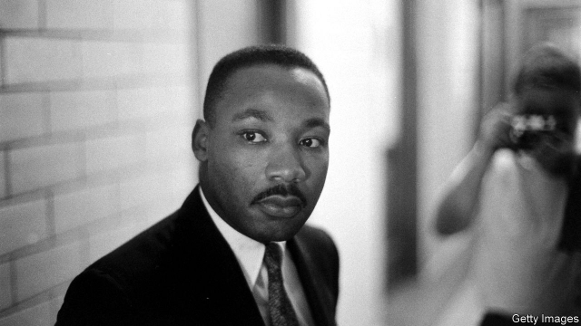

###### Regicide

# FBI files suggest MLK was more complicated than his myth 

 

> print-edition iconPrint edition | United States | Jun 8th 2019 

IN 1991 OLIVER STONE released a terrible film about John F. Kennedy’s assassination, filled with conspiracy theories about government involvement. Despite, or rather because of, its awfulness the film contributed to the passage of the snappily named President John F. Kennedy Assassination Records Collection Act of 1992. The law compelled anything related to the assassination to be released 25 years after its passage, a date which fell in October 2017. 

The definition of relevance was broad, which meant that a large collection of FBI records from the 1960s was made public, if only you knew where to look for them. David Garrow, a historian who has published a Pulitzer-winning biography of Martin Luther King, “Bearing the Cross”, as well as a book about King and the FBI, did know where to look. Last summer he spent two months going through new documents, including summaries of transcripts from the FBI’s Stasi-like surveillance of King’s private life. 

The FBI managed to persuade the attorney-general, Bobby Kennedy, that King had links with communists and that the G-men must therefore wiretap his phones and bug any rooms he stayed in. The agents did not find reds under the bed, but they did overhear salacious stuff about what was happening on top of the mattress. The agency made tapes and transcribed them. Summaries of those transcripts were subsequently made, which included quotations from the transcripts. These are the files that were released in 2017. 

Can documents made by an agency that was out to get King really be trusted? Mr Garrow thinks so, and points to a 1977 report from the Justice Department which says that the transcripts accurately reflect what is on the tapes. King, who was married, had a lot of affairs, which was known already. But the documents describe powerful men arranging nights of sex with women and make for uncomfortable reading. One of the documents has a note scribbled in pencil in the margin saying that King was present when a parishioner was raped in a hotel room. That detail is the most controversial of Mr Garrow’s findings, because of the nature of the allegation and because it is not clear whether it describes something on tape. 

The FBI tried to spread this information around Washington, but in an age when men, including a sitting president, could get away with coercing women into having sex there was little take-up. The agency then tried a more direct route. Agents made a tape and sent it to King with an anonymous note. “You are a colossal fraud and an evil, vicious one at that,” the letter said. “You could not believe in God and act as you do.” The letter went on to instruct King to commit suicide, or the tape would be released: “King, there is only one thing left for you to do. You know what it is.” 

By any standards, the discovery of these documents by a reputable historian is newsworthy, because King was probably the greatest American of the 20th century. Yet Mr Garrow says he could not interest a mainstream outlet in publishing his findings, which instead came out in Standpoint, a small right-wing British magazine. The tapes themselves will be declassified in 2027, at which point people will be able to hear them and decide for themselves. 

Correction: An earlier version of this story states that David Garrow was working from transcripts of the FBI's tape. In fact the files he found were summaries of the transcripts, which included quotations from them. This was corrected on June 6th. 

