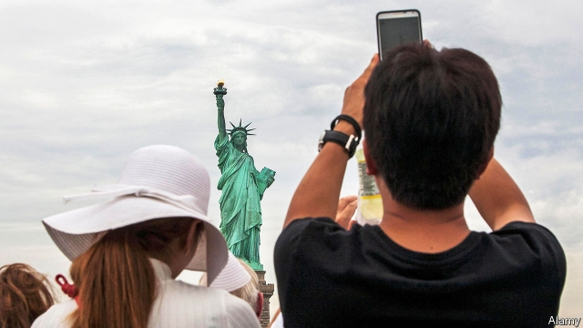

###### @DHSgov WTF

# Foreign travellers to America face scrutiny of their online activity 

 

> print-edition iconPrint edition | United States | Jun 8th 2019 

MOST TRAVELLERS to America know never to joke with immigration officials. Consider the miserable fate of a young Briton, Leigh Van Bryan, who warmed-up for a holiday in Los Angeles seven years ago by posting some excited tweets. Before flying, he trumpeted plans to “destroy America”, meaning he would party hard, drink lots of alcohol and possibly wake up with a tiger in the bathroom. He also joked about digging up the grave of Marilyn Monroe. 

Dour officials from the Department of Homeland Security who spotted his posts saw nothing to snigger about. On arrival he and a friend were detained and interrogated for hours, as investigators accused them of plotting crimes. Both were expelled, despite protesting their innocence. 

In the years since, would-be travellers have grown warier of what they post online. Most western Europeans, for example, may visit without a visa after making an online request for a waiver. In 2017, over 23m travellers did. But since December 2016 applicants have been asked not only to list countries they have visited—woe betide those who have been to Iran—but also to volunteer details of their social-media accounts and usernames. The idea, apparently, is for officials to screen for wrongdoers and terrorist sympathisers. 

The Brennan Centre for Justice, a think-tank, has just published a report on officials’ scrutiny of travellers’ social-media posts. It frets that President Donald Trump’s call for “extreme vetting” of foreigners is turning into an ever more intrusive policy regime. It notes that a National Vetting Centre opened in December, describing it as “a presidentially created clearing-house and co-ordination centre for vetting information”, mostly for those visa waivers. 

This initiative does look troubling. Information once voluntarily provided now becomes obligatory. In May 2017 the State Department made it compulsory for certain types of visa applicants—comprising some 65,000 people a year—to give every detail of their social-media activity, including their usernames on different platforms, over the previous five years. That appeared to be aimed at applicants from Muslim countries affected by a travel ban. 

The order has been expanded to almost every visitor. From this month, the State Department now obliges all visitors to offer details of their identities on any of 20 different social-media platforms, as well as any email addresses, phone numbers and other personal contact information. The new process affects some 15m travellers a year, mostly non-immigrant, temporary visitors. It is not clear how officials will store, share and use that information. 

Does this amount to unacceptable scrutiny, even an authoritarian turn? It is not new in kind. As the hapless Mr Van Bryan learned, nothing previously stopped officials from checking on visitors’ public, online statements. But the new regime is different in scale, so could make such scrutiny easier. Officials retort that a decision to deny anyone entry will never be based solely on social-media statements. 

Several worries linger. The Brennan Centre frets that “wholesale monitoring of social media creates serious risks to privacy and free speech”. That includes the privacy and speech of Americans, since scrutiny online looks at how foreigners interact with those already inside America. How masses of personal data are shared between security agencies is opaque. It seems likely that foreigners applying for visas will self-censor online, for fear of having their applications rejected. 

More practical concerns also exist. Bureaucrats may be ill-equipped to study five years of online posts, in hundreds of different languages, of 15m people each year. Instead, the online activity of certain individuals, such as young Muslim men, could be unfairly targeted. Migration lawyers also say paperwork for applicants coming to America—already long and tedious—is getting too unwieldy. Equally troubling is a fear of retaliation. What stops immigration officials in Russia, Turkey, China or elsewhere demanding that all American travellers give up details of their emails and social-media accounts? ◼ 

