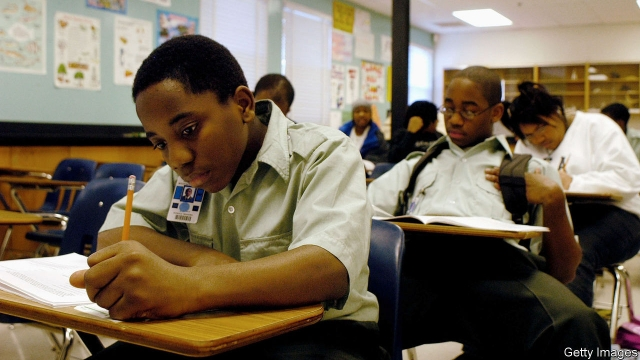
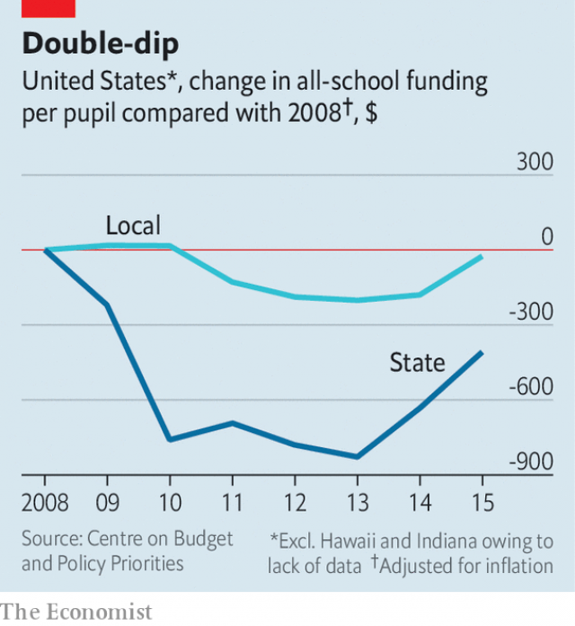

###### Experimenting with children

# What budget cuts during the Great Recession did to pupils’ test scores 

 

> print-edition iconPrint edition | United States | Jun 6th 2019 

LAWMAKERS SOMETIMES cut education budgets in the hope of forcing schools to become more efficient. Given the difficulty of measuring the effects of education spending on test scores, it can be hard to know whether this is as bad an idea as, at first glance, it might seem to be. Yet America ran a large, albeit unintended, experiment along these lines in 2007-09, when school budgets were cut during the recession. What happened to the pupils? 

According to a study by Kirabo Jackson of Northwestern University and his colleagues, recession-era budget cuts did lead to lower maths and reading scores. Imagine that a school district replaced all its average teachers with near-bottom-quality teachers. Mr Jackson says that the recession had a similar effect on pupil scores. The researchers also found that the budget cuts during the recession reduced graduation rates. A 10% reduction in spending per-pupil in all four years of high school reduced the likelihood of a student graduating by 2.7 percentage points. 

America’s public schools are paid for with a combination of federal, state and local funding. Most state revenue comes from personal-income and general sales taxes, which decreased during the recession when 8.7m jobs were lost. Wealthier districts can depend on local property taxes to fund schools during economic downturns, but poorer districts mostly rely on state funds. As a result, poor schools that depended heavily on state revenue faced the largest budget cuts. 

 

Since children from racial minorities disproportionately attend low-income schools, they endured the brunt of the consequences. Test scores in poor and minority school districts suffered most, according to Kenneth Shores of Pennsylvania State University and Matthew Steinberg of the University of Pennsylvania. The schools hit hardest by budget cuts were already struggling academically and financially. Although the cuts may have led some schools to trim otherwise wasteful spending, Mr Jackson and colleagues found that many schools were forced to cut funding of core activities. 

One of the most noticeable effects was on class size. William N. Evans of Notre Dame University and his co-authors found that nearly 300,000 school personnel, mostly teachers, lost their jobs as a result of the recession. Salaries and employee benefits make up approximately 80% of school expenditures per pupil, so they are often the first cuts made when budgets tighten. Small class sizes improve test scores, future college attendance and future job quality. The cuts increased class sizes in schools that already had the poorest test scores, the lowest college attendance rates and the worst employment rates. 

According to the Centre on Budget and Policy Priorities, a think-tank, 29 states had not returned to pre-recession funding levels by 2015. Rebecca Sibilia of EdBuild, a non-profit organisation that advocates more equal funding for schools, reckons that funding cuts during the recession provide one of the clearest examples of how current school-funding formulas have a detrimental effect on the children who need most help. She recommends changing the system, for example by redrawing school districts so that they are more equal. This would require wealthier places with higher property taxes to share their funds with needier schools within the same district. However, redistricting is unlikely. Since 2000, more than 128 wealthy neighbourhoods have agitated to secede from school districts in an attempt to hoard resources. Of those, 73 were successful.◼ 

