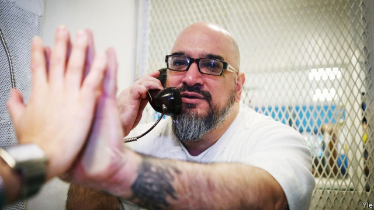

###### Nasty, brutish and long

# What it’s like to spend half a life in solitary confinement 

 

> print-edition iconPrint edition | United States | Jun 6th 2019 

TONY MEDINA is a polite, burly man with heavily tattooed arms. Like all those confined at the Allan B. Polunsky Unit, he is dressed in white. The prison’s squat grey buildings hold 214 death-row convicts. Locked into a tiny booth in a visiting room, handcuffs off, he compares being “out here” to a vacation. It is quiet, save clangs of metal doors. The room is also cooled and, a rarity, he can see through Plexiglas to the face of another human. 

He was convicted in 1996, aged 21, for a drive-by shooting that killed two children at a new-year party. Since then, for 23 years, he has been awaiting execution. In Texas the death penalty is applied to those found guilty of a heinous crime who are also judged to be a threat to others. Mr Medina’s legal appeals are continuing. 

A deafening wall of noise was “my clearest first memory of death row”, he says. “It’s gates slamming, the steel on steel, prisons are all concrete and steel, so it echoes, echoes, echoes. It never stops.” On his first night he was placed in a darkened wing full of shouting inmates, a dumbfounding experience, “like ThunderDome-type noise, yelling and screaming and banging and everything multiplied”. 

 

At first he shared a cell. Then, after other prisoners tried an escape in 1998, all death-row inmates were shifted to solitary. He complains that this is agony. “I wasn’t sentenced to solitary confinement. I was sentenced to death.” Every day since, for 19 years, he has been alone for 23 hours inside a concrete box measuring 7 feet by 11 feet. Guards pass trays of food through a slat in a door. Standing on his bed he can peer from a vent-window, a few inches high, near the ceiling. “Some guys spend all day long” doing so, he says. He never does, shunning “what is out there that I can’t touch”. 

He gets an hour in an enclosed yard, most days, for recreation. Again he is alone. In his cell he reads (at the moment a series about survivalists), writes or sometimes paints. Relations and volunteers, mostly European women, visit and send messages. Inmates shout to each other, cell-to-cell. But Texas, unlike some states, denies solitary prisoners any physical contact, other than frequent body inspections by guards. He says he last touched a relative, hugging his mother, on August 1st 1996. 

Other states with the death penalty, and federal prisons, have less strict conditions. In many, young inmates and those with mental-health problems are no longer isolated for long. Even Texas, with more prisoners in solitary than any other state—about 4,000 as of 2017—is reducing its numbers. A report in 2018 by the Liman Centre at Yale estimated that 61,000 inmates were kept isolated in America, including 1,950 who had endured six months or more. That tally is probably lower today. 

Mr Medina believes Texas goes on isolating its death-row prisoners out of vindictiveness, not because of security. He calls the practice outright “torture”, “cruel and inhumane”, a means of “intimidation to break a person mentally” before his execution. (On average a death-row prisoner in Texas waits nearly 11 years before being put to death; the longest wait was 31 years.) It is hard to dispute his claims. 

Dennis Longmire, of Sam Houston State University in nearby Huntsville, says prolonged use of solitary cells is costly and needless. The UN and advocacy groups routinely condemn the practice. He has testified at 40 trials that older inmates are not especially violent to others. He recalls that his own visits to death row were deafening and unpleasant. Unsurprisingly, many guards demand to work elsewhere. 

Many inmates suffer mental deterioration, and some turn to suicide, says Mr Medina, whose once “solid” immediate neighbour broke after 15 years. Prisoners grow anxious from isolation and sensory deprivation and obsessed by what they see as official petty malevolence. Inmates in Polunsky were refused permission to buy nail-clippers for 17 years. Nor are they supposed to decorate their cell walls. 

Some crack while waiting for execution. When close friends are taken away—sometimes noisily resisting—for lethal injections, there is added turmoil. He counts 437 executions in Texas since he arrived on death row, including “guys that I’ve considered brothers”. It is especially distressing, he says, hearing guards chat and joke as condemned men are removed for execution. Many inmates arrive with mental difficulties. One death-row inmate in Polunsky, Andre Thomas, gouged out his own eyes and ate one. 

In conversation Mr Medina is articulate and measured, but he says isolated confinement takes a toll. He experiences intense rage, which he calls beneficial, towards “the system—the way I hold onto my sanity is by reminding myself to be angry at the people that put me here.” The anger helped him “build a lot of walls very high…in my mind”, but “it’s not very healthy” for it “can eat at you”. He has heard of inmates in Texas, released from solitary, unable to cope among other people. 

His response echoes the words of Albert Woodfox, a prisoner kept in solitary confinement in Louisiana for 40 years before being released in 2016, aged 69. Mr Woodfox recently published a book, “Solitary”, in which he writes that “the fight for sanity never goes away” and says he “shut my emotional system down” to cope with being locked away alone. 

At issue is not whether to punish the guilty—though Mr Woodfox did eventually prove he was wrongfully convicted. It is whether America should treat even its worst offenders like this. “I feel like we’re seen in the same light as places like China, Saudi Arabia and Iran. That’s the company we keep,” says Mr Medina. “Human beings are not meant to be isolated in this way.” ◼ 

