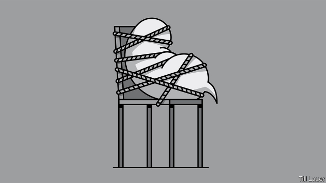

###### Banyan

# Australia’s surprising disregard for free speech 

 

> print-edition iconPrint edition | Asia | Jun 15th 2019 

FOR A GROWING number of Australians, it is like stumbling out of bed and not recognising, let alone liking, the face you see in the bathroom mirror. In early June federal police raided the Sydney headquarters of the state broadcaster, the ABC. It had aired allegations of appalling deeds by Australian special forces in Afghanistan, including the killing of unarmed men and children. You might think the ABC was doing the country a service by revealing such gross misconduct. The Australian Defence Force itself had become concerned about a “drift in values” among elite troops in Afghanistan. Yet the warrant against the ABC read as if it was straight out of an authoritarian rulebook. Among other things it allowed investigators to “add, copy, delete or alter” material in the broadcaster’s computers. 

The eye-rubbing is not just over press freedom, but about Australia’s direction as a liberal democracy. The whistleblower over the Afghanistan allegations was formerly a lawyer with the defence department. David McBride had followed public-interest disclosure rules by raising his concerns with his department. Only when he concluded that they were being ignored did he take his material to journalists. Far from being protected as a whistleblower, he is charged with the disclosure of unauthorised documents and faces a life sentence. His allegations, which have to do with events more than six years ago, have no obvious national-security implications today. 

Nor is this an isolated case. The day before the ABC raid, police separately raided the home of a journalist at the Sunday Telegraph, one of Australia’s bestselling papers, in connection with a story about secret plans to expand the state’s surveillance powers to include snooping on people’s e-mails, text messages and bank accounts. Last year a former spy, known as Witness K, and his lawyer, Bernard Collaery, were charged for (years ago) exposing Australia’s bugging of the government of Timor-Leste during sensitive negotiations over rights to offshore oil and gas. Meanwhile, a former employee at Australia’s tax office, Richard Boyle, faces 66 charges and no fewer than 161 years in jail for exposing its allegedly aggressive debt-collection techniques. When Mr Boyle reported such practices internally he himself became the subject of an investigation. Only after he refused to sign a gag order in return for compensation did he make his claims public. 

All democracies face a tension between civil liberties on the one hand and national security and confidentiality within government on the other. The tensions have grown along with the threat of Islamist extremism. In Australia the establishment feels another profound insecurity, too: the insidious influence of an authoritarian China in commerce, society, academia and even politics. 

Even so, the balance Australia has struck between freedom and security looks skewed. Since 9/11 government has passed more than 60 pieces of legislation that impinge on civil liberties (including one, last year, that obliges social-media firms to find ways for spooks to access encrypted communications). That is more than either America or Britain. 

What is more, America’s first amendment and related laws protect journalists from police who want them to disclose their sources. Britain acknowledges the guarantees of free speech in the European Convention on Human Rights. Australia is almost alone among established democracies in lacking explicit constitutional protection for civil liberties. Its feeble whistleblower laws pointedly exclude protection for public servants—even in cases that have nothing to do with national security. 

For all the opposition Labor party’s attempts to make hay out of the government’s discomfort, it has long been an enthusiastic backer of security legislation. Indeed, few Australians challenge the overweening state. Could their self-image as authority-averse larrikins be wide of the mark? Could it be that Australia’s rugged individualists are happy to defer to nanny? 

Mr McBride, whose trial is due to start in a couple of weeks (and whose obstetrician father is credited with exposing the side-effects of thalidomide, a drug for morning sickness that caused babies to be born with deformed limbs), says the government is using the security apparatus “to fight its own people now”. He feels he has a duty to point this out: “I’ve never felt better. I’ve never liked myself more. I’ve never had a doubt it was the right thing to do for Australia.” Mr McBride, for one, is not afraid to look in the mirror. ◼ 

