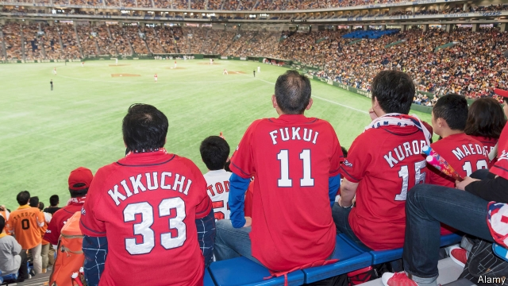

###### Flipping out

# Japanese debate how foreigners should refer to them 

 

> print-edition iconPrint edition | Asia | Jun 15th 2019 

THE WORLD calls the leader of China Xi Jinping. His North Korean counterpart is known as Kim Jong Un. The man who led North Vietnam to independence is almost always dubbed Ho Chi Minh. In all three instances, the surname comes first, and then the given names, as is customary in China, Korea and Vietnam. That is the custom in Japan, too. Yet English-speakers refer to the Japanese prime minister as Shinzo Abe, rather than Abe Shinzo. Why the inconsistency, asks Japan’s foreign minister, Taro Kono—or rather Kono Taro, as he would like to be known. He says he plans to ask foreign media to start conforming to Japanese practice. 

The oddity that upsets Mr Kono does not stem from the West attempting to impose its norms on Japan. When Matthew Perry, an American naval officer, forced Japan to end its self-imposed isolation in 1854, he had no qualms about referring to the Japanese officials he was threatening as they referred to themselves. Instead it was local elites who, after the Meiji Restoration of 1868, when Japan was rapidly modernising by imitating Western institutions and mores, took it upon themselves to reverse the order of their names for foreign consumption. The intention was to disassociate Japan from the rest of Asia and signal its advanced status to Westerners. 

Mr Kono is no nationalist firebrand. He speaks fluent English and is hearteningly open-minded. Indeed, the cause is not really a nationalist one: even at the height of Japanese expansionism during the second world war, Japanese stuck to the convention he is now challenging. The cabinet and the wider population are split on the issue. Some organisations, such as Japan’s national football team, already put family names first in English. 

The debate is an illustration of Japanese culture’s unique, and sometimes awkward, blend of east and west, which stems not only from the Meiji era but also from the American occupation after the second world war. The Japanese love both baseball and shogi (Japanese chess); sushi and doughnuts. Mr Kono argues that the switch to indigenous practice should occur in time for an impending series of showcase events including the Olympics, which Tokyo is hosting next year. But others would argue that Japan’s relaxed and largely unselfconscious blending of foreign and local customs should be the main exhibit.◼ 

