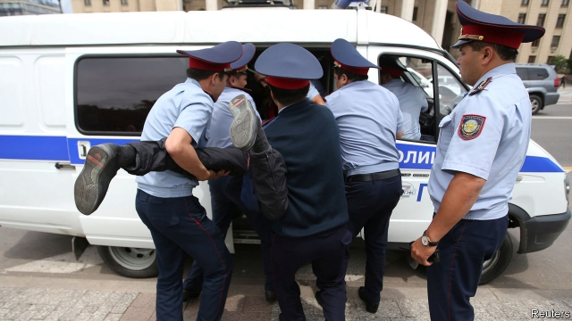

###### Old problems, no solutions

# Kazakhstan’s choreographed election goes off-script 

 

> print-edition iconPrint edition | Asia | Jun 15th 2019 

“HAPPY HOLIDAY!” cried a pie-seller in national dress as voters left a polling station in Almaty, Kazakhstan’s financial capital. A short stroll away in a leafy park, police were ruining the festive mood. Masked officers carried away prostrate protesters and hurled them into police vans. They were breaking up a peaceful demonstration by a few hundred dissenters who had gathered to demand change, even as the man on the verge of being elected president promised continuity. 

With 71% of the vote, Kassym-Jomart Tokayev easily won the election, which was called after the resignation in March of Nursultan Nazarbayev, the autocrat who had ruled for three decades. Mr Tokayev’s closest rival, Amirzhan Kosanov, trailed far behind, on 16%. But monitors from the Organisation for Security and Co-operation in Europe said the poll showed “scant respect for democratic standards”. 

Kazakhstan has never held an election deemed free and fair by credible observers. Mr Nazarbayev won the previous one with 98% of the vote. This week’s contest marked some superficial improvements. It was the first presidential election in 14 years to feature a challenger with a record of opposition. Mr Nazarbayev used to run against loyal supporters who took part simply to provide the illusion of competition. Democracy activists worry that Mr Kosanov, too, simply ended up providing a democratic veneer. How could it be otherwise in a country that has no formal opposition parties, and in which the media and civil society are muzzled? 

The rubber-stamping of Mr Tokayev (who was already interim president) is part of an experiment that Mr Nazarbayev has dreamt up for his country, untested elsewhere in the post-Soviet world. In an apparent effort to secure his legacy, he has handed over power to a chosen successor while still alive. Some speculate that Mr Tokayev is merely a seat-warmer for Mr Nazarbayev’s daughter, Dariga Nazarbayeva, who presides over the Senate. 

Either way, Kazakhstan’s 78-year-old founding father is micromanaging the transition. Mr Tokayev, 66, is a Soviet-era apparatchik who became foreign minister and prime minister after Kazakhstan became independent. His diplomatic skills should help him juggle relations with Kazakhstan’s mighty neighbours, Russia and China, as well as the West—a trick Mr Nazarbayev managed with great dexterity. 

But it is at home that Mr Tokayev will face his greatest challenges. Mr Nazarbayev’s resignation has spurred some of Kazakhstan’s 18m citizens—especially people under 29, who have only ever known Mr Nazarbayev as leader and are now over half the population—to challenge the regime’s zero-tolerance attitude towards dissent. The authorities in Almaty and Nur-Sultan, the capital recently renamed after Mr Nazarbayev, arrested 500 protesters on election day and hundreds more later, after results were released and Mr Tokayev sworn in. Three mothers are under house arrest after taking part in a demonstration in May. The regime has jailed people for demanding a fair election. One man held up a blank piece of paper, with no overt criticism of anyone, to test the limits of peaceful expression. Police grabbed and detained him. (He was later released.) 

Such repression has backfired. It has become a catalyst for protests invoking a phrase from a century-old poem urging Kazakhs to shake off Russian colonial rule: “I’ve woken up.” Inventive videos mocking the government’s heavy-handedness have gone viral. Offline, activists have formed a new movement, “Oyan, Qazaqstan” (Wake Up, Kazakhstan). Their nine-point platform for political reform includes the abolition of the executive presidency. The government’s apologists have been deriding them as out-of-touch sophisticates. 

Even if he wanted to, Mr Tokayev will find it difficult to adopt reforms in the shadow of Mr Nazarbayev, who will not want to see the system he fashioned dismantled. Despite the country’s oil wealth many complain of unemployment, low wages, corruption and a lack of access to housing, health care and education. Before the election, Mr Tokayev took to Twitter to promise “political modernisation”. “Old problems—new solutions,” he tweeted brightly. Kassymkhan Kapparov, a democracy activist, riposted tartly: “Old problems—old people who created them.” ◼ 

