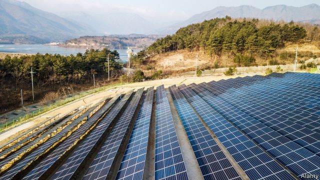
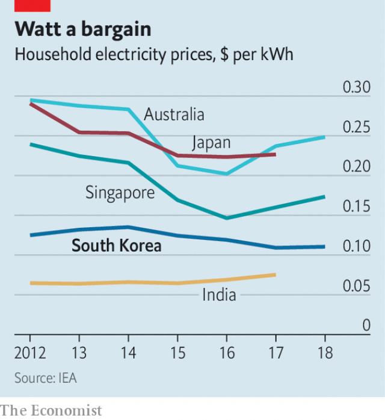

###### A muddy future

# South Korea’s government wants greener energy. Who will pay for it? 

 

> print-edition iconPrint edition | Asia | Jun 15th 2019 

STANDING IN THE middle of a huge coastal mud flat, Moon Jae-in, South Korea’s president, announced in October the beginning of “a new 1,000-year energy history” for his country. Behind him stretched a field of solar panels; a large windmill loomed in the background. The area, called Saemangeum, was dammed with the world’s largest seawall under a previous administration. Mr Moon wants it to become home to wind farms and solar plants capable of generating 4GW of power, to give South Korea a “brighter future”. 

The site has unfortunate associations. The seawall, conceived in the early 1990s to reclaim land for agriculture, is the country’s most famous white elephant. It cost billions to build, but by the time it was completed, in 2010, there was little demand for new farmland. Environmentalists, meanwhile, lamented the destruction of an important way-station for migratory birds. Local fishermen complained their catches had shrunk. The vast expanse of stagnant, brackish water trapped behind the dyke hardly speaks of a greener future. 

Yet a greener future is needed. By Mr Moon’s own admission, South Korea lags “embarrassingly behind” other countries when it comes to renewable energy. In 2017 43% of its electricity came from coal-fired plants, up from 39% the year before (the increase is because of another of Mr Moon’s policies, the slow phase-out of nuclear power). Emissions of greenhouse gases are rising, even though South Korea is a signatory to the Paris climate agreement and has pledged to reduce them to 20% below the level of 2010 by 2030. In April the government said it would increase renewables’ share of generation from the present 6% to 20% by 2030 and to 35% by 2040. 

The commitment is timely. South Korean voters are increasingly sensitive to environmental matters, particularly the fine dust that blankets the country for large parts of the year. Scrutiny of coal-fired power plants and other industries is growing, and the authorities are backing away from their long-standing claim that most air pollution is blown in from China, and so is out of their hands. 

 

But the government is woolly about how it will achieve its goals. A generous price subsidy for renewable generation was scrapped in 2012. Saemangeum aside, the country’s rugged terrain makes installing renewables expensive. The average electricity price paid by consumers is around $0.10 a kilowatt-hour, among the lowest in the OECD, a club of rich and middle-income countries. Raising it would be the obvious way to pay for the expansion (as well as to encourage efficiency). But that would be politically tricky, says Jung Tae-yong of Yonsei University in Seoul: “People think of electricity as a public good—they expect it to be cheap.” 

That makes it hard for the government to attract private investment to projects such as Saemangeum. The local development agency is offering tax breaks and preferential land leases to investors who are willing to take the plunge. Since 2012 the government has said that a steadily growing share of power sold by utilities—currently 6%—must come from renewable sources, but it is not rising fast enough to hit the government’s targets. “It’s just not that attractive to invest in renewable energy in South Korea,” says Mr Jung. 

More than 90% of the country’s electricity is generated by KEPCO, a listed but state-controlled utility, which also controls the grid. Since the government began scaling back nuclear power in earnest in late 2017, it has lost money in every quarter but one. In the first quarter of this year it posted an operating loss of 630bn won ($525m), more than twice as much as expected. KEPCO blames the poor results mainly on the rising price of imported natural gas and coal, as well as having to cut back on cheap nuclear generation. It is thinking of petitioning the regulator to raise prices. Mr Jung thinks that this is the way forward. “We’re not a developing country any more. Eventually, the government will just have to admit that if we want clean and safe energy, we’re going to have to pay for it.” ◼ 

