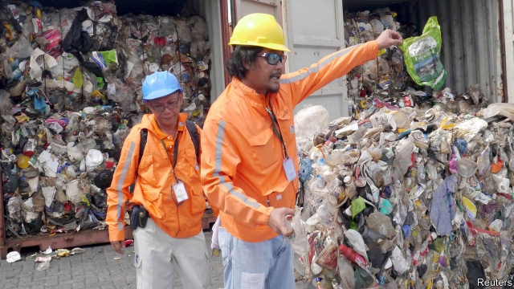
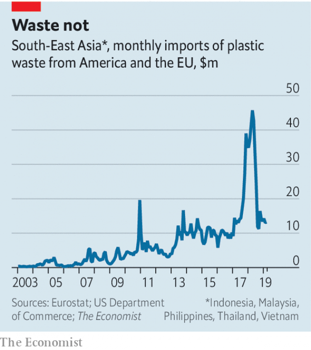

###### Refusing refuse

# South-East Asian countries are banning imports of waste for recycling 

 

> print-edition iconPrint edition | Asia | Jun 15th 2019 

THERE IS NO point collecting recyclable waste unless someone is willing to buy it and actually do the recycling. Until late 2017 China was the world’s biggest importer of scrap by far. This made sense. Like most other forms of manufacturing, recycling is cheaper there. Moreover, Chinese factories consumed lots of the resulting plastic and pulp, whereas developed economies, which tend to be net importers of goods, had plenty of plastic bottles and cardboard boxes to spare. It also helped that shipping to China was cheap, since ships would often otherwise return to the country with empty containers. 

All this came to a halt when the Chinese government banned the import of all but the purest scrap material in 2017, killing a trade worth $24bn a year. Waste dealers in the rich world had to scramble to find new buyers. South-East Asia soon emerged as the pre-eminent destination for foreign waste. Unfortunately, the region’s recycling industry is much smaller than China’s; its processing plants were quickly overwhelmed. Plastics from America and Europe have piled up in landfills. Lots of toxic rubbish has simply been torched. 

South-East Asian governments are not pleased. They have begun to ban or crimp imports themselves, abruptly diminishing a booming business (see chart). On May 28th Yeo Bee Yin, Malaysia’s environment minister, complaining that “garbage [was] being traded under the pretext of recycling”, announced that her government would be sending back 3,000 tonnes of foreign plastic. Much of it was of poor quality, she noted, and hence unrecyclable. 

 

Thailand plans to ban plastic-waste imports by 2021. Vietnam’s government has similar ideas. Kate O’Neill of the University of California, Berkeley, reckons these bans are motivated not only by environmental concerns but also by pride: Asia does not want to be the world’s dumping ground. 

Rodrigo Duterte, the president of the Philippines, recently threatened to go to war with Canada if it did not take back a shipment of plastic scrap. Canada agreed to take it away, and Mr Duterte stopped blustering after an election had passed. All the same, rich-world exporters might want to start work on Plan C.◼ 

