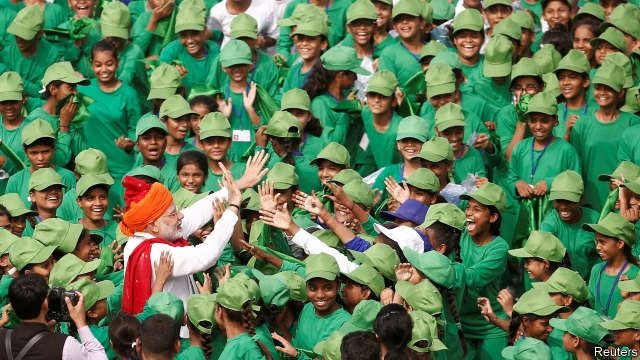

###### Costume drama

# What will Narendra Modi do in his new term as India’s prime minister? 

 

> print-edition iconPrint edition | Asia | Jun 15th 2019 

NARENDRA MODI, India’s prime minister, famously wears a different hat for every audience, from feathered headdresses to towering turbans. He adopts different personas, too: a hug-happy uncle on trips abroad, a finger-wagging prosecutor against critics, a pious ascetic for the religious, a chowkidar (watchman) to please law-and-order nationalists. Now, after a landslide election that gave him an even stronger mandate than in his first five-year term, Indians are wondering which of these guises will prove to be the real Mr Modi. With no looming elections to distract, and the opposition crushed, he can do whatever he likes. 

Judging from his ministerial picks, Mr Modi intends to be even more hands-on than before. Coalition partners of his Bharatiya Janata Party (BJP) had hoped for top posts. But Mr Modi owes them nothing: he won a parliamentary majority without them. So his bulging 57-person government consists largely of loyalists from his own party. Many of the new ministers are provincials with little experience of Delhi. The big exceptions are his new foreign minister, Subrahmanyam Jaishankar, a capable career diplomat, and the new home minister, Amit Shah. 

Tireless as Mr Modi, Mr Shah has for decades been a close henchman and enforcer. As president of the BJP he greatly strengthened party numbers and discipline, and is widely credited as the organisational genius behind the party’s electoral success. Mr Shah’s new job, with oversight of domestic intelligence and police, confirms his standing as second-in-command. He will take a hard line on unrest among Muslims in the seething state of Jammu & Kashmir and has promised a nationwide register of citizens to root out illegal immigrants, whom he labels “termites”. 

The new government has signalled plans to build on some of Mr Modi’s first-term successes. During the campaign Mr Modi claimed to have brought electricity to all 600,000 of India’s villages; the next step is to make it work around the clock. He will also bolster vote-winning social programmes, such as cash handouts to farmers and a broadening of health insurance for the poor. 

Mr Modi’s personal pledge to eliminate “open defecation” spurred the building of an impressive 92m toilets. His new government’s laudable first promise is to follow this up by bringing safe, piped drinking water to every Indian home by 2024. As a start, it has merged a handful of agencies and ministries dealing with water. 

Mr Modi’s new minister of finance, Nirmala Sitharaman, has started off with a broom, sweeping 12 top bureaucrats out of the tax administration and inviting wider public consultation on the budget, which is due to be released in July. The ministry has won plaudits over the past five years for relative fiscal probity and for bringing in a long-awaited national goods-and-services tax (GST) to replace a web of local duties. But it remains unclear whether Ms Sitharaman, a former BJP spokesperson who most recently ran the defence ministry, has the understanding or her bureaucrats the will to sweep away a clutter of other tax rules which, among other things, discourage employers from adding workers or properly registering them, punish savers and impose unduly tangled compliance requirements on even small businesses. 

An early test will be whether the government can simplify the GST and reduce rates. If it wanted to succour the moribund construction industry, for example, it could lower the tax on cement from 28%, as well as slash heavy fees for property registration. Corporate debt presents another challenge: just as a $150bn accumulation of bad debts in the banking system peaked and began to decline last year, the debts of other sorts of finance firms ballooned dangerously. Mr Modi’s government has until now reacted slowly and hesitantly to this mess, hoping that injections of fresh capital at state-owned banks, lower interest rates and rapid economic growth would help to paper over the disastrous lending. But this week Arvind Subramanian, a former adviser to Mr Modi, released a paper suggesting that the economy has been growing much more slowly than official data say (see article). That suggests that more vigorous action may be needed. 

For a prime minister with so resounding a mandate, Mr Modi has proved surprisingly shy about another pressing issue: administrative reform. India is peculiar in having a hugely fussy but remarkably skinny and understaffed bureaucracy. Around a quarter of central government positions are vacant at any given moment. Top bureaucrats are shunted between posts at bewildering speed. Rules rarely allow for the hiring of outside brainpower, such as urban planners or financial experts. Mr Modi has made a first chink in this system by allowing for contract employment of a limited number of specialists. But there is a long way to go. 

On other big issues, such as the choking air pollution that afflicts northern India, or the water mismanagement that has led to dangerous shortfalls across the country, the government has been less than impressive. Some of Mr Modi’s ministers have done incremental work to address pollution, but others dismiss complaints as exaggerated. Even as the government talks of bringing clean water to every home, it also suggests linking all India’s big rivers with a series of canals, to the horror of environmentalists. India’s problems are as varied as Mr Modi’s hats. Only by concentrating less on appearances and more on actions will he get to grips with them. ◼ 

