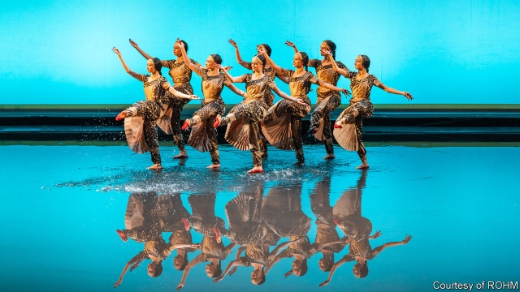

###### The sultan’s song

# An opera boom in the Gulf 

 

> print-edition iconPrint edition | Books and arts | Jun 15th 2019 

IN “LAKMé”, AN opera by Léo Delibes, a Brahmin priest laments his daughter’s affair with a British officer. The patriarch’s view of forbidden love has a special piquancy at the Royal Opera House, Muscat (ROHM), where the work was performed earlier this year. One of the most spectacular opera houses in the world, the venue is the flagship of the art form’s swift rise across the conservative Gulf region. 

In 1970, when Sultan Qaboos ousted his father, Oman had only two hospitals and three schools. Qaboos, now 78, has used some of the country’s oil wealth to update both its infrastructure and its image. The sultan is an autocrat (and a spendthrift), but he affects an enthusiasm for the arts. He founded the Royal Oman Symphony Orchestra in 1985; the ROHM (pictured) opened in 2011. Its staircase and marble match the Opéra de Paris in grandeur. 

But the region’s opera boom transcends Oman. Dubai opened a glass-cased opera house in the shadow of the world’s tallest skyscraper in 2016. Kuwait’s glitzy new culture complex staged “The Magic Flute” last year. Meanwhile Jordan’s open-air opera festival, the region’s first, is now held each year in Amman’s Roman amphitheatre. 

One reason for the fad is economic. Qaboos wants to create jobs for Omanis and diversify beyond oil, including by boosting tourism. The ROHM has reputedly become Muscat’s second-most-popular sight, after the Grand Mosque; three-quarters of its staff are Omani. 

Soft-power diplomacy is also part of the story. For example, a plan is afoot for Oman to fund an opera house in Beirut. A bid to recruit a Saudi minister to the board of La Scala in Milan—and for it to accept €15m from the Saudi government—foundered amid an outcry over human-rights abuses. But La Scala’s academy still plans to set up an opera school for children in Riyadh. 

Oil has fuelled the opera boom, but Western expertise has helped. Jasper Hope, formerly of the Royal Albert Hall in London and now chief executive of Dubai Opera, has introduced a spin-off from the BBC Proms. Umberto Fanni, the well-connected director of the ROHM, has attracted prestigious artists to Oman. Plácido Domingo has sung there; a new production of “Rigoletto” by Franco Zeffirelli, a legendary director, is due to open in Muscat next year. 

Still, adapting a mannered—and often bawdy—European art form to local tastes is a challenge. “The risk is that you disorientate audiences,” says Farid Rahi, CEO of Opera Lebanon (itself founded in 2015). “You need a very simple theatrical language.” Sex and religion cause particular problems. “When we staged ‘La Traviata’ [Verdi’s opera about a Parisian courtesan], we had water instead of wine,” Mr Fanni recalls. The production in Muscat emphasised the heroine’s “dignified journey to death rather than her libertine lifestyle.” 

As well as European classics, the ROHM offers works from the Middle East, such as “Antar and Abla”, an Arabic opera commissioned by Opera Lebanon. Mr Fanni’s ultimate aim is to replace the imported shows that have hitherto dominated the repertoire with in-house productions. The Teatro Carlo Felice in Genoa provided the chorus and musicians for “Lakmé”, but the ROHM made the sets. Mr Fanni hopes soon to mix Omani musicians with the foreign players who occupy the orchestra pit now. 

The complexion of the audience is also changing—slowly. When the ROHM was inaugurated during the Arab spring, protesters decried the project’s profligacy. Local interest in opera has risen; but even now, only around 15% of punters are Omani. ◼ 

