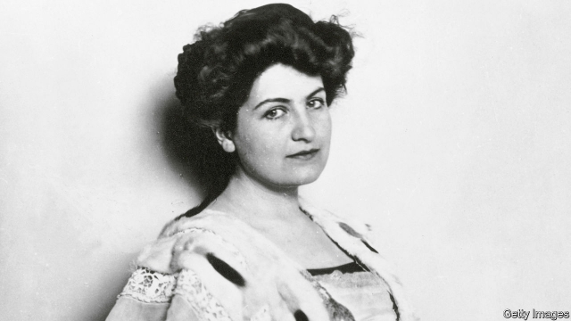

###### A muse’s burden

# The life and loves of Alma Mahler 

 

> print-edition iconPrint edition | Books and arts | Jun 15th 2019 

Passionate Spirit: The Life of Alma Mahler. By Cate Haste.Bloomsbury; 486 pages; £26. To be published in America by Basic Books in September; $32. 

ALMA MAHLER was the supreme femme fatale of early-20th-century Vienna. From composers to priests, artists to architects, scientists to writers, she conquered hearts—and broke them. Her first kiss was with Gustav Klimt; her first husband was Gustav Mahler. Her second was Walter Gropius, founder of the Bauhaus movement; her third, the writer Franz Werfel. Her lovers included Oskar Kokoschka, a daring artist who commissioned a fetishistic, life-size doll of Alma after she ditched him. A century on, she has become the subject of feminist revisionism. Was she a capricious muse—or victim of chauvinist oppression? 

“Passionate Spirit”, Cate Haste’s seductively accessible biography, offers a sympathetic interpretation of Alma’s life. Written in elegant, lucid prose, her book is a treasure trove of European cultural riches and scandalous intrigue. She uses Alma’s diaries to capture her subject’s inner world. 

Alma was born in 1879, the daughter of the painter Emil Schindler. She worshipped her father, which may help explain the magnetism that talented men exerted on her throughout her eventful life. Yet as Ms Haste emphasises, Alma was creative herself, pursuing both musical composition and piano. 

Her first serious fling was with the composer Alexander von Zemlinsky. She jettisoned him after meeting Mahler, whose fiancée she soon became. Sternly he decreed that there was room for only one artist in their relationship. Devastated, Alma nevertheless gave up her music for the sake of love. Theirs at first seemed a happy marriage, but, increasingly frustrated, she began an affair with Gropius. Gustav sought advice from Sigmund Freud, but Alma continued the dalliance until his death. Ms Haste thinks she took the only way out of an oppressive marriage. Others claim that she as good as killed her husband. 

This biography captures the turmoil of Alma’s affairs, her artistic disappointments, visceral appetites and the tragic deaths of three of her four children. She emerges as a tough, lively, cultured and wilful woman, who also composed highly regarded songs that were characteristic of her era; a modern performer describes them as “sensual, charming and surprising”. As Ms Haste says, these works have been overshadowed by Gustav’s genius. 

This portrait of Alma is compelling; the feminist gloss, less so. Alma is known to have edited her diaries (and Gustav’s correspondence), making them unreliable records of her travails. His dominant streak does not account for her later behaviour. They were married for only nine years; Alma lived to be 85. 

Did she have the tenacity and discipline to have been as prolific a composer as Gustav? She seems generally to have preferred more immediate forms of gratification. The sad truth, from a feminist perspective, is that, if Alma had actually led the life of a dedicated composer and forgone her sensational flings, she might now be a much less famous figure. ◼ 

