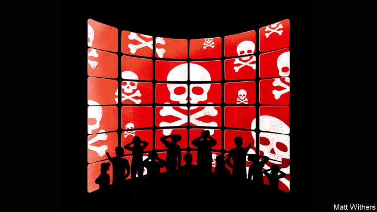

###### Guardians of the galaxy

# The unacknowledged legislators of the online world 

 

> print-edition iconPrint edition | Books and arts | Jun 15th 2019 

Behind the Screen. By Sarah Roberts.Yale University Press; 280 pages; $30 and £20. 

THEY ARE paid to spend their days watching filth: beheadings and chemical-weapons attacks, racist insults and neo-Nazi cartoons, teenagers encouraging each other to starve, people having sex with animals or with ex-lovers against whom they want revenge. When batches of images leap onto their screens, they must instantly sort them into categories, such as violence, hate speech and “dare” videos, in which people offer to do whatever a stranger asks. If the material violates the platform’s explicit policies (nudity, sensationalistic gore), they take it down. If it contains suicide threats or evidence of a crime, they alert law-enforcement authorities. If it is a borderline case (violence with possible journalistic content, say), they mark it for review. Some earn $15 an hour, some a piece-work rate of a few cents per item, sorting anywhere from 400 to 2,000 a day. 

With soldierly bravado, they insist the job does not upset them. “I handle stress pretty well,” says one of the social-media content moderators interviewed by Sarah Roberts in “Behind the Screen”—before admitting to gaining weight and developing a drink problem. They avoid discussing their work with friends or family, but it intrudes anyway. War-zone footage, child sex-abuse and threats of self-harm are especially hard to repress. “My girlfriend and I were fooling around on the couch or something and she made a joke about a horse,” says another moderator. “And I’d seen horse porn earlier in the day and I just shut down.” 

Those who work directly for the big American internet platforms may boast about it to their friends, but they are mainly on short-term contracts with little kudos or chance of promotion. At a huge Silicon Valley firm that Ms Roberts calls MegaTech, the content moderators were barred from using the climbing wall. Even further down the hierarchy are third-party contractors in India and the Philippines, who handle material for corporate websites, dating sites and online retailers, as well as for the big platforms. Whether in San Francisco or Manila, their task is fundamentally the same. These are the rubbish-pickers of the internet; to most of the world, they are all but invisible. 

An estimated 150,000 people work in content moderation worldwide. Ms Roberts’s book is one of just a few about them. Much of her research was conducted early this decade; for recent developments, she is obliged to refer to articles by journalists such as Adrian Chen of Wired. But in some ways little has changed. A short documentary Mr Chen made in 2017 about moderators in India suggests the job was largely the same as it was in California in 2012. 

One reason content moderation is hard to investigate is that social-media companies prefer not to talk about it. The platforms have never been comfortable with their role as gatekeepers. Like much of Silicon Valley, their culture reflects the libertarian optimism of the internet’s pioneers, which Ms Roberts terms “an origin myth of unfettered possibility for democratic free expression”. Early cyberspace utopians thought censorship would soon be obsolete: the internet would treat it as a broken node and route around it. (The Great Firewall of China had not yet been erected.) Until recently, strategists at giant social-media firms seemed to imagine they were still running the sorts of self-policing communities which existed on text-only messaging boards in the 1990s, and which survive today on forums like 4chan and Reddit. 

The platforms also have less rarefied reasons to keep content moderation out of the public eye. America’s law on online content, the Communications Decency Act of 1996, lets internet companies restrict it as they see fit, and holds them largely immune from liability for third-party material on their websites. A fear that legislators might deem the firms’ methods biased or inadequate—and decide to regulate them—makes executives circumspect in both what they do and how they talk about it. The big platforms and their contractors routinely require moderators to sign non-disclosure agreements. 

Since the American presidential election of 2016 and the Brexit referendum, controversies over fake news, hate speech and online harassment have forced internet companies to bring content moderation into the light—up to a point. Facebook says it now has 30,000 people working on safety and security worldwide, of whom half are moderators (many of them employed by outside contractors). Twitter has beefed up its moderation staff; it now boasts about the number of accounts it suspends, sometimes millions per month. A new German law requires internet sites to delete material that breaks hate-speech laws within 24 hours of a complaint. Last week YouTube began taking down thousands of channels that violated policies against racism, sexism and religious bigotry. It has also been criticised for algorithms (now amended) that routed family videos to viewers who expressed an interest in child porn. 

These efforts have exposed the platforms to just the sort of criticisms they are least comfortable with. Alt-right YouTubers whose channels are taken down because of racism complain they are being censored by the liberal establishment. Some history channels were initially knocked out too, because they displayed racist material in order to critique it (they have since largely been restored). Still, when targets of suspensions complain, they are usually met by a boilerplate statement that their content violated company policies, with no explanation of what those policies are or exactly what the violation was. 

As Ms Roberts shows, the opacity is ingrained. Social-media sites have often been reluctant to tell malefactors precisely what they did wrong. Beside the political risks, they fear that would let provocateurs flirt with the edges of prohibitions, and furnish endless fodder for challenges to their decisions. A report in February by the Verge, a news site, found that a Facebook subcontractor’s training regime required moderators to learn a decision-tree of rules, then justify which one led to a take-down. Even so, individual instances often involve subjective judgments, which are almost never explained to users. 

For years, tech activists have called for more transparency about these boundaries. But some say that simply revealing the rules is insufficient, because formal criteria can never capture the irreducible moral and political decisions moderators make. Ms Roberts’s subjects already faced such dilemmas in 2011, when MegaTech decided that gruesome images from the Arab spring constituted news (and so could stay), but equally grim ones from gang conflicts in Central America had to go. 

Others think the focus on what may be published misses the bigger question of which posts get amplified—by being shared, liked or “ratioed” (the current term for a wave of negative comments). Last week Carlos Maza, a reporter for Vox.com, pilloried YouTube for refusing to take down videos by Steven Crowder, a conservative YouTuber who had mocked him using homophobic slurs. As well as complaining about the slurs themselves, Mr Maza said he had been subjected to online harassment by some of Mr Crowder’s many followers. This raises the difficult question of whether platforms should impose stricter rules on influential personalities. 

A different approach was suggested last year by Tarleton Gillespie, a consultant, in his book “Custodians of the Internet”. Part of the problem, he says, is that both users and companies have got it wrong: content moderation is not a peripheral inconvenience, but “in many ways, the commodity that platforms offer”. Increasingly, these sites are where people conduct their lives, and the task of keeping them within acceptable bounds of discourse, and excluding the unconscionable, may be the most important thing the firms do. It is too demanding for harried box-tickers. 

Facebook has recently raised moderators’ pay; YouTube has limited their exposure to disturbing videos to four hours a day. But in general, as Ms Roberts chronicles, moderators are treated as low-skilled labour. She is particularly good at depicting how the strange international network of content moderation mirrors the class divides of other globalised industries. Just as it dumps some of its nastiest refuse in poor countries, the West leaves it to them to sort much of the internet’s yuckiest trash. ◼ 

