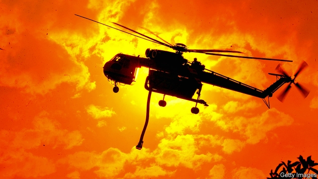

###### Into the inferno

# What caused Australia’s devastating bushfires? 

 

> print-edition iconPrint edition | Books and arts | Jun 15th 2019 

The Arsonist. By Chloe Hooper.Scribner; 272 pages; £14.99. 

BEEHIVES SPONTANEOUSLY combust and trees ignite in sudden blasts. Burning birds fall from the sky. As embers the size of dinner plates rain down and a blaze roars “like seven jumbos landing on the roof”, people submerge themselves in any body of water they can find. They cover their faces with lilypads, pond slime, tea-towels or wet gloves. The sun is smothered by smoke and everything turns red. There is, reports Chloe Hooper, “no air in the air”. 

This was how survivors described their experiences ten years ago, after hundreds of fires, giving off the heat of 500 atomic bombs, raged through the state of Victoria in south-eastern Australia. Thousands of homes were lost, 173 people died and 450,000 hectares of land were burnt to a crisp, over seven times the area that was incinerated in and around Paradise, California, last year. When investigators looked down from helicopters afterwards, it seemed that the roofs of houses had been peeled off, the rooms below resembling “chambers of the heart”. 

Although many of the fires that wreaked havoc in the state were subsequently found to have been caused by failures in its badly regulated electricity grid, two turned out to have been lit intentionally. In “The Arsonist” Ms Hooper focuses on the infernos sparked by a “firebug” in the Latrobe Valley. She asks what she calls “the impossible question”: What sort of person would do this, and why? 

The answers were not simple. Evidence was all around—in the wasteland, the rubble and the gum leaves of highly flammable eucalyptus trees, “thousands of fingers pointing the way the fire had gone”. But arson is notoriously difficult to solve: only 1% of wildfire arsonists are ever caught. The conviction of Brendan Sokaluk, a middle-aged man on the autism spectrum, for deliberately starting a blaze that killed 11 people, was a surprising success for the Victoria police. 

But the road to the guilty verdict was rocky. Unemployed and eccentric, Mr Sokaluk collected scrap metal to sell for pocket money and enjoyed watching episodes of “Thomas the Tank Engine” in his shed. He can barely read or write and had never been on a plane, but was able to draw complex maps with an uncannily precise bird’s-eye perspective. He was the “butt of jokes amongst people who were themselves the butt of jokes”, the author says of his ostracised life in a downtrodden part of the country. 

Mr Sokaluk emerges as both vulnerable and an odd, sometimes malicious, pest. To the detectives, he was a cunning fiend capable of “unleashing chaos and horror”. To his lawyers he was hapless and naive. After the verdict was delivered they felt devastated, “for it seemed they were leaving behind a child”. 

Another villain lurks in the background of this story: the Hazelwood power station, a coal-powered plant that looms over Latrobe Valley and provided almost a quarter of the state’s electricity before it was closed in 2017. Brown coal is dirty and unstable, and the lives of those associated with it are liable to be equally volatile. The plant’s privatisation in the 1990s led to a rise in long-term unemployment. “People’s friends and family worked cutting the stuff out, burning it, and then everyone breathed in the vapours of strife,” writes Ms Hooper. “The valley became a human sink.” 

Unpredictable as arson can be, she learns that people are more inclined to destruction in places where “high youth unemployment, child abuse and neglect, intergenerational welfare dependency and poor public transport meet the margins of the bush”. In an age of climate change and stubborn inequality, in Australia and beyond, that is an unsettling conclusion to a gripping and insightful book. ◼ 

