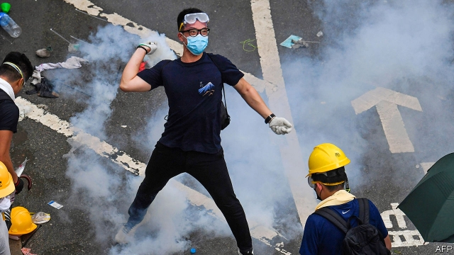
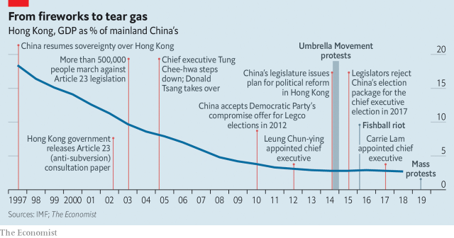
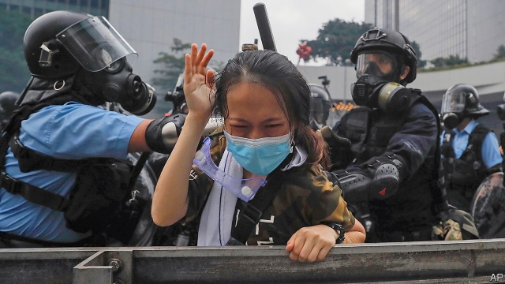

###### A palpable loss

# A proposed extradition law triggers unrest in Hong Kong 

 

> print-edition iconPrint edition | Briefing | Jun 13th 2019 

THIS IS A story told in tears. The most obvious were those streaming from the eyes of protesters in the shadows of Hong Kong’s glass-walled office towers, while police tried to disperse them with tear gas, as well as plastic bullets, water hoses and clubs. The protesters had gathered late on June 11th to try to stop a debate in Hong Kong’s legislature on an extradition bill. If passed into law it would allow, for the first time, the sending of criminal suspects from the territory to mainland China, where judges explicitly serve under the absolute leadership of the Communist Party. 

The protest escalated on June 12th and succeeded in delaying the debate. But when the protesters refused to leave, and pushed forwards through police lines towards the Legislative Council building, violence broke out. Hospital officials say 72 people were injured, two seriously. The following day a few dozen protesters gathered, as well as many police. But as The Economist went to press, the city was calm. 

The most revealing tears, though, were those of Hong Kong’s chief executive, Carrie Lam—tears all the more chilling for being seemingly heartfelt. On the sweltering afternoon of June 9th the city saw a huge march against the extradition law. As many as a million people may have joined it, possibly making it the largest demonstration since China took over in 1997. Mrs Lam was asked by a local television channel if she might consider shelving the extradition law in response to this protest. Sadly, she would not. “I’m a mother, too,” she said, wiping her eyes. “If I let him have his way every time my son acted like that, such as when he didn’t want to study, things might be OK between us in the short term. But if I indulge his wayward behaviour, he might regret it when he grows up.” Her tone—self-righteous and pitilessly parental—was the authentic voice of Hong Kong’s ruling elite contemplating an display of defiance it cannot, and will not, tolerate. 

Mrs Lam, who was hand-picked by a panel dominated by politicians and tycoons loyal to Communist rulers in Beijing, says the new bill will plug a “loophole”—as if previous leaders somehow forgot to draft rules for sending suspects to China’s courts, which take orders from the Communist Party. Its opponents, she says, would make Hong Kong a refuge for fugitives. Besides, the authorities there note, the law excludes those accused of political crimes. To this opponents retort that Chinese dissidents routinely face trumped-up charges of offences like bribery or blackmail. When Gui Minhui, a Hong Kong-based publisher of scandalous books about Communist leaders, vanished in Thailand and reappeared in custody in China, the charges against him referred to a car accident more than a decade earlier. 

The occasion, or pretext, for Mrs Lam trying to rush the law through with minimal debate was the murder in Taiwan of Poon Hiu-wing, a woman from Hong Kong. Chan Tong-kai, her boyfriend and the prime suspect, was subsequently convicted in Hong Kong of money-laundering. Hong Kong’s government said that, to make sure Mr Chan stands trial in Taiwan when he finishes his sentence, the chief executive needed the power, with only limited procedural oversight from the courts, to extradite fugitives to places with which Hong Kong has no extradition deal. These include other parts of China—which, as far as the governments in Hong Kong and Beijing are concerned, include Taiwan. 

This will not wash. Taiwan will not use the proposed law to seek Mr Chan’s rendition because it refuses to be treated as China’s territory. Opposition lawmakers and academics in Hong Kong have drafted proposals for a one-off arrangement which would let the territory return Mr Chan to Taiwan with no new law. 

 

As to Mrs Lam’s loophole, it is not a bug but a feature, according to Margaret Ng, a barrister. The current extradition law took effect just months before the territory was handed over from Britain. Ms Ng, who was a legislator from 1995-2012, says that the officials drafting it chose to maintain a firewall between Hong Kong’s justice system and that of the mainland. They wanted “to protect the rule of law in Hong Kong and confidence in Hong Kong as an international hub free from China’s much-mistrusted system.” If China’s nostrum of “one country, two systems” was to mean something, this part of Hong Kong’s system would have to stand apart from China’s. 

Anson Chan, who was the chief civil servant in the Hong Kong government both under the British and for the first four years of Chinese rule, notes that the colonial government considered granting Hong Kong courts extraterritorial powers to try serious crimes committed by Hong Kongers in the mainland as long ago as 1986. It did so precisely because it believed that Chinese courts were not trusted. Under China’s current leader, Xi Jinping, she says “there is even less” trust today. 

It was the prospect of losing that firewall that brought out the crowds on June 9th. If the organisers’ estimate is correct, the turnout represented a seventh of the territory’s population. Many dressed in white, the colour of mourning. Several confided that this was their first time at a political demonstration. The scale of the protest was a surprise to many observers. It gave the lie to the oft-aired notion that Hong Kongers have tired of standing up for their freedoms. 

The protest that began on June 11th was smaller, involving tens of thousands of demonstrators who returned to the city’s administrative and ceremonial heart when the legislature was due to debate the bill. This time, most were dressed in black. Many were university students on their summer vacation. Others were workers from hundreds of businesses that had given staff the day off. They were mostly young. But they were not inexperienced. Many had taken part in the pro-democracy “Occupy Central” protests that snarled streets for weeks in 2014, also known as the “Umbrella Movement” after the means used by protesters to ward off pepper spray. On June 12th they had not just umbrellas but masks, scarves, hard hats and plastic cling film for protecting bare skin. Some also came armed with bricks, which they hurled after the police began using force. 

The scale of the protest against the extradition law has been a surprise even to pro-democracy activists. In an interview last year Benny Tai, a rumpled law professor from Hong Kong University who was one of the leaders of Occupy Central, expressed doubt as to whether his city might ever see large demonstrations again. “People are concerned that it is not safe to protest, especially in the business sector,” he sighed. He talked of “holding the line” while waiting for democracy to stir in mainland China. 

 

It would be interesting to hear Mr Tai’s views now. But since April he has been in prison, along with other Occupy Central leaders. Some of today’s crop of demonstrators will doubtless follow in their footsteps; and their sentences may well be longer than Mr Tai’s 16 months. Mrs Lam called the protest “a blatantly organised instigation of a riot”. If “riot” was meant in its strict legal sense, that suggests participants could face ten years in prison. 

Officials in Beijing, too, were probably not expecting such widespread opposition to the bill. By now, 22 years after Hong Kong became a Chinese Special Administrative Region, the country’s rulers had expected the territory’s people to have accepted their allotted fate: a life of well-fed but politically neutered domestication, like so many golden-egg-laying geese. Recent years have seen the emphasis on autonomy at the time of the handover being overturned by proposals that would leave Hong Kong merely China’s wealthiest and most international city. Hong Kong remains valuable to China as a global financial centre. But whereas the territory was responsible for over 15% of the combined GDP of China and Hong Kong in 1997, it provided less than 3% in 2018. 

The costs of defiance, meanwhile, have risen. In 2003 marches convinced the authorities to shelve an anti-sedition law that Beijing wanted to impose, an upset which led to the resignation of the first chief executive, Tung Chee-hwa. Since then, and most notably after Mr Xi became party leader in 2012, the central government has grown less patient. One of the most striking, and disturbing, aspects of the extradition-law crisis has been that members of the Standing Committee of the Politburo in Beijing have weighed in directly. Such unprecedented interventions say much about the central government’s growing impatience with the territory. 

Though news outlets and social media aimed at mainland audiences censored reports of the protests, in commentaries intended for overseas consumption Chinese state media have accused “foreign forces” of trying to create “havoc” in Hong Kong. Actually, this is a strikingly moderate, organic movement, backed by local lawyers, priests, scholars and by business lobbies that usually shun politics. Mrs Chan spent four-and-a-half hours among the marchers on June 9th. They probably “held out very slim hope that the government will change these proposals” she says. “But they wanted to stand up and be counted.” 

Hong Kong has already endured limits on the freedom of locals to stand for election—they have to accept Chinese rule and forswear independence for Hong Kong—and has seen activists jailed. Critics and enemies of the Communist Party have never been truly safe, even without an extradition law. Some have been abducted, usually reappearing on the mainland mouthing stilted confessions of guilt. But the protection of their rights still matters to Hong Kongers. “People with a clear conscience in Hong Kong feel safe in their own beds,” says Mrs Chan. Now, with the prospect of being taken into arbitrary detention by China, that safety is at risk. 

Mrs Chan hopes that the chief executive will think again and set out “viable options” for handling fugitives from China, with a long period of consultation. Alas, that seems too optimistic. It cannot help that Mr Xi is already under pressure within China’s elite for his handling of the trade war with America, suggests Jean-Pierre Cabestan of Hong Kong Baptist University. 

China’s rulers have suffered a clarifying rebuke, and a lesson about the power of loss and the limits of bribing people to give up freedoms. Exposure to China’s cynical version of the rule of law feels like an unbearable loss to many Hong Kongers—outweighing the rewards of integration with a faster-growing mainland. Assuming that the extradition law is rammed through anyway, it will be a victory for fear and resignation, not parental love. ◼ 

