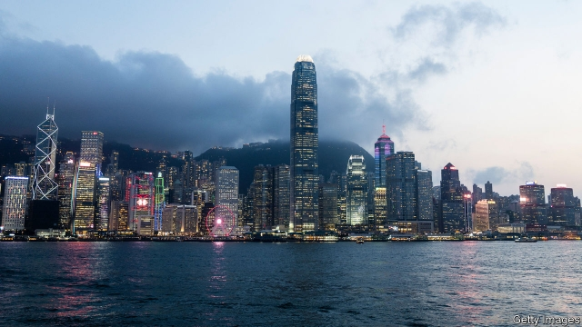
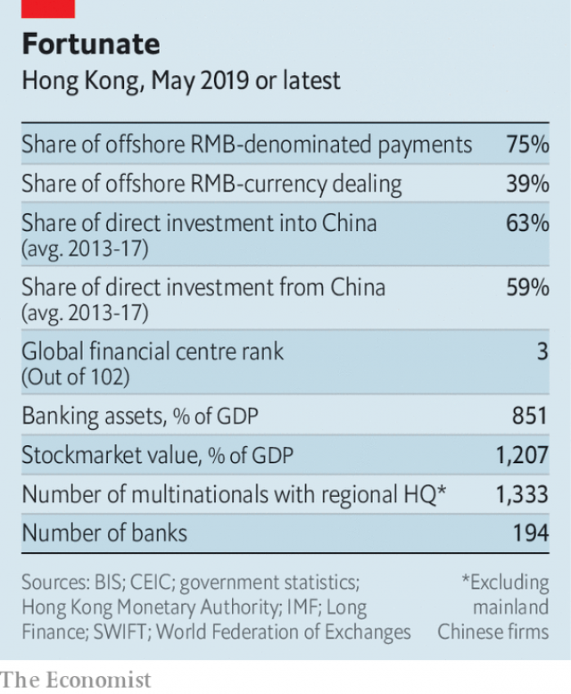

###### Garrotting the golden goose

# Hong Kong’s proposed extradition law puts ties with America at risk 

 

> print-edition iconPrint edition | Briefing | Jun 15th 2019 

AS EVENTS UNFOLD in Hong Kong, the world is watching closely. Vladimir Putin, who this week had to deal with demonstrations of his own, can observe a fresh case study in the handling of discontent, for note-sharing at his next meeting with Xi Jinping, his partner in a new axis of authoritarianism. Britain, the former colonial ruler, called for calm and urged the Hong Kong government to heed the concerns of its people and its friends abroad. But the reaction that really matters is in Washington, DC, where the response could have big implications for Hong Kong’s future. 

Nancy Pelosi, the Speaker of the House, said on June 11th that if the “horrific” extradition bill passes, Congress would have to reassess whether Hong Kong was “sufficiently autonomous” to justify its current status in trade with America, which sets it apart from China. Ms Pelosi has a long history of championing human rights in China. In 1991 she unfurled a banner in Tiananmen Square dedicated “To those who died for democracy in China”. But support for Hong Kong’s protesters is bipartisan. The Senate majority leader, Mitch McConnell, and fellow Republicans such as Marco Rubio and Lindsey Graham, have joined a chorus of condemnation. Plans are afoot to legislate for a review of America’s relationship with Hong Kong. 

The framework for that relationship is the US-Hong Kong Policy Act of 1992, which established continued separate economic treatment for the territory beyond its handover to China in 1997. This boosted Hong Kong as a bridge between the rich world and a booming China. More recently, it has meant freedom from America’s tariffs on China. 

Even before the latest troubles in Hong Kong, however, concerns were growing that it would get caught in the crossfire of President Donald Trump’s trade war with China. As restrictions on China led to the diversion of more transactions via Hong Kong, its privileged position has inevitably attracted attention. Transferring technology to Hong Kong may increasingly be seen as equivalent to passing it to China—not the intent of the Policy Act. Last year the US-China Economic and Security Review Commission, set up by Congress to report on the security implications of trade, recommended a fresh look at export controls for sensitive technology via the treatment of China and Hong Kong as separate customs areas. 

 

A lot is at stake. Hong Kong is China’s conduit. It accounted for nearly 60% of direct investment both into and out of China in 2012-16 (see table). It has a mighty share of offshore yuan-denominated payments. Western firms put money and headquarters there because it is seen as part of the Western system. Its currency is tied to the American dollar. It ranks third in the world as a financial centre; its banking assets are worth a whopping 851% of GDP. 

Such might makes it vulnerable. A belief that its financial system is no longer fungible with the West’s would be devastating. Erosion of the rule of law, and louder questioning of Hong Kong’s trading status, pose a growing threat. 

Whether actually killing that status would do anything to help Hong Kong’s protesters is doubtful. “That’s a gun you don’t want to shoot, frankly,” says Jeffrey Bader of the Brookings Institution, a think-tank. But the deepening strategic rivalry between America and China will bring greater scrutiny of Hong Kong. Under the Policy Act the president can suspend specific privileges by executive order if he deems Hong Kong insufficiently autonomous. In the midst of a trade war with China, a big blow to Hong Kong’s future may be only a tweet away. 

